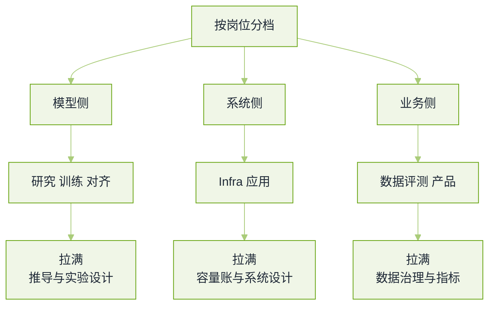

# 岗位分档与转岗真题


**一句话**：同一道题在校招、社招、研究岗上的及格线完全不同——这页给的是「按你的背景该准备哪三轮、每轮被期待答到哪一层」。


转岗（后端 / 前端 / 测开 / 数据分析 / 传统 CV·NLP）与不同年资的考察重心差异，比题目本身更能决定结果。题源见本章[导读](README.md)。

## 岗位地图：谁考什么

*《图：七类岗位归成三列——投岗前先确认自己那一列被拉满的是哪两栏，准备时间按这个分》*

## 年资与档位的及格线

**1. 同一个「设计一个企业知识库问答」的系统设计题，校招、3 年社招、8 年社招的答法差在哪？**

- 要点：校招的及格线是**结构完整**（能把分块—embedding—检索—重排—生成—评测这条链讲通，并说清一处取舍）；3 年的及格线是**数字与故障**（并发、延迟预算、索引规模、失败时降级到哪、上线后怎么发现质量掉了）；8 年的及格线是**决策与代价**（为什么这个场景该/不该自建、买还是建、组织上要谁配合、错了怎么回退）。
- 失分点很具体：校招答得太像论文综述；高年资答得像执行清单，听不出取舍与责任边界。
- 面试官在等：你的答案要匹配你申报的级别——「级别不匹配」是资深候选人最常见的挂法。

**2. 实习和校招轮最常被拉满的是哪两轮？各准备什么？**

- 要点：基础轮（注意力、位置编码、训练三阶段、采样）与手撕轮（注意力、损失、限流器、简单数据结构）。这两轮区分度最高，也最容易短期提分。
- 具体准备：能默写并解释注意力与一个损失函数；准备两个能讲 20 分钟的项目（一个动手做的、一个你复现并改进的）；刷题量不重要，**能讲清复杂度与边界条件**更重要。
- 加分：实习面试里主动展示「我读过这个项目的代码并发现某处与设计不符」，比刷再多题都有信号。
- 回看：[手撕代码与算法真题](live-coding.md)

**3. 高年资社招一定会问失败：什么样的失败叙述才算及格？**

- 要点：四步——当时的约束、你做的取舍、**代价在什么时候显现**、你事后改了哪个机制（不是改了哪个 bug）。缺了「机制」这一步，会被判定为「还没成长到能负责一块」。
- 反例：把失败归给「需求变了」「同事不配合」「资源不够」——面试官听到的是「不可控因素」，而高级岗要的是「我改变了系统」。
- 诚实边界：不要编「我最大的缺点是追求完美」。可以挑一个真实但已收敛的问题，并说明你用什么流程防它复发。
- 回看：[项目深挖与行为面真题](behavioral-project.md)

## 转岗高频题

**4. 「你为什么从后端 / 前端转大模型方向？」这题真正在考什么？**

- 要点：考的不是动机，是**可迁移证据 + 判断力**。及格答法三句：我在原来的系统里遇到了什么具体限制（举一个可量化的例子）→ 我已经用 AI 解决了其中哪一段（给出上线或 demo 的真实结果）→ 我知道这个方向上我的短板是什么，以及我怎么补（具体到已经做了什么）。
- 要主动给的信号：你带过来的不是「会用 SDK」，而是**生产系统的习惯**——灰度、回滚、可观测、成本控制、权限边界。这些恰恰是多数算法候选人缺的。
- 反例：把「行业火了、薪资高」当唯一理由；或者声称「我调过很多 prompt 所以懂大模型」。

**5. 「你没训过模型，怎么证明你懂训练？」**

- 要点：别辩护，给产物。可验证的三件：一次小规模复现（哪怕 LoRA 微调 + 自己的评测集，含数据说明与失败记录）、一份机制层面的推导笔记（能写出 PPO/DPO 的差别并指出各自省掉了什么）、以及一次真实故障归因（比如微调后某类能力退化，你怎么定位到数据或掩码）。
- 会说清自己的边界：「我没做过千卡规模，所以我不知道并行与稳定性上会踩什么坑」——这句话比含糊其辞可信，且通常会被追加一轮好问题。
- 加分：把「复现」讲成实验设计（假设、对照、判据），这是转岗者最容易展示的研究素养。
- 回看：[训练与对齐真题](training-alignment.md)

**6. 测试 / 数据分析背景转「AI 评测与数据岗」，会被问什么？**

- 要点：这类岗位现在问得很具体——你怎么给一个不确定的输出建立评测（黄金集怎么标、标注一致性怎么算、裁判模型怎么校准）；你怎么做数据质量治理（去重、配比、污染检测）；你怎么用统计判断一次改动是真的变好。
- 迁移优势要说出口：试验设计与显著性检验、指标体系与看板、坏例归因与工单流程——这些是评测岗最缺的能力，很多算法候选人不会。
- 要补的课：模型机制（不然会设计出「测不到点子上」的评测）、以及 LLM 特有的失败模式（幻觉、指令漂移、上下文退化）。
- 回看：[评测与裁判模型真题](evaluation-judge.md)

**7. 传统 NLP / CV 背景转大模型，最容易在哪一轮翻车？**

- 要点：最容易在「基础轮的口径更新」上翻车——训练范式从「任务专用微调」变成「预训练 + 后训练 + 提示/检索」，还在按旧口径答数据增强、单任务指标，会被判定为没跟上。第二处是评测与工程口径（线上灰度、成本、延迟）没概念。
- 迁移优势要挑对：CV 背景做图文与视频方向是加分（有表征学习与评测的功底）；NLP 背景做检索、结构化抽取、数据治理是加分（知道标注与噪声怎么处理）。
- 诚实的答法：承认「范式变了」，然后给出你用新范式重做过的一件旧事（比如把原来的 rerank 模型换成 embedding + 重排两段，并说清差别）。
- 回看：[多模态与视觉语言真题](multimodal-vision.md)

**8. 「简历上写什么项目才有信号？」——转岗者的项目选择标准**

- 要点：四条判据，一条不满足就别写：**有真实用户或真实数据**（哪怕是内部）、**有可量化结果**（前后对照的数字，含失败指标）、**你能讲清每一处取舍**（面试官必问「为什么不用另一种做法」）、**代码或文档可核查**（能当场翻出来）。
- 反面清单：跟着教程做的 todo 应用、只截图的 demo、把公开榜单分数当自己的贡献、以及「参与某大模型项目」却讲不出自己负责的那一段。
- 加分：一个「小但有闭环」的项目（比如 200 条评测集 + 灰度 + 回滚 + 成本账）远胜三个大而无当的复现。
- 回看：[系统设计真题](system-design.md)

## 排期与执行

**9. 只剩四周，每天两小时，怎么排？**

| 周 | 主线 | 交付物（可自查） |
|---|---|---|
| 第 1 周 | 基础轮：注意力、位置编码、训练三阶段、采样 | 手写并讲清 3 个公式；做完 [大模型基础真题](llm-foundations.md) 全 10 题 |
| 第 2 周 | 手撕轮：注意力、损失、限流、Agent 循环 | 每题限时 25 分钟写完并跑通；能说出复杂度 |
| 第 3 周 | 设计与深挖：端到端摆两遍 + 项目四问 | 一张系统图 + 一份「数字—对照—失败—修正」讲稿 |
| 第 4 周 | 分档补齐（投什么岗补什么）+ 模拟面 | 两轮真人模拟；把弱项回炉；准备好反问与谈薪口径 |

- 要点：这个排期的核心是**每周产出可自查的交付物**，不是「看了几页」。第 3 周的设计与项目讲稿，是多数候选人真正挂掉的地方。
- 回看：[学习路线](../00-index/learning-path.md)

**10. 面试前的「岗位情报」该做到哪一步？**

- 要点：三件事就够，但每件都要有产物：读团队公开的技术博客/论文/开源仓库（能说出你认同和质疑的一个具体设计）；把 JD 里每个词换成一道你会答的题（写不出的就是缺口）；确认这个岗位真实的考核重心（问内推人或面试官：这个岗位前三个月要交付什么）。
- 面试官在等：从你的提问里判断你懂不懂这个岗位要背的指标——这也是第 5 轮之后的加分环节。
- 边界：不要打听内部题库、不要假装认识团队里的人。

## 常见误区

- ❌ 用同一套答案打所有档位：级别不匹配会直接挂，且不会进第二遍。
- ❌ 转岗只刷八股：没有可核查的产物，基础轮满分也只是「背得多」。
- ❌ 把旧经验贬得一文不值：面试官会怀疑你的自我评估能力；要讲清迁移点与缺口。
- ❌ 简历项目全是教程复现：一到「为什么这样做」就露馅。
- ❌ 不确认岗位重心就开准备：应用岗花两周推 PPO 的梯度，是排期上最贵的错误。

## 参考资料

- [从传统开发转大模型 / Agent 岗的转型指南（AgentGuide）](https://github.com/adongwanai/AgentGuide/blob/main/docs/04-interview/07-career-transition.md)
- [求职流程与准备清单（AgentGuide）](https://github.com/adongwanai/AgentGuide/blob/main/docs/04-interview/08-job-hunting-guide.md)
- [简历撰写指南（AgentGuide）](https://github.com/adongwanai/AgentGuide/blob/main/docs/04-interview/20-resume-guide.md)
- [AI Engineering Field Guide（岗位与面试环节拆解）](https://github.com/alexeygrigorev/ai-engineering-field-guide)
- [AI Engineering 面试题库（按公司标注的候选人转述）](https://github.com/pallavi-shekhar/ai-engineering-interview-questions-company-wise)

## 相关知识点

- [20 面试真题 · 本章导读](README.md)
- [项目深挖与行为面真题](behavioral-project.md)
- [前沿与研究岗真题](frontier-research.md)
- [学习路线](../00-index/learning-path.md)
