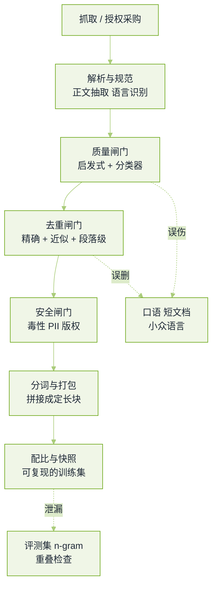

# 数据工程与合成数据真题


**一句话**：这一轮考的是「你有没有真的洗过几十 TB 文本」——每一步过滤都在丢东西，答不出丢了什么的人没上过手。


预训练/后训练数据岗、算法岗的数据环节、以及应用岗的「你的微调数据哪来的」都会落在这页。题源见本章[导读](README.md)。

## 一条语料管线的形状

*《图：语料管线的三道闸门与最后一道泄漏检查——面试里能说出每道闸门误伤了什么，比说出闸门名字值钱》*

## 管线与去重

**1. 从原始网页到能进训练的数据，管线有哪些步骤？每一步会丢掉什么？**

- 要点：解析抽正文（丢：正文被当成导航删除、表格与代码块结构丢失）、语言识别（丢：混语与低资源语言被判错）、质量过滤（丢：口语化、短文档、格式特殊但真实的文本）、去重（丢：爆款模板与合法复用）、安全与 PII（丢：医学、法律等高风险但有用的语料）、分词打包（丢：跨文档拼接造成的假上下文）。
- 关键判断：过滤强度与数据多样性是此消彼长的，所以要留一条「不过滤的对照组」在小模型上跑，量化每一刀付出的代价。
- 加分：能说出「管线要在小规模上先跑通并留样本给人看」，以及人工抽查几千条这种脏活是常规动作。
- 回看：[预训练与微调](../03-llm/pretraining-finetuning.md)

**2. 精确去重和近似去重各怎么做？MinHash + LSH 的碰撞概率说明白。**

- 要点：精确去重用文档级哈希（指纹集合），只能抓到逐字复制；近似去重把文档表示成 $$k$$ 元 gram 集合，用 MinHash 估 Jaccard 相似度，再用 LSH 把签名切成 $$b$$ 个条带、每带 $$r$$ 行，任意一带完全相同即候选碰撞。
- 一条要能写的式子：$$P_{\text{collide}}=1-(1-s^{r})^{b}$$，于是阈值近似在 $$(1/b)^{1/r}$$ 附近形成 S 曲线。说出「调 $$b,r$$ 就是在调召回的相似度门槛」说明你真懂，而不是背名字。
- 规模账：签名要过一遍全量语料，工程上按 sharding 分区做；去重顺序（先精确后近似、先文档后段落）会影响结果，要固定并写进配置。
- 追问「为什么段落级重复比文档级更值得治」：因为模型会背模板，段内重复把概率质量喂给固定句式，直接推高复读与幻觉；文档级去重抓不到它。
- 回看：[数据与向量存储](../16-ai-infrastructure/data-vector-storage.md)

**3. 训练集与评测集怎么去污染？只做哈希交集够不够？**

- 要点：不够。评测题常被改写、翻译、拆分后进入语料，所以要用长 $$n$$-gram 重叠（对题目侧取集合，算文档命中率）+ 语义近邻（拿评测题去训练索引查最近邻）双查，再对可疑命中做人工判定。
- 更根本的是**时间戳与来源账**：抓取时间晚于某榜单发布时间的语料，与榜单题目同源的概率高，要单独成桶并可选剔除。
- 面试官在等：一句「刷榜不一定是作弊，但拿不到污染报告我就不能信这个分数」。
- 回看：[评测指标与基准](../10-evaluation-safety/benchmarks.md)

## 质量、配比与合成

**4. 语料质量分类器怎么训？阈值调高会出什么问题？**

- 要点：拿少量人工标注（或「高质量来源 vs 低质量来源」弱标签）训一个轻量文本分类器，用它的分数做过滤。好处是比规则可调、可解释（看高分词元），坏处是它会学成「像维基」的偏好。
- 阈值调高的两个后果：分布窄化（代码、口语、方言、表格类文本被砍掉，模型在这些能力上退化）和自我强化（下一版分类器的训练数据来自上一版留下的语料，偏见越洗越深）。
- 必须补的验证：固定其他条件，只换过滤阈值，在小模型上跑分能力桶（不只是总分），确认被砍掉的能力有没有回不来。
- 回看：[机器学习基础](../01-ai-basics/machine-learning-basics.md)

**5. 预训练数据配比怎么定？你有 100B token 预算，怎么花在刀刃上？**

- 要点：先按能力桶分组（通用文本、代码、数学、多语言、知识密集），配比靠**小模型代理实验**定：训一批 100M/1B 级小模型，不同配比、同一预算，看能力桶曲线，再外推到目标规模。外推要谨慎，代码与数学的收益随规模变化最明显。
- 预算口径要能报：训练算力 $$C\approx 6ND$$，给定 $$C$$ 时 token 数 $$D$$ 与参数量 $$N$$ 要一起定（经验上每参数约二十个 token 的量级），只报「我们数据很多」是这题的失分点。
- 追问「上采样会不会过拟合」：会，重复次数与损失曲线要盯，通常靠「上采样 + 更强正则/较短训练窗口」权衡，并明确记进数据配置。
- 回看：[训练与微调基础设施](../16-ai-infrastructure/training-finetune-infra.md)

**6. 合成数据怎么造？风险在哪，怎么证明它没把模型喂成复读机？**

- 要点：三条主流造法——自举式指令生成（一批种子任务扩写成指令-回答对）、进化式复杂化（对已有指令逐步加深/加约束/加广度）、教师模型蒸馏（强模型出推理轨迹，弱模型学）。
- 风险两条：**同源循环**（数据全来自同一教师，学生只会复刻教师偏好，评测分涨但真实能力没变）与**分布塌缩**（合成语料过度规范，真实世界的噪声与罕见模式消失，长尾能力退化）。
- 可证明的做法：留出纯真实数据的对照组；把评测集分成「教师参与生成的题」与「完全隔离的题」两桶分别看分；监控输出多样性指标而不是只看准确率。
- 面试官在等：能主动说出「合成数据的价值在于难例与结构化推理，不在于替代真实分布」。
- 回看：[睡眠时记忆固化](../06-memory-rag/sleep-time-memory-consolidation.md)

**7. 后训练（SFT）数据怎么构造？loss 该算在哪些 token 上？**

- 要点：指令-响应对要有明确来源分布（真实用户问题 > 人工撰写 > 模型自造）；多轮样本按角色分段拼接；**损失掩码**只算模型该生成的那段 token，prompt、工具返回、检索片段、历史 token 全部置零。
- 常见坑：把工具返回也当监督目标（模型学会编造工具结果）、模板不一致（训练与推理的序列化格式有细微差异）、样本长度极偏导致有效 batch 里全是长样本。
- 加分：能说出用拒绝采样（同一 prompt 采若干回答，只留通过校验/判分的）来提质量，以及为什么拒绝采样必须配独立验证器（否则会把裁判模型的偏好当真理）。
- 回看：[Agent 轨迹微调](../03-llm/agent-traj-finetuning.md)

**8. 分词器怎么来的？词表大小和数字切分会带来什么后果？**

- 要点：BPE/SentencePiece 类方法在语料上统计合并，词表大小是「序列长度」与「嵌入/输出层参数」之间的直接权衡：词表小则同一段文本 token 更多、上下文与算力都变贵；词表大则尾部低频 token 训练不充分。
- 数字与代码的切分最常被问：数字被打散成多位片段会伤害算术与计数能力，工程上可对数字、单位做单独处理；说出「我们看的是数学题准确率有没有回来」比说「我们加了特殊 token」有力。
- 换语言要不要重训：扩表（保留已有 token、追加新语言并做嵌入冷启动）代价小、风险低；全量重训能更优但所有下游评测要重跑，一般只有底座换代才做。
- 追问「为什么同一个问题不同 tokenizer 的模型成本差很多」：因为计费按 token，切分粒度直接决定长度。
- 回看：[Token、Embedding 与上下文窗口](../03-llm/token-embedding-context.md)

**9. 怎么让一次训练可复现？数据侧要留哪些东西？**

- 要点：数据快照（不可变版本 + 校验和）、管线配置（每步阈值与顺序）、抽样留档（每步保留固定样本供对比）、随机种子与混洗顺序、以及数据卡/模型卡（来源、许可、已知缺口）。
- 真实动机要讲出来：出事故时要能回答「这版模型的有害行为是哪批数据带进来的」，复现不了就只能靠猜。
- 加分：能说清「可复现 ≠ 可复算」——同一份配置在新版本框架上数值会有漂移，所以要留基线评测的原始输出。
- 回看：[持续评测](../11-engineering/continuous-evaluation.md)

**10. 长上下文训练的数据从哪来？把短文档拼起来要注意什么？**

- 要点：真实长文档（书、长报告、代码库）稀缺且许可复杂，所以常用「同主题文档拼接 + 打包到定长块」造长序列。风险是模型学到的是「跨文档拼接的分布」而不是真正理解超长依赖。
- 必须处理：文档之间加分隔与位置重置的口径要统一；注意力掩码是否跨文档可见要显式决定（多数做法是同块内互相可见，代价是「大海捞针」评测会虚高）；位置编码的伸缩要与训练长度同步。
- 面试官在等：能说出「长上下文的能力一半在数据，一半在位置编码与注意力偏置，只堆长度没有用」。
- 回看：[长上下文退化](../06-memory-rag/long-context-degradation.md)

## 常见误区

- ❌ 把去重当「跑一次哈希」：文档级、段落级、训练—评测三处都要做，顺序还要固定。
- ❌ 只报总 token 数：不说配比、重复次数与过滤强度的 token 数是没法复现的。
- ❌ 合成数据不设隔离评测：教师的偏好会被当成学生的进步。
- ❌ 质量阈值越高越好：窄化分布是静默的，掉的是长尾能力。
- ❌ SFT 掩码不做：模型会去学 prompt 和工具返回，表现为凭空捏造检索结果。

## 参考资料

- [Deduplicating Training Data Makes Language Models Better](https://arxiv.org/abs/2107.06499)
- [Training Compute-Optimal Large Language Models（Chinchilla 缩放律）](https://arxiv.org/abs/2203.15556)
- [Self-Instruct：Aligning Language Models with Self-Generated Instructions](https://arxiv.org/abs/2212.10560)
- [WizardLM：Leveraging Evol-Instruct 生成复杂指令](https://arxiv.org/abs/2304.12244)
- [数据合成 / Data Pipeline 备战手册（AgentGuide 面试 playbook）](https://github.com/adongwanai/AgentGuide/blob/main/docs/04-interview/18-agent-interview-playbooks/data-synthesis-playbook.md)
- [MinHash LSH 为什么是训练数据去重的实用解](https://zilliz.com.cn/blog/MinHash-LSH-best-dedup-for-model-training)

## 相关知识点

- [20 面试真题 · 本章导读](README.md)
- [训练与对齐真题](training-alignment.md)
- [评测与裁判模型真题](evaluation-judge.md)
- [RAG 与检索真题](rag-retrieval.md)
- [大模型基础真题](llm-foundations.md)
