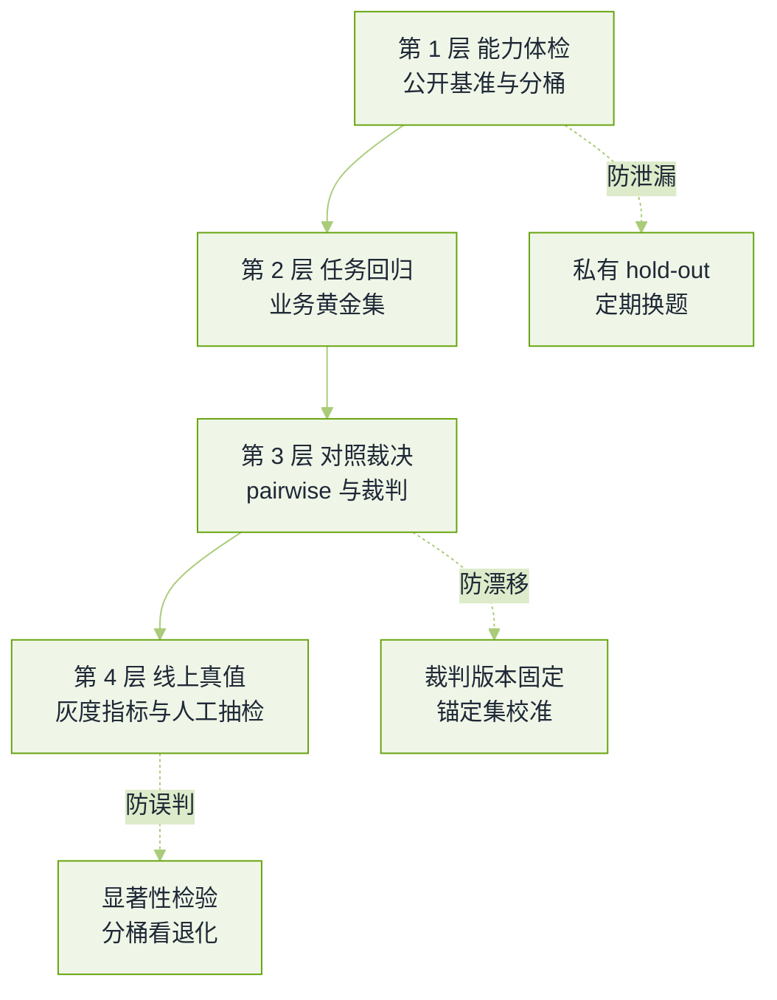

# 评测与裁判模型真题


**一句话**：这轮考的不是你会不会跑分，而是你能不能证明「这个分数是真的、这个提升不是噪声、这套评测评的是你的业务」。


数据与评测岗会连着问三小时；算法岗与应用岗至少会问「你怎么知道模型变好了」。题源见本章[导读](README.md)。

## 四层评测各管什么

*《图：四层评测的分工——越往下越贵、越可信；只用第一层的团队，线上事故都来自第二层的缺口》*

## 体系与裁判

**1. 给你一个新模型（或一次微调），上线前你怎么评？说清层次和取舍。**

- 要点：四层分开——公开基准做能力体检（看有没有明显退化，不用于决策）、业务黄金集做回归（几十到几百条真实工单/问题，带期望要点）、成对对照与裁判做优劣裁决（新旧同题对比）、线上灰度与人工抽检做真值。
- 关键取舍：黄金集要能覆盖「历史上出过事故的能力」，并且每次 badcase 都回流；跑分快但和线上无关的公开榜，只配当体检，不配当门禁。
- 加分：能说出评测要分桶报（按难度、按意图、按长度、按语言），总分掩盖退化是这一轮的典型失分。
- 回看：[持续评测](../11-engineering/continuous-evaluation.md)

**2. LLM-as-judge 有哪些已知偏差？你逐项怎么治？**

- 要点：位置偏置（偏爱先出现的回答）、冗长偏置（把长当好好）、自我偏好（偏爱同家族模型的措辞）、格式偏置（偏爱 Markdown 与列表）、评分尺度偏置（喜欢打高分，区分度塌在 4/5 附近）。
- 治法一一对应：成对交换位置两次取一致才计分；把长度作为协变量看相关性或在打分后做长度归一；裁判与被评模型异家族、或加人工锚点校准；rubric 拆成可核对的二分子项（是否给出证据、是否回答完整）而不是整体印象分。
- 必须补的一句：裁判只用于「相对比较」与「回归拦截」，绝对分数要有人评锚定，否则整个体系建在沙上。
- 面试官在等：能说出「我训过/调过一个裁判，在人评上 κ 到多少」——有数字才算做过。
- 回看：[评测指标与基准](../10-evaluation-safety/benchmarks.md)

**3. 裁判和人工的一致性怎么量化？κ=0.6 是什么水平？**

- 要点：Cohen's $$\kappa=\frac{p_o-p_e}{1-p_e}$$（$$p_o$$ 一致率，$$p_e$$ 随机期望一致率），它扣掉了「瞎猜也能一致」的部分；连续评分看 Spearman 相关，多标注者用加权 κ 或 Krippendorff's α。
- 口径：$$\kappa$$ 在 0.6 上下属于「中到强」，通常已可用于回归拦截；但要看**分歧落在哪一类**——若分歧集中在难题（人之间 κ 也低），那是任务本身模糊，不是裁判的错。
- 加分：报人—人一致性作为天花板。裁判离人评的差距要相对「人与人差距」来判，而不是相对 1.0。
- 回看：[可解释性与置信度](../10-evaluation-safety/explainability.md)

**4. 裁判模型自己会变（换版本、调温度、平台改路由），你怎么发现？**

- 要点：这是**裁判漂移**，最阴险之处在于它会让「所有模型一起变好或变差」，看起来像进步。防线有三条：锚定集（一批固定样本 + 已知期望分，每次跑评测先看锚定集有没有偏）、裁判版本与解码参数写进配置并 pin 住、以及把每次评测的裁判原始输出全量存档（能追溯是哪条判词变了）。
- 处置：锚定集偏移超过阈值时，评测结果只能作废重跑，不能「先看看数」。
- 追问「为什么不能每轮换更强裁判」：换了裁判等于换了尺子，历史曲线全部不可比；要做的是**并行双轨**（新裁判先跑一段影子评测）再切。
- 回看：[LLM 观测与评测平台](../16-ai-infrastructure/llm-observability-eval-platform.md)

**5. pointwise 打分和 pairwise 判优，你选哪个？多个模型的排名怎么聚合？**

- 要点：pairwise 更稳（人也都更擅长比较而不是绝对评分），但它不传递，且规模是 $$O(n^2)$$ 或采样配对；pointwise 便宜、可跨批次比，但会被尺度偏置污染。常见组合是「pointwise 做回归门禁，pairwise 做版本裁决」。
- 聚合排名：把成对结果拟合 Bradley–Terry/Elo，$$P(i\succ j)=\frac{e^{\theta_i}}{e^{\theta_i}+e^{\theta_j}}$$；要说明配对是否均衡（否则弱模型间的对局少，排名不确定度大），并给置信区间。
- 加分：能说出「对局分布偏差」——对战平台的排名只反映被抽到的用户流量，不代表全能力。
- 回看：[Agent 基准横向对比](../10-evaluation-safety/agentbench-webarena-swebench-gaia-toolbench.md)

## 统计与归因

**6. 离线涨了 2 个点，你敢上线吗？说清你怎么判断这是不是噪声。**

- 要点：先问三件事——样本多少、两个版本是不是同一批题（配对与否）、分桶里有没有退化。方法上用配对检验：分类/通过与否用 McNemar（只看两版本判分不一致的样本），连续分用配对 bootstrap 给差值置信区间。
- 常见错误：拿不同题目子集比、多轮比较不做校正（在 20 个分桶里挑最大的那个显著，几乎一定能挑到）、只看 p 值不看效应量与实际成本。
- 必须补：显著 ≠ 可上线。要同时看「这 2 个点对应业务上的哪类工单减少」，以及安全/延迟/成本三桶有没有变差。
- 回看：[推理经济学与部署形态](../16-ai-infrastructure/inference-economics-deployment.md)

**7. 离线指标涨、线上没涨（甚至跌），怎么归因？**

- 要点：按这条顺序排查：① 评测集分布与线上流量分布不一致（离线集偏「教科书问题」）；② 泄漏（离线题进过训练或提示模板）；③ 代理指标失效（裁判偏爱冗长，线上用户要短回答）；④ 系统变量没对齐（线上多一次检索、一次改写，模型只是链条里的一环）；⑤ 曝光与选择偏差（线上只看得到留下反馈的用户）。
- 可落地的做法：把线上真实会话匿名化后回流成离线集（同源分布），并把端到端链路做成「只替换模型、其他固定」的 A/B。
- 面试官在等：能主动承认「离线分数只是代理」，并给出至少一个把两者对平的具体机制（灰度 + 人工抽检 + 回流）。
- 回看：[Agent 失败模式排查手册](../11-engineering/agent-failure-playbook.md)

**8. Agent、多步任务怎么评？只看最终答案够不够？**

- 要点：不够。要**双轨**：结果评测（任务是否完成）与轨迹评测（步数、工具调用是否合法、是否绕过权限、成本与时延）。只看结果会放过「运气做对」的轨迹，只看轨迹会惩罚「绕远路但做对」。
- 通过率要按 $$k$$ 次采样报：$$\text{pass@}k=1-\frac{\binom{n-c}{k}}{\binom{n}{k}}$$，并说明为什么不能只报一次运行的成败（多步任务的成功率方差极大）。
- 加分：能说出「环境要可重置、可注入故障」，否则无法复现失败；评测要与真实工单分布对齐（长任务占比）。
- 回看：[动手实验：评测与追踪](../19-labs/lab5-eval-trace.md)

**9. 事实性与幻觉怎么自动评？指标怎么定义才不会自欺？**

- 要点：把回答拆成可核对的断言（claim），逐条找证据（检索片段、工具返回、数据库结果），统计支持/矛盾/无证据三类比例——这就是忠实度类指标的做法。关键在于**证据集要封闭**：允许裁判「用世界知识判断」等于把幻觉判成正确。
- 必须区分两类指标：事实错误率（答案错）与不忠实率（答案与给定材料矛盾），两者归因与修法完全不同（前者补知识/检索，后者改提示与解码约束）。
- 加分：能给出「引用可点回原句」的产品级要求，并说明它对标注成本的影响。
- 回看：[幻觉与事实性](../10-evaluation-safety/hallucination.md)

**10. 评测怎么接进 CI？门禁阈值怎么定才不会天天误报？**

- 要点：分层门禁——快集（每次改动跑，几分钟，拦明显退化）、慢集（每日/发布前跑，覆盖全能力桶）、人评（抽样，定期校准裁判）。阈值要按**历史噪声带**定（同一模型重复跑的波动范围），而不是拍脑袋 1 个点。
- 工程细节：随机种子、解码参数、上下文版本、裁判配置全部进 CI 变量；失败要能一键拿到判词与原始样本；阻塞级别区分「总分退化」与「分桶退化」。
- 面试官在等：能说出「门禁的价值不是拦住坏人，是让退化变成可讨论的事实」。
- 回看：[动手实验：护栏与守卫](../19-labs/lab6-guardrails.md)

## 常见误区

- ❌ 用公开榜单当上线依据：榜会饱和、会泄漏，也不含你的业务分布。
- ❌ 让裁判用世界知识判忠实度：等于让模型给自己的幻觉盖章。
- ❌ 只报一次运行结果：多步任务的成功率波动可以大到让人做出反向决策。
- ❌ 换裁判不重跑历史：曲线断层，之后所有「进步」都无法解释。
- ❌ 只看总分：能力桶里的局部退化正是事故来源。

## 参考资料

- [Judging LLM-as-a-Judge with MT-Bench and Chatbot Arena](https://arxiv.org/abs/2306.05685)
- [Evaluating Large Language Models Trained on Code（pass@k 的原始定义）](https://arxiv.org/abs/2107.03374)
- [HELM：Holistic Evaluation of Language Models](https://arxiv.org/abs/2211.09110)
- [AgentBench：Evaluating LLMs as Agents](https://arxiv.org/abs/2308.03688)
- [Agent 评测彻底备战手册（AgentGuide playbook）](https://github.com/adongwanai/AgentGuide/blob/main/docs/04-interview/18-agent-interview-playbooks/agent-evaluation-playbook.md)
- [AI Engineering 面试题库（按公司标注的候选人转述）](https://github.com/pallavi-shekhar/ai-engineering-interview-questions-company-wise)

## 相关知识点

- [20 面试真题 · 本章导读](README.md)
- [系统设计真题](system-design.md)
- [数据工程与合成数据真题](data-engineering.md)
- [Agent 工程真题](agent-engineering.md)
- [10 评估、安全与对齐](../10-evaluation-safety/README.md)
