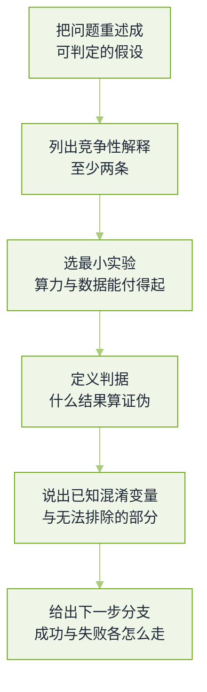

# 前沿与研究岗真题


**一句话**：研究岗的题多半没有标准答案，面试官评的是你**怎么把一个大问题切成一个可证伪的小实验**，以及你敢不敢说自己不知道。


这一页收的是实验室/研究岗与「追前沿」岗位的开放题，也适用于社招高级岗的最后一轮。题源见本章[导读](README.md)。

## 一道开放题的合格答法

*《图：研究岗一轮的评分路径——结论大胆没关系，但没有「什么结果会让我改主意」，这题就不及格》*

## 测试时算力与推理

**1. 为什么「推理模型」多花 token 就能变强？它的收益上限由什么决定？**

- 要点：本质是把一次前向的判断，换成多次采样 + 选择/验证，等价于用带宽换搜索深度。收益上限由三件事共同决定：**验证信号的可判别性**（数学有答案可查，写文案没有）、基模型的单步正确率、以及预算分配策略（难题多花、易题早停）。
- 会说清范式差异：可验证奖励（答案能被程序判定的任务，用对/错当奖励）与偏好奖励（人或裁判打分）在扩展性上完全不同——前者不会被裁判的偏好卡住，但只在有判分器的领域可用。
- 常见追问「为什么加长思考有时反而变差」：因为思考预算会挤掉最终答案质量，也会让模型在缺少验证信号的任务上「自圆其说」。能说出「思考长度与准确率不是单调关系」比报任何长度数字强。
- 回看：[推理预算与测试期计算](../04-prompt-reasoning/test-time-compute-reasoning-budget.md)

**2. 给一个只有 8 张卡的团队，你会设计什么实验来验证「测试时算力」这条路线值得投？**

- 要点：这题考的是实验设计而不是立场。可辩护的做法：选一个有自动判分器的窄领域（数学、代码、结构化抽取），固定模型只变预算，画**算力—准确率**曲线；同时报每档预算的成本，找出「再花一倍算力只涨 0.5 点」的拐点。
- 关键对照：把同额算力改用别的用法（更大模型、更好数据、更多检索）做同台比较——不然你证明的只是「算力有用」。
- 加分：能主动设停止条件（多少步没涨就放弃这条假设），并说明结果如何外推。

## 架构与规模

**3. 长上下文的能力从哪来？外推方法的机制与代价分别是什么。**

- 要点：三条来源——继续预训练加长位置范围、位置编码的插值/缩放（把高频与低频分量分别处理，避免短程分辨率被牺牲）、以及检索与外部记忆（把「记住」换成「查得到」）。
- 工程代价要说得出：长序列的注意力成本、KV 显存随长度线性涨而注意力计算按平方涨；由此推出「稀疏/线性注意力省的是计算，不必然省信息保真度」。
- 面试官在等：区分**宣称窗口**与**有效窗口**——中段信息利用退化是普遍现象，能说出「我用分难度位的检索探针量有效长度」的人，说明真做过。
- 回看：[长上下文退化](../06-memory-rag/long-context-degradation.md)

**4. MoE 接下来会往哪走？你怎么评价一个路由方案好不好？**

- 要点：评价维度只有三个真实问题——**专家是否特化**（用专家—任务共现矩阵看，而不是只看均衡 loss）、**是否过载**（热门专家成为瓶颈，看每专家 token 数分布）、**是否浪费**（冷专家长期不更新）。
- 常见改进方向：共享专家兜底通用能力、细粒度多专家 + 每 token 少激活、负载均衡损失与真实特化之间的张力（强约束会抹掉 specialization）、以及路由从「token 级」上移到「块/段级」以稳定延迟。
- 加分：能说出「均衡损失是一个代理指标，别把它当目标优化」，并给出你用什么下游指标交叉验证。
- 回看：[推理经济学与部署形态](../16-ai-infrastructure/inference-economics-deployment.md)

**5. 蒸馏、量化、投机解码三条「变小变快」的路线，各自会伤到什么？**

- 要点：蒸馏伤的是教师分布的尾部（罕见但正确的行为最先丢），并且学生只会像教师而不超过它；量化伤的是低秩敏感部分（注意力投影、MoE 的专家、以及长链推理中的自我纠错能力常最先退化）；投机解码几乎不伤质量（因为严格验证），伤的是延迟稳定性与实现复杂度。
- 必须补：三条路线要各自配一个「能力桶级」的回归评测，而不是只看困惑度——困惑度对少数关键 token 的错误极不敏感。
- 追问「为什么小模型做复杂推理特别容易翻车」：因为推理链上的错误会累积，小模型的自我纠错率更低，这让「长度」与「质量」在小模型上冲突更尖锐。
- 回看：[推理、量化与部署](../03-llm/inference-quantization-deployment.md)

## 生成、具身与自改进

**6. 图像与视频生成岗位会问：扩散模型和自回归生成怎么选？**

- 要点：扩散擅长连续高维信号的保真度，代价是多步采样与较难做统一序列建模；自回归把图像当 token 接进语言模型，天然与多模态统一、可复用现有加速栈，代价是离散量化误差与对 tokenizer 的强依赖。
- 会追问的机制：条件注入方式（交叉注意力 vs 拼接）、 classifier-free guidance 用「有条件/无条件两路外推」换可控性、以及它的代价（过饱和、多样性下降）。
- 加分：能说清「统一多模态模型」在工程上真正的难点是**训练配方与数据配比**，不是网络骨架。
- 回看：[世界模型与视频生成](../17-embodied-ai/world-models-video.md)

**7. 具身方向的研究题：为什么机器人模型不能靠网络视频学会操作？**

- 要点：视频里只有像素，没有「动作—后果」的配对；接触动力学、力与摩擦、执行延迟这些必须在带动作标签的数据里学。所以方向是仿真 + 真机遥操作 + 跨本体数据混训，以及从人类视频里学**表征**而不是学**控制**。
- 会说清 sim-to-real 差距的来源：渲染差异、动力学参数不准、执行器延迟与标定误差；缩小差距的手段是域随机化、真实数据微调与系统辨识。
- 面试官在等：能指出「数据引擎」这件事在具身里比在语言里更硬约束——采集成本是物理的。
- 回看：[具身数据引擎](../17-embodied-ai/data-engine.md)

**8. 「自我改进 / 持续学习」听着很香，你信吗？怎么验证它有效？**

- 要点：先把它拆成可验证的三件事：模型能不能生成**比现有数据更难**的任务（而不是同分布复读）、有没有**独立于模型自己**的正确性信号（验证器、单元测试、环境反馈）、以及学到的东西能不能**不摧毁旧能力**。
- 无外部信号时的失败模式很具体：自我强化的偏好、奖励 hacking（把判分器刷满）、以及灾难性遗忘。可验证的做法：固定一组「旧能力回归集」和一组「新鲜题隔离集」，只有后者涨才算学到东西。
- 加分：能说出「自改进的收益目前集中在有判分器的领域」，并解释为什么开放域写作不具备这个条件。
- 回看：[Reflexion 与自我修正](../04-prompt-reasoning/reflexion.md)

**9. 开放题：如果给你足够算力，你会做什么研究？（考察研究品味）**

- 要点：这题被刷掉的人大多犯两个错——选了一个「更大更全」的方向（没有可证伪假设），或者选了一个无法测量的方向（没有判据）。可辩护的答案要有明确的三件套：假设、最小实验、什么结果会推翻它。
- 结构建议：先说一个你**已经动手验证过一半**的小观察（哪怕是复现某篇论文时的偏差），再推到大尺度；这比宏大叙事可信得多。
- 面试官在等：能否识别自己方案的**最强反对意见**——例如数据稀缺、评测不可信、结论无法外推。
- 回看：[Agent 与推理的最新进展](../18-frontier-2026/README.md)

**10. 「你怎么跟进这个领域」这题，怎么答才不像口号？**

- 要点：给出可核对的信息源与节奏（论文精读加复现笔记、代码库的变更而不是新闻稿、以及一份自己的评测集用来验证新模型是否真的更强），并说一个**最近改变过你判断**的具体例子。
- 加分：能说出「我试过但没用」的方向——研究岗非常在意你能否从负结果里学。
- 诚实的边界：追不上所有论文是正常的，关键是有一两个能讲到机制层面的纵深方向。

## 常见误区

- ❌ 用趋势词代替机制：说「scaling 会一直有效」而不说清哪个轴、代价由谁付。
- ❌ 只报分数不报成本：前沿题的默认评分点是「同算力下你怎么比较两条路线」。
- ❌ 开放题不敢说不确定：强撑到底会丢掉「知道自己边界」这一项分。
- ❌ 把自我改进当万能：没有独立验证信号时，它更像放大已有偏好。
- ❌ 声称读过所有新论文：面试官会随机挑一篇问细节，一句答不上就全盘失信。

## 参考资料

- [DeepSeek-R1：强化学习驱动的推理能力](https://arxiv.org/abs/2501.12948)
- [s1：Simple Test-Time Scaling Strategies](https://arxiv.org/abs/2501.19393)
- [YaRN：高效长上下文外推](https://arxiv.org/abs/2309.00071)
- [Switch Transformers：稀疏 MoE 的容量与效率](https://arxiv.org/abs/2101.03961)
- [前沿岗位备战手册目录（AgentGuide）](https://github.com/adongwanai/AgentGuide/blob/main/docs/04-interview/23-frontier-interview-guides/README.md)
- [LLM 未来趋势开放讨论题集（AgentGuide）](https://github.com/adongwanai/AgentGuide/blob/main/docs/04-interview/14-llm-future-trends.md)

## 相关知识点

- [20 面试真题 · 本章导读](README.md)
- [大模型基础真题](llm-foundations.md)
- [训练与对齐真题](training-alignment.md)
- [多模态与视觉语言真题](multimodal-vision.md)
- [18 2026 前沿](../18-frontier-2026/README.md)
