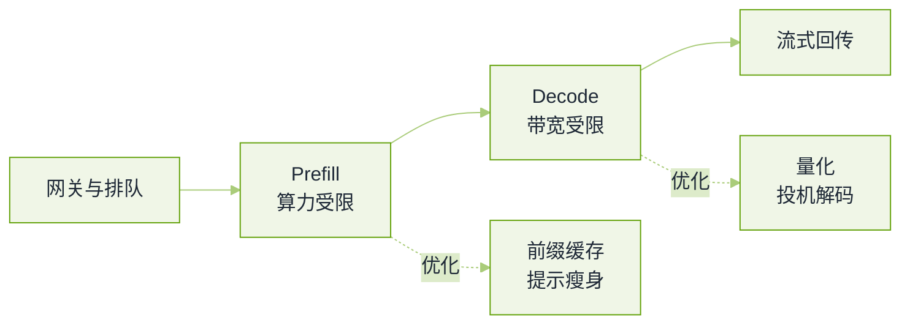

# 推理与服务化真题


**一句话**：这一轮全部围绕同一张账——一次请求花掉多少显存带宽、多少秒、多少钱，而你的优化动的是其中哪一项。


基础设施岗会把它问得很细，应用岗至少要知道 prefill 与 decode 的区别以及为什么长提示会拖慢首字。题源见本章[导读](README.md)。

## 一条请求的延迟构成

*《图：延迟拆成四段，其中两段各有归属的优化手段——把「慢」归到错的段上，是这一轮最常见的失分》*

## 引擎与调度

**1. vLLM 为什么快？讲清 PagedAttention 与连续批处理各解决了什么。**

- 要点：PagedAttention 解决的是**显存碎片**。按请求预留一整段连续 KV 空间会浪费一半以上（长度未知、提前退出、外部碎片），分页之后 KV 按固定块分配并用一张块表映射，利用率接近满载，还能在同前缀请求之间做块共享（写时复制）。
- 连续批处理解决的是**空转**。静态批要等这一批里最长的那条生成完，短请求提前结束也占着位置；逐 token 粒度调度让完成的请求立刻退场、新请求立刻补位，吞吐的主要来源是把解码步的利用率填满。
- 加分：能指出两者是正交的（一个省显存、一个省时间），并说明各自在什么负载下收益最大（长输出、高并发）。
- 回看：[推理服务化](../16-ai-infrastructure/inference-serving.md)

**2. 别的引擎（例如带前缀树缓存的方案）相对 vLLM 的优势在哪？**

- 要点：核心差异通常不在 kernel，而在**跨请求的前缀复用**：把公共前缀组织成基数树，命中就跳过重算，这对系统提示长、多轮对话、Agent 反复带同一份工具清单的负载是数量级差别。
- 第二条常见差异是把多次调用编排成程序式接口，减少上层重复拼装上下文的开销。
- 诚实的答法：这类比较随版本变化很快，面试里说「机制上差在哪」比报具体倍数安全得多——除非你手上有自己的压测数据。
- 回看：[前缀缓存与上下文工程](../16-ai-infrastructure/prefix-cache-context-engineering.md)

**3. 投机解码为什么能加速？它的收益上限由什么决定？**

- 要点：用一个便宜的草稿一次性给出若干 token，让大模型一次前向并行验证，验证通过就等于「一步出多 token」，把带宽受限的解码步合并。
- 上限受三件事：接受率（草稿与目标分布越一致越高）、草稿自身的开销、以及每步能并行的验证宽度。接受率低时会退化甚至变慢。
- 追问「为什么必须严格验证而不是直接用草稿」：因为不验证会改变输出分布——这是产品上不能接受的。
- 加分：能说出无需独立草稿模型的变体（多解码头、n-gram 检索式草稿）。

**4. Prefill 与 Decode 分离部署（PD 分离）解决什么问题？代价是什么？**

- 要点：两阶段资源画像不同（算力受限对带宽受限），混在一起时长提示的 prefill 会抢占解码步、拉高已在生成请求的间隔延迟。分开之后可以各自扩容、各自选并行策略、各自定精度。
- 代价是 KV 要在两组卡之间搬运（对网络要求高），以及调度复杂度上升；低并发时收益可能盖不过开销。
- 面试官在等：能说出「什么时候不该上 PD 分离」。

## 容量与硬件账

**5. 一个 400B 级稠密模型要上线，你怎么定并行策略与卡数？**

- 要点：先算权重下限——参数量乘每参数字节，再除单卡可用显存，向上取整到支持张量并行的规模；然后为 KV Cache 留并发预算（每并发一条序列，长度乘每 token 的 KV 字节）。
- 策略分工：张量并行只在卡间带宽足够高时扩（层内切分通信频繁），跨节点用流水线并行，MoE 才谈专家并行与 All-to-All。
- 精度选项改变结论：更低比特能把一个节点的卡数需求压下来，但会引入质量与算子支持问题，要在评测集上验证。
- 加分：报「并发上限由 KV 决定，不是由权重决定」这一句，并解释为什么。
- 回看：[GPU 调度与多租户](../16-ai-infrastructure/gpu-scheduling-multitenancy.md)

**6. 一个 MoE 大模型部署要多少算力？**

- 要点：显存按**总参数**算（所有专家都要驻留），计算按**激活参数**算（每 token 只走 top-$$k$$）。这两个数差一个数量级，正是 MoE 部署最难对齐的地方。
- 因此卡数由权重驻留决定，吞吐由激活计算与专家间通信决定；批越大越吃互连带宽。
- 追问「为什么不直接把专家放 CPU/对象存储按需加载」：可以，代价是延迟与带宽抖动，适合冷专家多、请求稀疏的场景。
- 回看：[推理经济学与部署形态](../16-ai-infrastructure/inference-economics-deployment.md)

**7. 一个 Copilot 类功能要求首字 3 秒内出现，时间会花在哪，你怎么砍？**

- 要点：先拆段——排队与网关、检索/上下文拼装、prefill、解码到第一个可见 token、以及（产品口径上的）「到第一个有用片段」。不测量就优化是这题的失分点。
- 砍法按收益排：流式输出把「可用」提前、前缀缓存吃掉稳定部分、提示瘦身（模板与工具描述压短）、把重活挪出关键路径（检索并行、后台补全）、必要时用小模型先出再升级。
- 加分：能区分 p50 与 p95 的成因不同（p95 常被排队和长提示尾巴主导），并说出该看哪张分布图。
- 回看：[部署与扩缩容](../11-engineering/deployment-scaling.md)

**8. 在线推理和微调任务混部在同一批卡上，你怎么调度？**

- 要点：先分类抢占性——在线请求不可抢占（延迟违约不可逆），离线训练可 checkpoint；因此给在线留冗余水位，把训练当成可被挤压的弹性负载（低谷扩、高峰缩）。
- 关键机制：训练任务的 checkpoint 频率决定它能被压得多狠；显存碎片与 MIG/整卡选择决定切换成本；配额与优先级要按租户维度落地，否则一个团队的大 job 会饿死别人。
- 面试官在等：能主动谈「谁的钱在烧」——闲置卡是成本，抢占错误是事故。
- 回看：[训练与微调基础设施](../16-ai-infrastructure/training-finetune-infra.md)

## 成本治理

**9. 怎么把 LLM 服务成本砍一个数量级？枚举杠杆并排序。**

- 要点：这题考排序能力，排序依据是「省下的比例 × 引入的质量风险」。一条可辩护的顺序：
  1. 少送 token：提示压缩、工具返回裁剪、把长文档换成检索片段（收益最大且几乎无损）；
  2. 少算几遍：前缀与语义缓存（同问题、同上下文的重复调用直接命中）；
  3. 换更合适的模型：按难度路由，简单请求走小模型（多数流量是简单的）；
  4. 提高单位算力吞吐：量化、连续批处理、更长上下文的分块策略；
  5. 限制输出：给思维链与回答长度设预算，把「啰嗦」当成本项治理；
  6. 挪时间：离线批量任务放到低峰或弹性实例；
  7. 最后才谈蒸馏与自训模型（收益真实但要付数据与评测成本）。
- 必须补的一句：每一项都要有质量护栏（同一评测集看分桶退化），否则「降本」在面试里等于「你敢不敢盲降」。
- 回看：[缓存与成本优化](../11-engineering/caching-cost-optimization.md)

**10. 长上下文与多轮对话让成本失控，架构上有哪些选择？**

- 要点：三件事分开做——缓存稳定前缀（顺序要固定，动态内容放后面）、把历史做成分层记忆（近期原文 + 远期摘要 + 可检索的落盘记录）、给每轮上下文设预算并在超限时按价值裁剪。
- 别把「窗口大」当方案：中段信息利用会退化，成本按 token 线性走。
- 加分：能说出把上下文放前端还是后端的取舍（前缀缓存要求稳定部分在前，模型的位置偏置要求关键内容在头尾）。
- 回看：[上下文工程](../06-memory-rag/context-engineering.md)

## 常见误区

- ❌ 把 vLLM 的吞吐归给单一特性：分页省显存、连续批处理省时间，两件事不同来源。
- ❌ 说投机解码「让小模型替代大模型」：它改变的是解码步合并，输出分布仍由大模型保证。
- ❌ 报引擎倍数却不报负载：并发、上下文长度、输出长度三个变量都会翻转结论。
- ❌ 容量规划只算权重：并发的上限从来是 KV Cache，长上下文下它反超权重。
- ❌ 降本不建评测护栏：省下来的钱会在工单和流失上加倍还回去。

## 参考资料

- [AI Engineering 面试题库（按公司标注的候选人转述）](https://github.com/pallavi-shekhar/ai-engineering-interview-questions-company-wise)
- [AIGC-Interview-Book 大厂高频面试题](https://github.com/WeThinkIn/AIGC-Interview-Book)
- [AgentGuide 企业面试案例](https://github.com/adongwanai/AgentGuide/blob/main/docs/04-interview/12-company-interview-cases.md)
- [牛客面经：通义一面（推理与训练基础设施）](https://www.nowcoder.com/discuss/810272844167872512)

## 相关知识点

- [20 面试真题 · 本章导读](README.md)
- [系统设计真题](system-design.md)
- [大模型基础真题](llm-foundations.md)
- [AI 基础设施章节](../16-ai-infrastructure/README.md)
