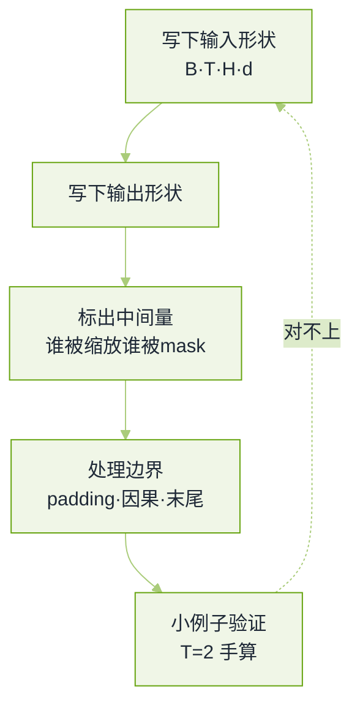

# 手撕代码与算法真题


**一句话**：手撕题判的不是能不能跑通，而是你对张量形状、边界条件和不确定性的处理有没有想过。


各家口径差别很大：海外实验室常写成「从实现讲起」的开放题（允许用 NumPy 或 PyTorch，也允许只写伪代码），国内大厂会明确点名「不许用高层封装」。题源与口径见本章[导读](README.md)。

## 形状先于算子

*《图：手撕的正确顺序是先钉形状再写算子——九成失败是从中间某步开始维度对不上，然后越改越乱》*

## Attention 家族

**1. 手写带因果掩码的缩放点积注意力。**

- 契约（先说清楚再动手）：输入 `Q, K, V` 形状 `B × T × d`，输出同形；`mask` 为上三角真值区（禁止看未来）；返回注意力权重供分析。
- 形状链：$$\text{softmax}\!\left(\frac{QK^{T}}{\sqrt{d}} + \text{mask}\right)V$$，其中被屏蔽位置在 softmax **之前**置为负无穷，而不是事后把输出置零。
- 三个必考点：除以 `√d` 的理由（方差随维度线性增长，不归一化会把 softmax 推到饱和区）、掩码要在归一化前施加、数值稳定（减去每行最大值，否则指数上溢）。
- 面试官接着问的一般是：`d_head` 与 `d` 的关系、为什么按头切而不是按 batch 切。
- 回看：[Transformer 架构详解](../03-llm/transformer-attention.md)

**2. 在上一题基础上实现多头注意力，然后改成 GQA。**

- 要点：多头是「投影到 `n_head × d_head` 后各头独立算，再拼接回 `d`」，不是并行调多次同一函数。
- 改动量要能讲清：MHA 每份 Q/K/V 都是 `n_head` 份；MQA 只有 1 份 K/V；GQA 是 `n_kv` 组，每组共享给若干 Q 头。所以代码里变的只是 K/V 的头数与「Q 头 → KV 组」的映射（整除即可）。
- 为什么值得做：解码期每步的显存与带宽由 K/V 决定，`n_kv` 直接就是 KV Cache 的倍率。
- 加分：能顺口说出 MLA 走的是另一条路（把 K/V 压到低秩潜空间再解压），而不是「更多的组」。

**3. 实现一个 KV Cache，并写单步解码。**

- 契约：缓存持有每层 `B × n_kv × (T-1) × d_head` 的 K 与 V；单步输入只有当前 token 的 Q。
- 要点：单步的 Q 形状是 `B × 1 × d`，与缓存拼接后长度变为 `T`；掩码退化成「全部可见」，因为缓存里没有未来。
- 最容易失分的两点：忘了缓存也要随序列增长而追加（而不是每步重算），以及**位置编码必须跟着步数走**——缓存复用了历史 K，位置信息得按绝对步号补上，否则相对位置错乱。
- 追问「前缀共享/分支怎么办」：分页缓存 + 引用计数 + 写时复制。
- 回看：[KV Cache 优化](../16-ai-infrastructure/inference-serving.md)

## 训练与损失

**4. 手写 DPO 的损失。**

- 要点：DPO 的巧妙处在于不训显式奖励模型，而是把奖励写成策略与参考策略的对数似然比：$$r(x,y)=\beta\log\frac{\pi_\theta(y\mid x)}{\pi_{\text{ref}}(y\mid x)}$$，代入偏好损失即得
  $$\mathcal{L}=-\log\sigma\!\left(\beta\big(\Delta_\theta^{w}-\Delta_\theta^{l}\big)\right)$$
  其中 `Δ` 是「策略减参考」的对数似然差。
- 实现上的真考点：`logprob` 要按**回答部分的 token 求和**（配合 loss mask），而不是取均值或算进 padding；`π_ref` 要冻结且不进梯度。
- 加分：能解释 `β` 的作用（对偏离参考模型的惩罚强度），以及它调错会看到什么症状（太大几乎不动，太小会把通用能力训崩）。
- 回看：[偏好对齐 DPO](../03-llm/rlhf-dpo-alignment.md)

**5. 用张量库实现 KL 散度；再推导并手写交叉熵。**

- 要点：KL 的两种写法要能互转（对数概率差与熵加交叉熵），且要说清方向——`KL(p‖q)` 对 `q` 漏掉 `p` 的模惩罚重，`KL(q‖p)` 反之。
- 真考点：`log_softmax` 之后再乘概率求和，**不要**先 `softmax` 再取 `log`（数值不稳）；以及「忽略位置」必须在归约前用 mask 屏蔽，否则均值被 padding 拉偏。
- 交叉熵推导：$$\text{CE}(p,q)=-\sum_i p_i\log q_i$$，标签为 one-hot 时退化成取正确类的那一项负对数概率——说出这一步，就等于说明为什么实现里只需要 `gather`。
- 追问「温度怎么进公式」：logits 先除温度再归一化，并在损失里保持同一温度（否则蒸馏时对不上）。

**6. 手写 MoE 的前向与负载均衡损失。**

- 要点：路由是「每 token 经门控取 top-$$k$$ 专家，输出按门控权重加权求和」；数据要按专家分桶再各自计算（dispatch / combine），这一步天然是 All-to-All。
- 负载均衡损失的思路：一项鼓励「各专家接收的 token 数均匀」（用路由概率的批均值乘该专家被选中的比例），与主损失相加，权重通常很小但不可省。
- 专家坍缩怎么发生：早期随机让某专家多拿 token → 它梯度更多 → 更常被选中，正反馈锁死；负载均衡项与（部分方案里的）噪声/容量因子就是为打断这个反馈。
- 加分：能指出 MoE 的显存按总参数、计算按激活参数。

**7. 手写 softmax 与采样（贪心、beam、top-k、top-p）。**

- 要点：softmax 一定要减最大值；采样要在**过滤后重新归一化**，否则概率和不为 1。
- 各策略失效模式：贪心易重复 loops；beam 在开放式生成里会退化成保守平均；top-k 的 `k` 对尖锐/平坦分布含义完全不同（这是它被 top-p 取代的主因）；温度 > 1 会把噪声抬进有效区。
- 高频追问：`do_sample=False` 时温度还有没有用（没有），以及为什么同一 `seed` 也复现不出（批形状与核选择的不确定性、浮点归约顺序）。

## 系统与工程实现

**8. 实现令牌桶限流器，然后把它做成分布式。**

- 要点：单机版核心是「按时间补充 + 请求时扣减」，不要用定时任务去回填（时钟抖动会漂）；要能同时支持突发与平滑两种语义，并说清差别。
- 分布式的三个真问题：状态放哪（集中式存储的读放大）、时钟怎么对齐（不要用各节点本地时间推补充量）、失败时偏保守还是偏宽松（限流器挂了应放行还是应拒绝，取决于保护的是谁）。
- 变体（各家面过）：**滑动窗口**且线程安全——要点是窗口按时间桶存计数，读写都要在锁内或使用无锁结构；以及「同 key 串行、不同 key 并行」的执行器，用 per-key 队列 + 有限 worker。
- 变体：对 5 万份文档跑 LLM 调用，接口允许约 100 并发，会返回 429 与超时。要点是并发闸门（信号量）+ 指数退避并带抖动 + 尊重响应头里的重试提示 + 幂等键避免重复计费 + 进度可断点续跑；错误分类（可重试/不可重试）是这题的判分点。
- 回看：[错误处理与重试](../11-engineering/error-handling-retry-fallback.md)

**9. 写一个最小 Agent 循环：工具派发、错误处理、步数预算。**

- 契约：输入目标与工具表，循环直到给出最终回答或触发预算（步数、token、墙钟任一）。
- 骨架分五段：装配上下文 → 判熔断 → 模型决策 → 解析并派发工具 → 把观察写回。熔断必须在发请求**之前**。
- 判分点：工具调用不合法（名字不存在/参数不合 schema）时的修回路（把校验错误作为观察回喂一次，而不是抛异常终止）、观察过长要截断、同一个工具反复同样失败要识别为震荡并升级。
- 这题在本书已有完整版本，直接照它写：[最小 Agent 循环](../02-agent-basics/what-is-agent.md)

**10. 数值与手感小题：`sqrt(x)` 保留 6 位小数。**

- 要点：牛顿迭代或二分都行，考的是**收敛判据怎么写**（相对误差还是绝对误差、迭代上限、`x<1` 时初值取法）与定点输出的舍入。
- 这类题的失分几乎都在边界：`x=0`、负数、极小值、以及「保留 6 位」是舍入还是截断——先问清再写。

## 通用题池与追问

**11. 三数之和：找出所有和为 0 且不重复的三元组。**

- 契约：输入含重复元素的整数数组，输出是**去重后**的全部三元组；先问清「顺序不同的同一组算不算重复」。
- 要点：排序后固定第一元、对剩下的一段走双指针，时间 $$O(n^{2})$$。判分点全在去重的三处——第一元跳过与前一个相同的值、找到解之后左指针跳过重复、右指针同样跳过；少写一处，输出里就会出现重复三元组。
- 边界：长度小于 3 直接返回空；全零数组只能有一组解；提前剪枝（最小的三个之和已经大于 0 就 break）常被追问「它影响复杂度吗」——影响常数，不影响最坏阶。
- 面试官在等：你写完主动跑一个「带重复」的用例，而不是等他提醒。

**12. 两个有序数组的交集，如果重复元素也要按出现次数计入呢？**

- 要点：双指针版本要按 min(两侧计数) 产出，并在一次匹配后同时前移；用哈希计数的版本要说清「谁建表、为什么建在短的那个上」。
- 追问（大厂真考过）：两个数组大到一个装不进内存、甚至长成无法整体排序的无限流怎么办——这时只能分批归并加有界缓冲，代价是必须接受**漏报**或者推迟结果；说清「哪种误差可以接受」比写代码更重要。
- 常见失分：把「交集」写成「并集」的指针推进；或者对空数组与无交集时返回了 `None` 而不是空集合。

**13. 岛屿数量：由 0 与 1 组成的网格，数连通块。**

- 要点：DFS/BFS/并查集都行，判分在**标记方式**——要么原地把访问过的 1 改成别的值，要么开一张 visited 表；不标记就会重复计数，标错了位置（比如标了水）就会漏。
- 必须主动说的两点：递归深度（最坏是整片陆地，网格一万行就能把栈打爆，所以生产写法要换 BFS 或显式栈）与斜向是否连通（题意只给四方向，动手前先确认）。
- 追问「让你数**不同形状**的岛屿」：把每个岛相对其最左上角归一化成坐标序列，再放进集合去重——这一步考的是「等价类怎么表示」。

**14. 编辑距离与零钱兑换：两个 DP 各自的状态怎么定义？**

- 要点：编辑距离的状态是「`word1` 前 $$i$$ 个变成 `word2` 前 $$j$$ 个的最少操作数」，判分在初始化——第 0 行与第 0 列是「空串到前缀」的真实语义（插入或删除全部），填 0 是错的；替换只在两字符不同时才计代价。
- 零钱兑换求**最少**硬币数：状态是「凑出金额 $$j$$ 的最少枚数」，不可达要显式初始化为一个大于任何解的哨兵值，返回前再判断；追问「改成有多少种凑法」就是换递推的累加号，同时要注意组合与排列的口径差（外层循环谁在内侧决定会不会把同一组合数多次）。
- 面试官在等：你能不能报出「时间 $$O(mn)$$、空间可压到 $$O(\min(m,n))$$」这一句，并说清压空间时那个 prev 变量为什么不能省。

**15. LRU 缓存的实现原理；顺带：布隆过滤器和 Bitmap 各自的陷阱。**

- 要点：LRU 是「哈希表定位 + 双向链表保序」，两边合起来才让 get 与 put 都是 $$O(1)$$；双向链表的价值在于能 O(1) 摘掉任意中间节点。
- 判分点：命中和写入**都**要把节点移到头部（含 key 已存在的情况）、容量为 0 的行为、淘汰时是否要回调、以及 Redis 用的是「近似 LRU」（采样淘汰）而不是严格双链表——把这层区别说出口通常是加分项。
- 布隆过滤器：位数组加 $$k$$ 个哈希，判「不存在」一定不存在、判「存在」可能假阳性；普通版不能删除（多个元素共享同一位），要删就换计数版，空间代价更高。适用面是「预判式过滤」：缓存穿透防护、去重、黑名单粗筛。
- Bitmap 的陷阱在值域：按取值域分配位置，$$U$$ 个不同整数值约需 $$M=\lceil U/8\rceil$$ 字节——值域大而稀疏时「省空间」立刻变成爆空间，要换稀疏位图或哈希集合。
- 同场的链表小题（反转链表也真考过）：判分点是**改向的顺序**——先把 next 存下来再断链，顺序写反就丢后半段；递归版要说清栈深与返回值接法，虚拟头节点（dummy）用在「头可能变」的场合。
- 回看：[缓存与成本优化](../11-engineering/caching-cost-optimization.md)

**16. 令牌桶追问三连：Redis 里怎么实现精确滑动窗口？高 QPS 怎么办？窗口边界有什么问题？**

- 要点：精确实现用有序集合——score 存请求时间戳、member 存请求标识，一次请求里先删窗口外的（按分数区间裁剪）、再数窗口内的、没超限才写入并设过期；这几步必须**放在一段脚本里原子执行**，否则并发下会超卖。
- 高 QPS 换近似：哈希表按时间桶计数（字段是秒级时间戳，值是该桶计数），内存可控但精度取决于桶粒度；用 List 或 Stream 也能做日志，但「按时间范围删 + 计数」这两件事就是有序集合最顺手。
- 窗口边界的真问题：固定窗口在边界处会放过双倍流量，滑动桶把突刺摊平但仍有粒度误差；越界的那一秒要不要计入上一窗口，是口径问题不是代码问题。
- 最后那问必须答对：限流器自身故障时放行还是拒绝（fail-open 还是 fail-closed），取决于它保护的是谁——保护下游容量就拒绝，保护业务可用性就放行并降级。
- 回看：[模型网关](../16-ai-infrastructure/model-gateway.md)

**17. 「手写完整的多头注意力，不能只写框架」——这句话到底在判什么？**

- 要点：只投影、调一次注意力、再输出投影的骨架不算完成。判分在四处：头怎么切与怎么合（转置后变形是否连续，那本账在[推理与服务化真题](inference-serving.md)第 14 题）、缩放与掩码在归一化**之前**、数值稳定（减行最大值）、以及 Q 与 K/V 的长度可以不同（交叉注意力、解码单步都靠这一条）。
- 用两条断言证明掩码真的生效：内部断言看权重矩阵——每行之和为 1（归一化生效），且上三角那些被屏蔽的位置严格为 0（非负项的和为 0 就等于每一项都是 0）；后果断言看输出——把某一行的未来 token 换成随机值重跑，当前步的输出必须逐元素不变。一个查实现、一个查语义，只写其中一个都算没证完。
- 追问「batch 维和 head 维谁在外」：说清你选的布局并把每一步的形状念出来，这一步比代码更像判分点。
- 加分：把 GQA 的改动说出来就两句——K/V 的头数变成 $$n_{kv}$$，Q 头到 KV 组用整除映射。

**18. 线性回归用 SGD：更新公式怎么推、怎么写？顺带：交叉熵为什么配 softmax。**

- 要点：损失取均值 $$L=\frac{1}{n}\sum_i(\theta^{\mathsf T}x_i-y_i)^2$$，对 $$\theta$$ 求导得到每样本 2 倍残差乘特征再平均，更新就是参数减去学习率乘该梯度。
- 判分在四个口径：损失常被写成 $$L=\frac{1}{2n}\sum_i(\theta^{\mathsf T}x_i-y_i)^2$$，那个 $$\frac{1}{2}$$ 只为把导数里的 2 消掉，不改变最优解；用求和还是均值（学习率不可跨口径迁移，换批大小就等于换了学习率）；偏置项通常不进正则；特征不标准化会让 SGD 沿长轴震荡。
- 交叉熵配 softmax 的梯度干净到反常：$$\nabla_z\,\text{CE}=\hat{p}-p$$，预测减真值——这就是为什么实现里不需要显式求导，也是它常和线性回归一起问的原因（同属「极大似然 vs 最小二乘」这个家族）。
- 追问：MSE 对离群点敏感怎么办（换 Huber）、以及手写时为什么不能先算完整平方再除（数值与规约顺序）。

**19. 实现一个管理 Agent 状态的有限状态机：INIT、PLANNING、EXECUTING、CHECKING、COMPLETED、FAILED。**

- 契约：先列三样东西再动手——状态集合、事件集合、合法转移表；副作用（记日志、发指标）单独说，别混在转移里。
- 转移表要含这几条：校验通过进 PLANNING、计划非法进 FAILED、工具完成进 CHECKING、**可恢复错误且重试预算未耗尽时 EXECUTING 自环**、CHECKING 判定需要下一步时回 PLANNING 或 EXECUTING、终态不可静默跳出（补偿或重启必须是显式事件）。
- 判分点：非法转换要**显式抛错**，而不是返回原状态假装没事；并发下用 compare-and-set 或条件更新保证一次事件只被消费一次；每次转移记录旧状态、事件、操作者、任务版本、时间与错误。
- 边界要说清：状态机只回答「现在处于哪一步、哪些事件合法」，它不解决工具幂等、分布式一致性和最终结果正确性；取消（CANCELED）应与失败（FAILED）分开建模，否则「用户主动停」会污染错误统计。
- 回看：[状态机与事件驱动](../11-engineering/state-machine-event-driven.md)

## 常见误区

- ❌ 上来就写算子，不先声明形状与契约：面试官看不到你的边界思考。
- ❌ 事后把被屏蔽位置的注意力输出置零：softmax 已经把它混进了归一化。
- ❌ 用 `log(softmax(x))`：数值不稳，用 `log_softmax`。
- ❌ KV Cache 只缓存数值不管位置：相对位置错乱的表现是「训练正常、上线胡说」。
- ❌ 分布式限流用本地时钟推补充量：节点间时钟差会让配额抖动。
- ❌ 通用题只做对不报口径：去重规则、迭代深度、返回空集合还是 None、求和还是均值，这四类口径才是判分点。
- ❌ 状态机把非法转换写成「保持原状态」：静默吞掉等于把 bug 藏进生产；抛错与记录才是可诊断的实现。

## 参考资料

- [AI Engineering 面试题库（按公司标注的候选人转述）](https://github.com/pallavi-shekhar/ai-engineering-interview-questions-company-wise)
- [AgentGuide 手撕题库](https://github.com/adongwanai/AgentGuide/blob/main/docs/04-interview/22-algorithm-ai-coding-question-bank.md)
- [AIGC-Interview-Book：通用 AIGC 算法岗高频面试题（大厂高频手撕算法题与经典题池）](https://github.com/WeThinkIn/AIGC-Interview-Book/blob/main/%E5%A4%A7%E5%8E%82%E9%AB%98%E9%A2%91%E9%9D%A2%E8%AF%95%E9%A2%98%EF%BC%88%E5%AE%9E%E6%97%B6%E6%9B%B4%E6%96%B0%EF%BC%89/%E9%80%9A%E7%94%A8AIGC%E7%AE%97%E6%B3%95%E5%B2%97%E9%AB%98%E9%A2%91%E9%9D%A2%E8%AF%95%E9%A2%98.md)
- [AIGC-Interview-Book：字节跳动高频面试题（Redis 滑动窗口限流、LRU、布隆过滤器、Bitmap、SGD 与交叉熵）](https://github.com/WeThinkIn/AIGC-Interview-Book/blob/main/%E5%A4%A7%E5%8E%82%E9%AB%98%E9%A2%91%E9%9D%A2%E8%AF%95%E9%A2%98%EF%BC%88%E5%AE%9E%E6%97%B6%E6%9B%B4%E6%96%B0%EF%BC%89/%E5%AD%97%E8%8A%82%E8%B7%B3%E5%8A%A8%E9%AB%98%E9%A2%91%E9%9D%A2%E8%AF%95%E9%A2%98.md)
- [AIGC-Interview-Book：DeepSeek 高频面试题（手写完整多头注意力、Agent 状态机 FST）](https://github.com/WeThinkIn/AIGC-Interview-Book/blob/main/%E5%A4%A7%E5%8E%82%E9%AB%98%E9%A2%91%E9%9D%A2%E8%AF%95%E9%A2%98%EF%BC%88%E5%AE%9E%E6%97%B6%E6%9B%B4%E6%96%B0%EF%BC%89/DeepSeek%E9%AB%98%E9%A2%91%E9%9D%A2%E8%AF%95%E9%A2%98.md)
- [牛客面经：百度大模型面经（手撕与算法）](https://www.nowcoder.com/discuss/927018114900922368)
- [小林大模型面试笔记](https://xiaolinnote.com/ai/)

## 相关知识点

- [20 面试真题 · 本章导读](README.md)
- [训练与对齐真题](training-alignment.md)
- [大模型基础真题](llm-foundations.md)
- [Agent 工程真题](agent-engineering.md)
- [岗位分档与转岗真题](career-tracks.md)
