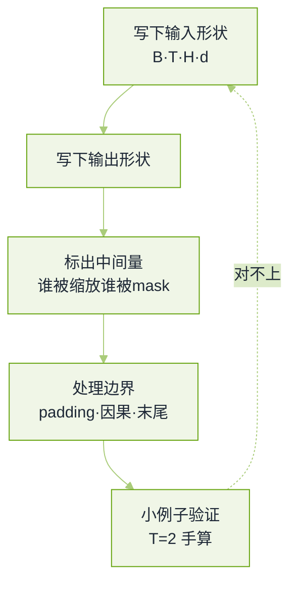

# 手撕代码与算法真题


**一句话**：手撕题判的不是能不能跑通，而是你对张量形状、边界条件和不确定性的处理有没有想过。


各家口径差别很大：海外实验室常写成「从实现讲起」的开放题（允许用 NumPy 或 PyTorch，也允许只写伪代码），国内大厂会明确点名「不许用高层封装」。题源与口径见本章[导读](README.md)。

## 形状先于算子

*《图：手撕的正确顺序是先钉形状再写算子——九成失败是从中间某步开始维度对不上，然后越改越乱》*

## Attention 家族

**1. 手写带因果掩码的缩放点积注意力。**

- 契约（先说清楚再动手）：输入 `Q, K, V` 形状 `B × T × d`，输出同形；`mask` 为上三角真值区（禁止看未来）；返回注意力权重供分析。
- 形状链：$$\text{softmax}\!\left(\frac{QK^{T}}{\sqrt{d}} + \text{mask}\right)V$$，其中被屏蔽位置在 softmax **之前**置为负无穷，而不是事后把输出置零。
- 三个必考点：除以 `√d` 的理由（方差随维度线性增长，不归一化会把 softmax 推到饱和区）、掩码要在归一化前施加、数值稳定（减去每行最大值，否则指数上溢）。
- 面试官接着问的一般是：`d_head` 与 `d` 的关系、为什么按头切而不是按 batch 切。
- 回看：[Transformer 架构详解](../03-llm/transformer-attention.md)

**2. 在上一题基础上实现多头注意力，然后改成 GQA。**

- 要点：多头是「投影到 `n_head × d_head` 后各头独立算，再拼接回 `d`」，不是并行调多次同一函数。
- 改动量要能讲清：MHA 每份 Q/K/V 都是 `n_head` 份；MQA 只有 1 份 K/V；GQA 是 `n_kv` 组，每组共享给若干 Q 头。所以代码里变的只是 K/V 的头数与「Q 头 → KV 组」的映射（整除即可）。
- 为什么值得做：解码期每步的显存与带宽由 K/V 决定，`n_kv` 直接就是 KV Cache 的倍率。
- 加分：能顺口说出 MLA 走的是另一条路（把 K/V 压到低秩潜空间再解压），而不是「更多的组」。

**3. 实现一个 KV Cache，并写单步解码。**

- 契约：缓存持有每层 `B × n_kv × (T-1) × d_head` 的 K 与 V；单步输入只有当前 token 的 Q。
- 要点：单步的 Q 形状是 `B × 1 × d`，与缓存拼接后长度变为 `T`；掩码退化成「全部可见」，因为缓存里没有未来。
- 最容易失分的两点：忘了缓存也要随序列增长而追加（而不是每步重算），以及**位置编码必须跟着步数走**——缓存复用了历史 K，位置信息得按绝对步号补上，否则相对位置错乱。
- 追问「前缀共享/分支怎么办」：分页缓存 + 引用计数 + 写时复制。
- 回看：[KV Cache 优化](../16-ai-infrastructure/inference-serving.md)

## 训练与损失

**4. 手写 DPO 的损失。**

- 要点：DPO 的巧妙处在于不训显式奖励模型，而是把奖励写成策略与参考策略的对数似然比：$$r(x,y)=\beta\log\frac{\pi_\theta(y\mid x)}{\pi_{\text{ref}}(y\mid x)}$$，代入偏好损失即得
  $$\mathcal{L}=-\log\sigma\!\left(\beta\big(\Delta_\theta^{w}-\Delta_\theta^{l}\big)\right)$$
  其中 `Δ` 是「策略减参考」的对数似然差。
- 实现上的真考点：`logprob` 要按**回答部分的 token 求和**（配合 loss mask），而不是取均值或算进 padding；`π_ref` 要冻结且不进梯度。
- 加分：能解释 `β` 的作用（对偏离参考模型的惩罚强度），以及它调错会看到什么症状（太大几乎不动，太小会把通用能力训崩）。
- 回看：[偏好对齐 DPO](../03-llm/rlhf-dpo-alignment.md)

**5. 用张量库实现 KL 散度；再推导并手写交叉熵。**

- 要点：KL 的两种写法要能互转（对数概率差与熵加交叉熵），且要说清方向——`KL(p‖q)` 对 `q` 漏掉 `p` 的模惩罚重，`KL(q‖p)` 反之。
- 真考点：`log_softmax` 之后再乘概率求和，**不要**先 `softmax` 再取 `log`（数值不稳）；以及「忽略位置」必须在归约前用 mask 屏蔽，否则均值被 padding 拉偏。
- 交叉熵推导：$$\text{CE}(p,q)=-\sum_i p_i\log q_i$$，标签为 one-hot 时退化成取正确类的那一项负对数概率——说出这一步，就等于说明为什么实现里只需要 `gather`。
- 追问「温度怎么进公式」：logits 先除温度再归一化，并在损失里保持同一温度（否则蒸馏时对不上）。

**6. 手写 MoE 的前向与负载均衡损失。**

- 要点：路由是「每 token 经门控取 top-$$k$$ 专家，输出按门控权重加权求和」；数据要按专家分桶再各自计算（dispatch / combine），这一步天然是 All-to-All。
- 负载均衡损失的思路：一项鼓励「各专家接收的 token 数均匀」（用路由概率的批均值乘该专家被选中的比例），与主损失相加，权重通常很小但不可省。
- 专家坍缩怎么发生：早期随机让某专家多拿 token → 它梯度更多 → 更常被选中，正反馈锁死；负载均衡项与（部分方案里的）噪声/容量因子就是为打断这个反馈。
- 加分：能指出 MoE 的显存按总参数、计算按激活参数。

**7. 手写 softmax 与采样（贪心、beam、top-k、top-p）。**

- 要点：softmax 一定要减最大值；采样要在**过滤后重新归一化**，否则概率和不为 1。
- 各策略失效模式：贪心易重复 loops；beam 在开放式生成里会退化成保守平均；top-k 的 `k` 对尖锐/平坦分布含义完全不同（这是它被 top-p 取代的主因）；温度 > 1 会把噪声抬进有效区。
- 高频追问：`do_sample=False` 时温度还有没有用（没有），以及为什么同一 `seed` 也复现不出（批形状与核选择的不确定性、浮点归约顺序）。

## 系统与工程实现

**8. 实现令牌桶限流器，然后把它做成分布式。**

- 要点：单机版核心是「按时间补充 + 请求时扣减」，不要用定时任务去回填（时钟抖动会漂）；要能同时支持突发与平滑两种语义，并说清差别。
- 分布式的三个真问题：状态放哪（集中式存储的读放大）、时钟怎么对齐（不要用各节点本地时间推补充量）、失败时偏保守还是偏宽松（限流器挂了应放行还是应拒绝，取决于保护的是谁）。
- 变体（各家面过）：**滑动窗口**且线程安全——要点是窗口按时间桶存计数，读写都要在锁内或使用无锁结构；以及「同 key 串行、不同 key 并行」的执行器，用 per-key 队列 + 有限 worker。
- 变体：对 5 万份文档跑 LLM 调用，接口允许约 100 并发，会返回 429 与超时。要点是并发闸门（信号量）+ 指数退避并带抖动 + 尊重响应头里的重试提示 + 幂等键避免重复计费 + 进度可断点续跑；错误分类（可重试/不可重试）是这题的判分点。
- 回看：[错误处理与重试](../11-engineering/error-handling-retry-fallback.md)

**9. 写一个最小 Agent 循环：工具派发、错误处理、步数预算。**

- 契约：输入目标与工具表，循环直到给出最终回答或触发预算（步数、token、墙钟任一）。
- 骨架分五段：装配上下文 → 判熔断 → 模型决策 → 解析并派发工具 → 把观察写回。熔断必须在发请求**之前**。
- 判分点：工具调用不合法（名字不存在/参数不合 schema）时的修回路（把校验错误作为观察回喂一次，而不是抛异常终止）、观察过长要截断、同一个工具反复同样失败要识别为震荡并升级。
- 这题在本书已有完整版本，直接照它写：[最小 Agent 循环](../02-agent-basics/what-is-agent.md)

**10. 数值与手感小题：`sqrt(x)` 保留 6 位小数。**

- 要点：牛顿迭代或二分都行，考的是**收敛判据怎么写**（相对误差还是绝对误差、迭代上限、`x<1` 时初值取法）与定点输出的舍入。
- 这类题的失分几乎都在边界：`x=0`、负数、极小值、以及「保留 6 位」是舍入还是截断——先问清再写。

## 常见误区

- ❌ 上来就写算子，不先声明形状与契约：面试官看不到你的边界思考。
- ❌ 事后把被屏蔽位置的注意力输出置零：softmax 已经把它混进了归一化。
- ❌ 用 `log(softmax(x))`：数值不稳，用 `log_softmax`。
- ❌ KV Cache 只缓存数值不管位置：相对位置错乱的表现是「训练正常、上线胡说」。
- ❌ 分布式限流用本地时钟推补充量：节点间时钟差会让配额抖动。

## 参考资料

- [AI Engineering 面试题库（按公司标注的候选人转述）](https://github.com/pallavi-shekhar/ai-engineering-interview-questions-company-wise)
- [AgentGuide 手撕题库](https://github.com/adongwanai/AgentGuide/blob/main/docs/04-interview/22-algorithm-ai-coding-question-bank.md)
- [牛客面经：百度大模型面经（手撕与算法）](https://www.nowcoder.com/discuss/927018114900922368)
- [小林大模型面试笔记](https://xiaolinnote.com/ai/)

## 相关知识点

- [20 面试真题 · 本章导读](README.md)
- [训练与对齐真题](training-alignment.md)
- [大模型基础真题](llm-foundations.md)
- [Agent 工程真题](agent-engineering.md)
- [岗位分档与转岗真题](career-tracks.md)
