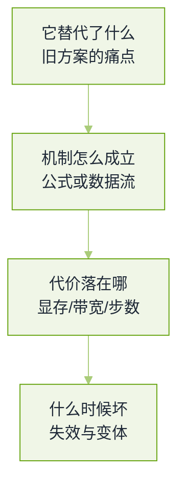

# 大模型基础真题


**一句话**：基础轮考的不是「知不知道这个名字」，而是能不能把一个结构讲成三段：它解决什么问题、代价落在哪一层硬件或哪一项计算上、失效模式是什么。


这一页的题全部来自公开题库与候选人面经（本章[题源与口径](README.md)）。同一道题在不同公司会换一种问法，所以每题除了答题要点，还标了**面试官在等什么信号**——那就是评分点，而不是措辞。

## 答题的四层展开

*《图：基础题的通用答题骨架——只讲第一层是背书，讲到第三层才算用过，第四层区分「做过」与「做过并且踩过」》*

## 注意力与位置

**1. 为什么 $$QK^\top$$ 要除以 $$\sqrt{d_k}$$，不除会怎样？**（出现频次最高的结构题）

- 要点：若 $$q$$、$$k$$ 各维近似零均值单位方差，点积的方差是 $$d_k$$，不缩放则 logit 的尺度随维度线性放大；softmax 在大 logit 区间几乎退化成 one-hot，梯度趋零。
- 除完之后方差回到 1，注意力分布在训练早期才留在有梯度的区域。
- 面试官在等：能把「缩放」和「梯度消失/饱和」连起来，而不是只说「防止数值过大」。
- 回看：[Transformer 注意力机制](../03-llm/transformer-attention.md)

**2. 自注意力的复杂度是多少？上下文变长之后你有哪些选择？**（OpenAI 问过）

- 要点：时间 $$O(n^2 d)$$、显存 $$O(n^2)$$（朴素实现），KV Cache 是 $$O(n)$$ 每层。
- 四条路：IO 友好的精确注意力（FlashAttention 一族）、稀疏/滑窗局部注意力、低秩压缩（MQA/GQA/MLA）、以及外接检索把送入模型的 $$n$$ 压小。
- 加分：说明「长上下文不等于有效上下文」——窗口标称 128K 与中段信息真能被调用是两件事。
- 回看：[长上下文退化与有效上下文窗口](../06-memory-rag/long-context-degradation.md)

**3. MHA、MQA、GQA 在推理阶段的差别到底在哪？MLA 又改了什么？**

- 要点：三者查询头数一样，**键值头数**不一样。KV 头从 $$h$$ 降到 1（MQA）或降到 $$g$$（GQA），decode 阶段每步要读的 KV 字节数按比例下降，显存带宽是这一阶段的瓶颈，所以吞吐涨。
- 代价：共享 KV 头会掉一点质量，折中点是 GQA。
- MLA 的做法不是少存几个头，而是把 K/V 压成低秩潜变量再缓存，配合解耦的位置键，缓存占用降到远低于 GQA 的量级——它服务的是「超长上下文 + 高并发」而不是「训练更快」。
- 面试官在等：能把「省的是带宽/显存」讲出来，而不是「效果更好」。
- 回看：[推理服务化](../16-ai-infrastructure/inference-serving.md)

**4. RoPE 为什么能实现相对位置编码？位置编码一共演进到哪了？**

- 要点：RoPE 按位置给 $$q$$、$$k$$ 的每一对维度乘一个旋转角 $$m\theta$$，于是内积只依赖 $$m-n$$ 的差；不需要额外参数。
- 演进链：正弦绝对位置 → 可学习绝对位置（长度外推差）→ RoPE（相对性 + 可缩放）→ ALiBi（在 logit 上加距离惩罚，外推稳但长距检索吃亏）。
- 加分：能讲清「把窗口从 4K 拉到 128K」的三种做法——位置插值、NTK-aware 基频缩放、YaRN 式分频段缩放，都动的是基频而不是权重。
- 回看：[Token、Embedding 与上下文窗口](../03-llm/token-embedding-context.md)

**5. Pre-norm 和 Post-norm 的区别？LayerNorm 沿哪个维度归一化？**

- 要点：Post-norm 在残差相加之后再归一化（2017 原版），Pre-norm 把归一化搬进分支内，残差主干保持畅通，深层网络不用长 warmup 也能稳定，代价是等效深度利用略低。
- LayerNorm 沿**特征维**（每个 token 自己的 $$d$$ 维）归一化，不跨 token，因此与批大小、序列长度无关。
- 追问常落在 RMSNorm：去掉均值中心化只用均方根缩放，效果接近、算子更省。

**6. FFN 为什么先升维再降维？**

- 要点：升维提供非线性与「键值记忆」容量，降维把结果投影回残差流的宽度，保证堆叠与残差相加成立。
- 加分：SwiGLU 需要三个矩阵（gate、up、down），所以隐藏维常按 $$8/3$$ 倍而非 4 倍取，才能和同参数量对齐。
- 为什么不用 RNN 而用 Transformer？因为任意两位置的路径长度是常数、且训练时按位置并行，见下一题。

**7. 为什么 Decoder-only 成为主流？**

- 要点：训练目标单一（下一 token 预测），可无监督扩数据；不需要编码器-解码器对齐结构，规模化时工程简单；同一模型既生成也可通过提示承担理解任务。
- 诚实的另一面：Encoder-decoder 在 seq2seq 与语音这类输入输出模态不同的任务上仍然合理，不是历史垃圾。
- 回看：[LLM 是什么](../03-llm/what-is-llm.md)

## 推理与显存

**8. KV Cache 的原理、显存怎么算，为什么只缓存 K 和 V 不缓存 Q？**

- 要点：自回归解码时历史 token 的 $$k$$、$$v$$ 不再变化，重算是纯浪费；$$q$$ 只服务于「当前这一步的新 token」，用完即弃，缓存它没有意义。
- 量级：$$\text{bytes}=2\times n_{layer}\times n_{kv}\times d_{head}\times s\times b$$，前面的 2 是 K 与 V 两份。面试时能手算一个具体模型（比如 32 层、8 个 KV 头、每头 128 维、32K 上下文、FP16）就够了。
- 结论要落到决策上：长上下文下 KV Cache 会先于权重变成显存主项，所以并发数、量化、分页分配都是围绕它做的。
- 回看：[缓存与成本优化](../11-engineering/caching-cost-optimization.md)

**9. FlashAttention 不减少 FLOPs，为什么还快？**

- 要点：它优化的是显存层级之间的搬运。朴素实现要把 $$n\times n$$ 的注意力矩阵写回高带宽显存再读回来，FlashAttention 把 Q/K/V 分块装进 SRAM，用在线 softmax 边算边归一化，不落整个矩阵。
- FLOPs 甚至因为重算而略增，但 HBM 访问从 $$O(n^2)$$ 降到 $$O(n)$$ 量级的分块读写，所以墙上时间下降。
- 面试官在等：把「快」归因到带宽而不是算力，这是这一行的基本世界观。
- 回看：[模型网关](../16-ai-infrastructure/model-gateway.md)

**10. Prefill 与 Decode 两个阶段，为什么一个吃算力、一个吃带宽？**

- 要点：prefill 一次吞下 $$n$$ 个 token，矩阵乘的批维很大，是计算受限；decode 每步只有一个 query，权重要整份过一遍而结果只有 1 个 token，是显存带宽受限。
- 后果：两阶段的延迟特性、批处理策略、抢占与容量规划都不同，混在一起会互相拖慢——这就是分离式部署（PD 分离）的动机。
- 加分：能说出前缀缓存命中改变的是 prefill 的量，而不是 decode 的量。
- 回看：[前缀缓存与上下文工程](../16-ai-infrastructure/prefix-cache-context-engineering.md)

## 结构与数据

**11. BPE 是怎么工作的？它的失效模式有哪些？**

- 要点：从字符开始，按语料统计反复合并最高频相邻对，得到子词表；编码是贪心应用合并规则。
- 失效：数字被切成不规则片段导致算术靠「看串」；代码缩进与常见符号爆炸成多 token；非拉丁文种（尤其中文、天城文）token 成本显著更高，同样上下文窗口容纳的实际信息更少。
- 追问会问「为什么多语言模型换分词器能涨点」，答案就在这一条的成本差异上。
- 回看：[Token、Embedding 与上下文窗口](../03-llm/token-embedding-context.md)

**12. MoE 为什么能在不加 FLOPs 的前提下扩容量？负载均衡损失怎么推导，专家坍缩怎么避免？**

- 要点：每 token 只激活 top-$$k$$ 个专家，参数量随专家数涨、每 token 计算量不变。
- 路由是离散选择，无法直接反传，所以用一条辅助损失把「各专家被选中的比例」推向均匀；DeepSeek 一族的做法还包括细粒度专家切分、共享专家承接公共知识、以及不用辅助损失而改用可学习偏置来调节均衡。
- 专家坍缩的表现：少数专家吸收几乎所有流量，其余专家欠训练，训练损失看着还行但容量浪费了——所以要看路由器统计而不是只看 loss。
- 部署追问「235B MoE 要多少卡」：权重显存决定下限，激活专家决定带宽，通信走 All-to-All 决定拓扑要求。
- 回看：[2026 前沿模型地图](../18-frontier-2026/frontier-models-2026.md)

**13. Chinchilla 的缩放定律说了什么，和更早的直觉差在哪？**

- 要点：固定算力预算下，参数量与训练 token 数应大致同倍率增长；早期工作的直觉是「优先堆参数」，于是模型普遍过大、数据过少。
- 实际后果：同样算力下训一个更小的模型更久，效果更好——这直接支撑了后来「参数不再线性增长、数据与推理算力持续增长」的路线。
- 加分：说清缩放定律是拟合出来的经验外推，超过一个数量级就会失真，别把它当物理定律讲。

**14. 超长上下文业界怎么做？Lost in the Middle 为什么出现？**

- 要点：位置外推（插值/基频缩放）、注意力稀疏化、长上下文继续预训练 + 位置感知的指令微调、以及数据侧构造长距离依赖任务。
- 现象解释：训练数据里证据通常在开头或结尾，模型学到的是位置先验而不是内容相关性；再加上注意力在长序列上的分配被稀释。
- 工程结论：把最关键的约束放头尾、中间塞检索证据，比指望「窗口够大就都行」有效。
- 回看：[长上下文退化与有效上下文窗口](../06-memory-rag/long-context-degradation.md)

**15. Llama 一系为什么选 GQA + RoPE + SwiGLU 而不是 2017 原版结构？**

- 要点：三个选择各自回答一个问题——GQA 回答「推理成本怎么降」，RoPE 回答「相对位置与长度外推」，SwiGLU 回答「同参数量下怎么换质量」；再配 Pre-Norm、RMSNorm、无偏置矩阵，共同点是都为规模化训练与低成本推理服务。
- 面试官在等：把结构选择和**部署后果**连起来讲，而不是罗列名词。

## 采样与数值

**16. 贪心、beam、top-k、top-p、temperature 各自什么时候坏？**

- 要点：贪心/低温稳定但易重复退化；beam search 在开放生成上过于确定（适合翻译、ASR 这类有唯一目标的任务）；top-$$k$$ 用固定条数，在分布平坦段留下噪声、在尖峰段砍掉合理候选；top-$$p$$ 按累计概率自适应更稳，但两者都不治重复。
- 加分：说出实践组合——中等温度 + top-p + 重复惩罚，以及「工具参数用低温、头脑风暴用高温」这种按调用点分档的思路。
- 回看：[推理预算与测试期计算](../04-prompt-reasoning/test-time-compute-reasoning-budget.md)

**17. FP16、BF16、FP8、INT8、INT4、FP4，逐级往下什么先坏？**

- 要点：FP16 指数位窄，梯度与激活容易溢出，需要损失缩放；BF16 用 8 位指数保住动态范围，精度位少，成为训练默认；FP8 分 E4M3 与 E5M2 两种，用于不同张量并需要缩放管理；INT8/INT4 是定点，必须靠校准或平滑把离群值压住。
- 先坏的东西有规律：**长程推理、数学、多语言**掉得最快，短答案问答几乎无感——因为这几类依赖精细的注意力分数与长链误差不累积。
- 补偿手段：GPTQ 类用二阶信息逐层补偿量化误差，AWQ 类识别并保护显著权重通道，QLoRA 用 4 位基座 + 双重量化 + 分页优化器把单卡微调变成可能。
- 追问「量化后理解能力下降怎么办」：先量是哪一类任务退化，再考虑只量化非敏感层、提高 KV 精度或换更小的压缩比。
- 回看：[推理量化与部署](../03-llm/inference-quantization-deployment.md)

## 开放题

**18. 你觉得大模型的上限在哪里？**（近一年出现频率上升）

- 这不是送分题，是要看你的世界观是否自洽。可以站得住的答法：承认三条约束同时存在——高质量文本数据接近用完、单一「下一 token 预测」目标带来的归纳偏置限制、评测本身饱和导致的改进不可证。
- 再给出你认为的解锁方向：可验证奖励的环境（代码、数学、工具执行）、测试期计算把算力从参数搬到推理、与世界交互获得的非文本监督。
- 千万不要：把它答成「参数堆到多少就 AGI」，也不要答成「没什么上限」。

## 常见误区

- ❌ 只讲机制不讲代价：说清 RoPE 是什么但不说它省了什么、坏在哪，会被判定为读博客没上手。
- ❌ 把 KV Cache 说成「加速训练」：它服务的是自回归**解码**，训练是并行的、不需要缓存历史。
- ❌ 说 FlashAttention「减少了计算量」：它减少的是显存搬运，FLOPs 不降。
- ❌ 把长上下文窗口当能力：窗口是配额，能不能用中段信息是另一回事。
- ❌ 用「效果更好的那个」来描述 GQA/MLA：要说清省的是显存带宽，代价是表达容量。

## 参考资料

- [按公司标注的 AI Engineering 面试题库（候选人转述）](https://github.com/pallavi-shekhar/ai-engineering-interview-questions-company-wise)
- [AIGC-Interview-Book 大厂高频面试题](https://github.com/WeThinkIn/AIGC-Interview-Book)
- [AgentGuide 企业面试案例](https://github.com/adongwanai/AgentGuide/blob/main/docs/04-interview/12-company-interview-cases.md)

## 相关知识点

- [20 面试真题 · 本章导读](README.md)
- [训练与对齐真题](training-alignment.md)
- [手撕代码与算法真题](live-coding.md)
- [Transformer 注意力机制](../03-llm/transformer-attention.md)
- [多模态与视觉语言真题](multimodal-vision.md)
- [前沿与研究岗真题](frontier-research.md)
