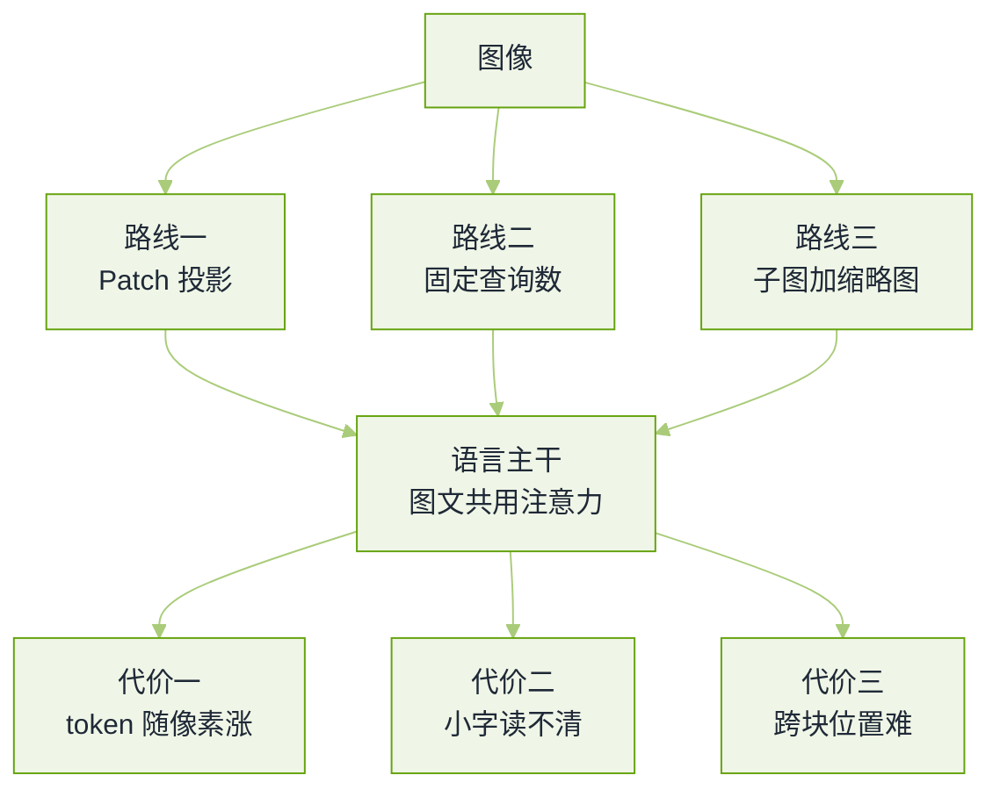

# 多模态与视觉语言真题


**一句话**：这一轮只考一件事——图像是怎么变成 token 的，以及这件事在显存、延迟、幻觉三本账上各付了什么价。


多模态岗（VLM/OCR/视频/语音）与通用大模型算法岗共用这组题，题源见本章[导读](README.md)。区别只在于：视觉方向的面试官会把手撕题换成「把这张图的 token 数算出来」。

## 三条接入路线长什么样

*《图：把视觉接进语言模型的三条主流路线，面试里说清「选哪条」不算本事，说清「这条的代价落在哪本账上」才算》*

## 视觉—语言对齐

**1. CLIP 是怎么训出来的？把损失写出来，并说明温度项和 batch 大小的作用。**

- 要点：双塔（图像编码器 + 文本编码器）各自出向量，归一化后算余弦相似度成 $$N\times N$$ 方阵，对角线是配对的 $$N$$ 个正样本，其余 $$N^2-N$$ 个是当场白拿的负样本。损失是对称 InfoNCE，行、列各做一次 softmax 交叉熵再取平均。
- 一条能写的式子：$$\mathcal{L}=-\frac{1}{2N}\sum_{i}\left[\log\frac{e^{s_{ii}/\tau}}{\sum_{j}e^{s_{ij}/\tau}}+\log\frac{e^{s_{ii}/\tau}}{\sum_{j}e^{s_{ji}/\tau}}\right]$$。说出「$$\tau$$ 越小分布越尖、对难负样本越狠」这一句，比背名字有用。
- batch 大小直接决定负样本数量与对比任务的难度，所以这类训练宁可堆卡也不减 batch；这也解释了为什么 zero-shot 分类在细粒度类别上先输。
- 追问「77 个 token 的文本截断会带来什么后果」：长 caption、文档里的长文字被截掉，于是 OCR 与密集文字场景天然吃亏——这是「CLIP 系模型看不懂小字」的根本原因之一，不是微调能白拿的。
- 回看：[多模态大模型](../03-llm/multimodal.md)

**2. in-batch 负样本有什么系统性偏差？你怎么在数据侧治它？**

- 要点：三类。伪负例（同一场景的不同照片被判为不匹配）、分布偏斜（网络图文对里高频物体占绝大多数）、以及来自采集端的图文弱关联（图里根本没有 caption 说的那个东西）。
- 治法按代价排：数据清洗与图文相关性打分过滤、重复图/近重复 caption 去重、难负例挖掘后单独控制权重、更大更均衡的语料配比。
- 面试官在等：能主动区分「模型容量不够」与「标签噪声」两种失败，并说出各自的验证办法（把噪声样本标签人工重标一小批看指标是否翻）。
- 回看：[Embedding 微调与领域适配](../06-memory-rag/embedding-finetuning.md)

**3. 把一个预训练语言模型接上视觉，有哪几条主流路线？各自的代价落在哪？**

- 要点：① 视觉 patch 特征过一个（浅层）投影矩阵直接当「外语 token」喂进 LLM——实现最简单、可端到端微调，代价是 token 数随分辨率平方涨；② Q-Former/Perceiver 一类固定长度查询把图压成常数个 token——省上下文，代价是信息瓶颈，细小文字和密集图表最先丢；③ 高分辨率切成若干子图再加一张全局缩略图——读得清小字，代价是位置编码与跨子图推理变复杂。
- 加分：能说出主流开源方案分别属于哪一条，并说明为什么「文档/OCR 类任务」几乎都往第三条走。
- 诚实的答法：路线选择由「下游读不读得清小字」决定，而不是由参数量决定。

## 上下文与位置

**4. 一张 1024×1024、patch=14 的图，进模型吃掉多少 token？如果再做 2×2 空间合并呢？**

- 要点：$$N_{\text{token}}=\left(\frac{H}{P}\right)\times\left(\frac{W}{P}\right)$$，代入得 $$73\times73=5329$$；2×2 合并后约 $$1332$$。合并是把多 patch 拼起来过一次投影，所以合并只算一次 token。
- 会算这笔账以后，几个结论是自动出来的：显存与注意力代价按 token 数平方走；「支持 4K 输入」和「支持 4K 输入且看得清」是两件事；提高分辨率等于给每一次对话都加几千 token 的固定税。
- 追问「视频怎么办」：帧数乘每帧 token，所以工程上先降帧率、再降每帧分辨率、再考虑时间维合并；能说出「先按任务决定需要多细的时间/空间粒度」比报帧数重要。
- 回看：[Token、Embedding 与上下文窗口](../03-llm/token-embedding-context.md)

**5. 位置编码怎么从一维扩到二维或三维？说说你了解的做法。**

- 要点：2D RoPE 把旋转角拆成行、列两个方向分别作用；更常见的做法是在 token 序列上把 RoPE 的维度切开，分别编码时间、行高、列宽（M-RoPE 类的思路），让同一张图内的二维结构与跨帧的时间结构共享同一套机制。
- 关键难点不在公式而在**相对位置的连续性**：裁剪、缩放、合并、拼接子图都会改变坐标，而训练与推理必须一致，否则模型「知道有字但不知道字在哪」。
- 加分：能说清纯文本、图像、音频三类 token 位置如何分段编号，以及为什么长视频的绝对位置容易撑爆（要按时基而不是按帧号）。
- 回看：[Transformer 注意力机制](../03-llm/transformer-attention.md)

## 幻觉、检索与落地

**6. VLM 的幻觉和纯文本的有什么不一样？给一套可落地的治理顺序。**

- 要点：视觉幻觉多两类——**看图说话式虚构**（图里没有的物体/文字被说出来，常来自语言先验）与**属性错配**（物体在、颜色/数量/位置错）。后者最难，因为答案看起来很像对的。
- 治理顺序：① 数据侧，把「图里确实有证据」当成指令数据的硬要求，加入「图中没有此项」的负样本回答；② 解码侧，对计数、颜色、坐标这类可验证字段用结构化输出约束；③ 证据侧，先跑检测/OCR 得到显式中间结果再让模型组织语言（把「读」与「说」拆开）；④ 评测侧，单独统计属性级准确率，别只看整体得分。
- 面试官在等：一句「我不接受模型说它看见了，除非它能指出在哪」——把空间定位当验证信号（能说出坐标/框才计分）。
- 回看：[幻觉与事实性](../10-evaluation-safety/hallucination.md)

**7. 「文搜图」的召回系统怎么搭？为什么不能直接拿大 VLM 来打分？**

- 要点：两阶段。离线用图文对齐模型把图库编成向量入索引，在线用文本塔编码查询做近邻召回；VLM 只在精排阶段对 top 几十条做跨模态判分。原因是延迟与成本：VLM 每判一条要生成若干 token，对百万级候选不可行。
- 细节加分项：查询与图片必须走**同一个模型的两侧**（跨模型编码的向量空间不对齐，这是新人最常犯的错）；图库更新要能增量 embedding；文字水印、纯色背景这类退化图要在索引前过滤。
- 必须补：评测要分「召回够不够（Recall@K）」与「精排排得好不好（nDCG/MRR）」两本账。
- 回看：[向量数据库与相似检索](../06-memory-rag/vector-database.md)

**8. 文档/票据解析的管线你怎么设计？哪些环节最容易出错？**

- 要点：版面检测/切块 → 分块 OCR 或 VLM 直读 → 结构还原（表格、键值对、多栏）→ 字段抽取与校验。工程上最容易出错的三处：表格的跨行跨列还原、旋转与低分辨率页、以及把 OCR 结果当事实而没做规则校验（金额大小写不一致、日期格式漂移）。
- 取舍要讲：端到端 VLM 读取更省事但难以定位错误，管线式可控但每段都会累积误差。合规要求高的场景要能给出「这一栏原文在第几页第几格」的证据链。
- 加分：能主动提「抽取字段要有置信度与人工复核出口」，以及批量任务里按页计费与失败重跑。
- 回看：[RAG 基础与切分策略](../06-memory-rag/rag-basics.md)

**9. VLA 模型和普通 VLM 的差别在哪？动作是怎么表示的？**

- 要点：多出来的是**控制频率与动作空间**。VLM 输出文字，一帧一次；VLA 要把动作离散成词表 token 或连续回归头，并以几十赫兹的节奏闭环执行，所以推理延迟直接变成控制质量。
- 常见做法三件：把高频动作块（action chunk）一次预测出来摊薄单次推理成本；用异构数据混训（网络图文 + 机器人轨迹）；仿真与真机数据按比例混合。
- 追问「为什么机器人模型不能直接拿网页图文预训练就够用」：因为图文数据里没有「动作—后果」的配对，接触、摩擦、延迟这些必须在物理数据上学。
- 回看：[VLA 模型](../17-embodied-ai/vla-models.md)

**10. 端到端语音大模型和「ASR + LLM + TTS」级联，你选哪个？延迟怎么算？**

- 要点：级联的好处是可控、可换音色、文本可审计；代价是延迟按段累加（ASR 尾点判停 + LLM 首字 + TTS 首帧），并且副语言信息（语气、情绪、打断）在中间被丢掉。端到端把这几段合并，延迟和自然度更好，但可观测性与内容审核面变窄。
- 会算账：一次可打断对话的体感延迟 ≈ 判停等待 + 模型首包 + 播放缓冲，三者各自都有下限；打断（barge-in）要求链路能在几十到几百毫秒内停住并回滚。
- 面试官在等：能说出「语音场景里最贵的通常是判停策略，不是模型本身」，以及如何用半句检测与超时兜底缓解。
- 回看：[语音 Agent](../12-applications/voice-agent.md)

## 常见误区

- ❌ 只答「用了视觉编码器」：三条接入路线的代价分别落在 token 数、信息瓶颈、位置拼接，说不出代价等于没答。
- ❌ 不会算 token 账：分辨率翻倍 → token 四倍 → 注意力成本十六倍，这是这一轮最基本的送分题。
- ❌ 用两个不同模型的向量做图文检索：空间不对齐，召回会莫名其妙地差且难排查。
- ❌ 拿整体分数说「幻觉变少了」：属性级错配要靠单独的计数/颜色/坐标准确率才看得见。
- ❌ 把 VLA 当「会说话的 VLM」：忽略控制频率与动作块，方案会在真机上直接失败。

## 参考资料

- [CLIP：Learning Transferable Visual Models From Natural Language Supervision](https://arxiv.org/abs/2103.00020)
- [LLaVA：Visual Instruction Tuning](https://arxiv.org/abs/2304.08485)
- [Qwen2-VL：Enhancing Vision-Language Model's Perception of the World at Any Resolution](https://arxiv.org/abs/2409.12191)
- [InternVL：Scaling up Vision Foundation Models and Aligning for Generic Visual-Linguistic Tasks](https://arxiv.org/abs/2312.14238)
- [LLM & VLM & Agent 面试问题总结（datawhale hello-agents 附录）](https://github.com/datawhalechina/hello-agents/blob/main/Extra-Chapter/Extra01-%E9%9D%A2%E8%AF%95%E9%97%AE%E9%A2%98%E6%80%BB%E7%BB%93.md)
- [大模型算法工程师面试题笔记（按主题整理的候选人转述）](https://github.com/km1994/LLMs_interview_notes)

## 相关知识点

- [20 面试真题 · 本章导读](README.md)
- [大模型基础真题](llm-foundations.md)
- [训练与对齐真题](training-alignment.md)
- [数据工程与合成数据真题](data-engineering.md)
- [前沿与研究岗真题](frontier-research.md)
