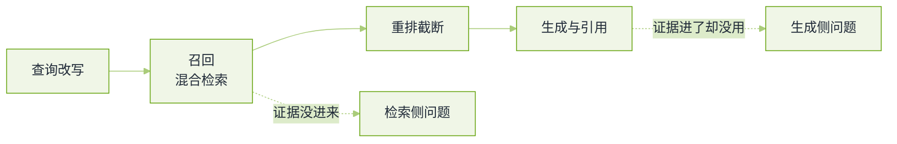

# RAG 与检索真题


**一句话**：RAG 题的评分点不在「知不知道向量库」，而在你能不能把一次答错归到链路上正确的那一段，并说清用什么证据支持你的归因。


应用与算法两侧都会问这一组，但侧重不同：应用岗考分块、重排与评测；算法岗更追 embedding 的训练与损失。题源见本章[导读](README.md)。

## 一次检索的失败可以发生在四处

*《图：RAG 链路的四个环节与两类归因分叉——「该来的没来」和「来了却没用」，面试定位题的答案就是这两条分叉》*

## 链路与分块

**1. 描述一条完整的 RAG 链路。**

- 要点：解析（版面、表格、代码保留结构）→ 切块 → 向量化与索引（稠密 + 稀疏 + 元数据）→ 查询理解（改写、拆解、路由到不同索引）→ 召回 → 重排 → 上下文组装（去重、预算、位置安排）→ 生成（强制引用）→ 校验与回退（无据可引就拒答或升级）。
- 收尾要补一句离线侧：评测集、badcase 回流、索引重建的触发条件。少了这半条链路会被判定为「只做过 demo」。
- 回看：[RAG 基础](../06-memory-rag/rag-basics.md)

**2. 为什么要切片？chunk size 和 overlap 怎么影响召回与生成？**

- 要点：切片的三个理由是一次塞不进、embedding 的语义会被长文本稀释、以及引用与权限需要以块为粒度。
- 小块命中精确但上下文残缺，答案常变成「片段拼接不像人话」；大块上下文完整但一块里混多个主题，向量表征偏向均值，还会挤占生成侧预算。overlap 治的是「关键句正好被边界切开」，代价是重复内容同时进上下文、去重压力上升。
- 好的回答给的是方法而不是数字：先按文档结构切（标题、段落、表格、代码块不拆断），再用保留集扫 $$\text{块长}\times\text{重叠}$$ 的网格，看召回命中率与生成侧引用正确率两条曲线各自在哪里掉头。
- 回看：[RAG 检索质量调优](../06-memory-rag/retrieval-quality-tuning.md)

**3. 稠密向量与稀疏向量有什么区别，各自适合什么检索需求？**

- 要点：稠密靠语义邻近，能容忍换词、跨语言，但对精确标识（错误码、型号、法条号、人名）不稳；稀疏靠词面匹配（BM25 一类），对稀有 token 与精确串很强，对同义改写没办法。
- 结构化条件（时间、部门、权限）不该交给相似度，走元数据过滤。
- 面试官在等：能说出「两类检索的失败模式是互补的」，这才引出下一题。

**4. BM25 和 RRF 的原理？为什么混合检索常用 RRF 而不是把两路分数相加？**

- 要点：BM25 是带饱和的词频打分——词频贡献有上限，长文档要做长度归一化，稀有词通过逆文档频率拿到更高权重。
- RRF 只用排名：每路按名次给 $$1/(k+\text{rank})$$，跨路求和。
- 不用加权求和的原因是两路分数量纲完全不同（一个是余弦相似度、一个是无界词频分），不归一的相加等于让某一路主导；而排名是可比的原语。
- 追问「RRF 丢了什么」：丢了置信度信息，所以两路的名次差距再也没法体现——需要精细调权时要换学习式融合。
- 回看：[向量数据库](../06-memory-rag/vector-database.md)

**5. 初筛召回之后为什么还要 Rerank？它解决向量检索的什么局限？**

- 要点：双塔 embedding 把整段文档压成一个向量，查询和文档从不「见面」，细粒度匹配（某个条件、某个数字对不对）被平均掉了。重排用交叉编码把查询与候选拼在一起算相关性，能分辨双塔分辨不了的差别。
- 所以分工是：召回保覆盖率（高 $$k$$），重排保精度（截到少数几条）。代价是每次调用都要算一遍查询与文档的联合前向，所以只能作用在小候选集上。
- 加分：能说清重排模型选领域微调还是通用；以及重排截断太狠会把正确答案挤掉（要按召回率而非重排分来定截断点）。

## 归因与调试

**6. 检索到了正确片段但生成仍然错，你怎么定位问题在检索侧还是生成侧？**

- 要点：两步定位法。第一步做「上帝检索」——把人工标注的正确片段直接塞进提示，如果答对，说明检索侧才是断点（命中率或排序问题）；如果还错，问题在生成侧（模型没用上下文、指令冲突、位置被忽略）。
- 第二步把生成侧拆开：证据在上下文里但没被引用 → 提示模板与位置安排的问题；引用了但结论错 → 是推理或证据本身冲突，需要拆句级校验。
- 面试官在等：一个**可控实验**，而不是「换更好的模型」。
- 回看：[RAG 检索质量调优](../06-memory-rag/retrieval-quality-tuning.md)、[Agent 失败模式排查手册](../11-engineering/agent-failure-playbook.md)

**7. 需要跨多篇文档才能回答的问题，RAG 怎么处理？**

- 要点：把「一次检索」变成「检索过程」。三种主流做法：查询拆解成子问题分别检索再聚合；迭代检索（先取一份文档，从中得到下一个要查的线索）；把关系型问题交给结构化路径（知识图谱或 Text-to-SQL）。
- 聚合侧要防两件事：同一事实的多个版本没做冲突消解，以及 map-reduce 式汇总丢掉数字。
- 加分：能指出这类问题**不适合**朴素 RAG，硬做只会让评测一直红，正确做法是承认能力边界并路由到别的路径。
- 回看：[GraphRAG](../06-memory-rag/graphrag.md)、[Text-to-SQL](../06-memory-rag/text-to-sql.md)

**8. 文档局部更新时怎么做增量索引，避免全量重向量化？**

- 要点：以文档为单位算内容哈希，只重建发生变化的块；块 id 要稳定（内容寻址或文档内序号），否则删改之后留下孤儿向量。
- 删除要显式处理（按文档 id 清或打墓碑），不然旧证据继续被召回——这是最常见的线上事故来源之一。
- 换 embedding 模型时增量不成立，只能全量重建：标准做法是影子索引（新索引并行建、灰度切流、留回退），并把「重建成本」写进选型评估。
- 回看：[数据与向量存储](../16-ai-infrastructure/data-vector-storage.md)

## 评测与幻觉

**9. 如何评估 RAG？RAGAS 那几个指标分别怎么算？**

- 要点：分两侧量。检索侧看命中率、$$\text{recall}@\text{k}$$、排序质量；生成侧看忠实度（回答里的每个论断能否被检索到的上下文支持）、答案相关性（回答是否切题）、上下文利用率。
- RAGAS 的口径：忠实度把回答拆成陈述再逐条判断是否有上下文支撑，本质是「引用正确率」；答案相关性用回答反向生成问题、再与原问题算相似度。
- 必须讲的坑：这些指标由模型判定，所以判分模型本身有偏（偏好长答案、偏好自己写得出的表述），要留一小份人工标注做校准锚点，并且冻结评测集防止污染。
- 面试官在等：能报「我改了什么、在保留集上哪个数字动了多少」。
- 回看：[评测指标](../10-evaluation-safety/evaluation-metrics.md)

**10. 怎么解决大模型幻觉？检索没召回时如何防止它编？**

- 要点：分层治理。检索层给出「无据可引」的显式信号（分数阈值 + 空上下文分支）；提示层要求逐句引用、并给出「无法回答」的合法出口；生成层压低温度并限制自由发挥；事后层做引用一致性校验，不合格就回退或升级人工。
- 关键判断是区分两类幻觉：知识型（模型不知道）和格式型（检索到了却没引用）——前者靠扩召回与拒答，后者靠提示与校验，混在一起治一定治不好。
- 加分：把「检索为空」当成需要产品化处理的路径（给出相邻问题的建议），而不是返回一句「我不知道」。
- 回看：[幻觉](../10-evaluation-safety/hallucination.md)

**11. GraphRAG 的基本做法与适用场景？为什么很多实际业务里效果不佳？**

- 要点：先用模型抽实体与关系构图，再对社区做层次化摘要；回答全局性问题（主题脉络、跨文档归纳）时从社区摘要取料，而不是从原文块取料。
- 适用：语料关系密集、问题偏「总结与关联」；不适用：精确事实问答（多跳抽取一旦错就整条链错）、超大规模且文档质量差的场景。
- 效果不佳的常见原因：抽取阶段错误率被图结构放大、索引成本随文档数与关系密度超线性上升、图更新时增量困难（局部改动牵动社区摘要）、以及评测集本身不考全局问题所以看不到收益。
- 诚实的结论：很多业务里混合检索 + 好的分块就把大部分收益拿到了，GraphRAG 是特定题型的增长项而不是默认架构。
- 回看：[知识图谱](../06-memory-rag/knowledge-graph.md)

## 查询侧与「还需要 RAG 吗」

**12. 多轮对话里查询怎么写？为什么原始提问常常检索不好？**

- 要点：对话里的「它、这个、上面那条」在向量空间里没有落点，必须做指代消解式的查询改写；另外用户问题常常欠约束（省略了领域与时间范围），需要补条件。
- 两条路线：把改写做成一次小模型调用（便宜、可控），或者让 Agent 自己决定要不要再查（灵活、贵）。
- 加分：说出改写要做缓存与幂等设计，否则同一句话在不同轮次被改写成不同查询，线上行为不可复现。
- 回看：[上下文工程](../06-memory-rag/context-engineering.md)

**13. HyDE 是什么原理？长上下文模型这么强了，RAG 的必要性是不是降低了？**

- 要点：HyDE 先让模型生成一篇「假想答案」，拿它的向量去检索——把查询从问题空间挪到答案空间，专治提问与文档措辞不一致；风险是模型幻觉出的假想答案会把检索带偏，因此通常与真实查询并行使用而不是替代。
- 后半题的答案是「没有降低，只是换了分工」：新鲜度、权限过滤、可追溯引用、单位成本、以及中段信息利用能力这几条，都不是靠窗口变大解决的。窗口变大反而让「整库塞进去」在成本与位置上更不划算。
- 面试官在等：不要答成「有长上下文就不需要检索」，那是最典型的失分答案。
- 回看：[长上下文退化与有效上下文窗口](../06-memory-rag/long-context-degradation.md)

**14. 权限不同的用户问同一个问题，检索层要怎么保证不越权？**

- 要点：过滤要发生在召回阶段而不是生成阶段——生成前塞进上下文的信息不可能再收回来。索引里存权限标签，查询时带上用户身份做硬过滤，多租户场景在物理或逻辑分区上再隔离一层。
- 坑：文档权限变了但索引里的标签没更新；以及摘要类块继承了源文档权限却按摘要自身的规则存。
- 加分：把「越权检索」当成可观测事件来设计（记录被过滤掉的候选数量），否则永远不知道自己是在什么基础上没出错。
- 回看：[数据与隐私](../10-evaluation-safety/data-privacy.md)

## 常见误区

- ❌ 用固定 chunk size 交差：结构不规则的文档（表格、代码）会被切开，命中率永远上不去。
- ❌ 把稠密与稀疏当成互斥方案：它们是互补的失败模式，混合 + 重排才是默认。
- ❌ 只换 embedding 模型不改评测集：分数动了也说不清是模型变好还是题变了。
- ❌ 靠提示词「请务必只根据资料回答」来治幻觉：没有空召回分支与事后校验，这句约束挡不住编造。
- ❌ 只在 demo 上验证 RAG：没做增量索引与权限过滤的设计，等于没做工程。

## 参考资料

- [AI Engineering Field Guide（含 RAG 与回家作业题目）](https://github.com/alexeygrigorev/ai-engineering-field-guide)
- [AgentGuide 算法与手撕题库](https://github.com/adongwanai/AgentGuide/blob/main/docs/04-interview/22-algorithm-ai-coding-question-bank.md)
- [AIGC-Interview-Book 大厂高频面试题](https://github.com/WeThinkIn/AIGC-Interview-Book)
- [RAGAS 论文（评估指标口径的出处）](https://arxiv.org/abs/2309.15217)

## 相关知识点

- [20 面试真题 · 本章导读](README.md)
- [系统设计真题](system-design.md)
- [大模型基础真题](llm-foundations.md)
- [记忆与 RAG 章节](../06-memory-rag/README.md)
