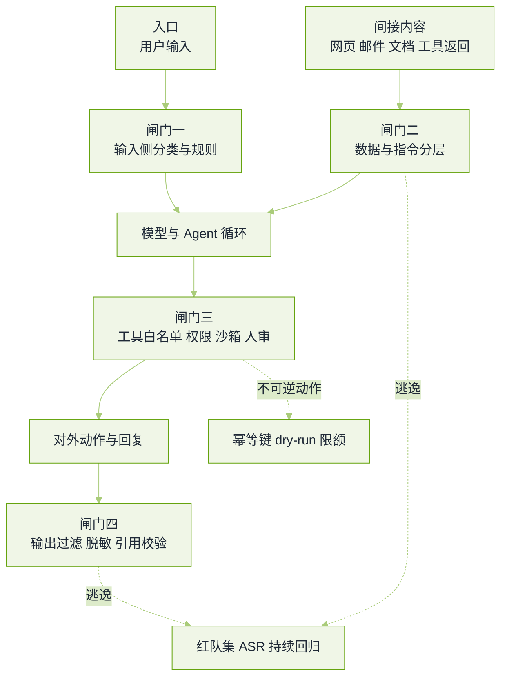

# 安全与红队真题


**一句话**：安全轮的评分标准只有一条——你说的防御是不是「模型之外的机制」；把「在提示里加一句不要听」当防线，这轮基本就结束。


对齐与安全岗会连着追问；应用与 Agent 岗至少会问「间接注入你怎么防」。题源见本章[导读](README.md)。

## 攻击面与防线

*《图：四道闸门与一条红队回路——只有模型之外的机制才算防线，模型自己的「意愿」不能计入防御预算》*

## 注入与权限

**1. 提示注入的威胁模型你怎么描述？直接注入和间接注入差别在哪？**

- 要点：本质是**同一串 token 里既有数据又有指令**，而模型没有可靠的区分能力。直接注入来自用户输入（越狱、角色扮演）；间接注入来自 Agent 会读的任何内容——网页、邮件、检索片段、工具返回、子 Agent 的消息，攻击者不需要是你的用户。
- 为什么「在 system 里写忽略指令无效」：因为这是一段自然语言偏好，攻击者只要给出更强的自然语言指令、或把它包装成正当的任务续写，就能盖过去；防御要落在**能力分配**上（不给这个工具、不注入这条权限），而不是落在措辞上。
- 加分：能举一个真实后果链——读到一封邮件 → 被要求把内部文档发到外部地址 → 工具具备外发能力 → 数据泄露。这条链每一环都有对应防线。
- 回看：[提示注入攻击与防御](../10-evaluation-safety/prompt-injection.md)

**2. 一个能读写外部系统的 Agent，你会怎么设计权限？**

- 要点：四层——工具级白名单（按 Agent 角色发不同工具集）、参数级约束（路径、域名、收件人、金额上限）、动作级分级（只读 / 可逆写 / 不可逆写）、不可逆动作要求人工确认或策略自动批准。
- 关键原则：**权限不能由模型持有**。凭证留在服务端执行器里，模型只能表达意图，因此「模型被说服」不等于「密钥被交出」。
- 必须补的细节：幂等键（重试不重复扣款）、dry-run 预览、限额与频率闸、以及每次调用的审计记录（谁、依据哪段内容、调了什么、参数是什么）。
- 面试官在等：能主动说「Agent 的成本 DoS 也是安全问题」——循环、并发放大、把大量不可逆动作塞进一次任务。
- 回看：[工具权限与沙箱](../05-tool-protocol/tool-permission-sandbox.md)

**3. 说说双模型 / 规划—执行隔离这类架构防御，它能挡到什么程度？**

- 要点：思路是把「读不可信内容的权限」和「执行动作的权限」交给两个不同主体：处理外部内容的模型只输出结构化结论（不含工具、不含凭证），执行侧模型只看结构化结论（不看原文）。这样注入文本就无法直接驱动动作。
- 能挡的：把「读到的内容」与「照做」解耦，减少一条最短路径。挡不住的：不可信内容通过结构化字段**间接**影响决策（把恶意指令塞进摘要、文件名、代码本体），以及信任边界画错（以为只读其实能写）。
- 加分：能说出「任何非结构化字段跨边界都是新的注入面」，并提出字段级长度/字符白名单或转义。
- 回看：[Agent 与机器人桥接](../17-embodied-ai/agent-to-robot-bridge.md)

## 越狱、红队与护栏

**4. 越狱有哪些常见类别？防御分别落在哪一层？**

- 要点：角色与情境设定（假装在演戏、假装是开发者模式）、编码与低资源语言（把恶意内容藏进 base64、少见语言、代码字符串里）、多轮渐进（每步都无害，组合起来有害）、拒绝改写（先拿到答案再要求「去掉免责声明」）、以及利用输出格式（要求先输出有害片段再解释）。
- 防御层位：训练层的对齐（会被绕过，只降低概率）、推理层的输入与输出分类器、产品层的话题与用途限制、以及最硬的一层——**能力层**（模型再怎么被说服，也拿不到不发给它的工具与数据）。
- 追问「多轮渐进为什么最难防」：因为单轮判定器每步都放行；要防就得做**会话级**状态跟踪（意图累计、敏感动作计数）。
- 回看：[越狱与对抗攻击](../10-evaluation-safety/jailbreak.md)

**5. 让你从零搭一个红队流程，你怎么做？指标怎么算？**

- 要点：四条腿并进——人工探索（找新构造，最有创造力也最难复制）、规则化模板库（把已知类别做参数化组合）、模型辅助生成（用攻击模型批量造变体）、以及真实用户日志挖掘（线上出现过的绕过才是真威胁）。
- 指标三件：攻击成功率 $$\text{ASR}=\frac{\text{达成恶意目标的尝试数}}{\text{尝试总数}}$$、覆盖率（有多少类别与工具组合被真正打到）、严重度分级（泄露 / 越权写 / 资源损耗 / 仅内容违规不能混在一个数里）。
- 必须补的口径：ASR 要按类别报，并报「拒绝质量」——模型是干净拒绝，还是绕着说了要点；只统计是否命中红线会奖励「换个说法继续做」。
- 面试官在等：能说出「红队结果必须变成评测集，否则同一漏洞下个版本还会回来」。
- 回看：[2026 安全事件复盘](../10-evaluation-safety/safety-incidents-2026.md)

**6. 内容安全的护栏怎么搭？误杀和漏放怎么权衡？**

- 要点：分层——先便宜的规则与分类器（词表、正则、小模型）拦大头，再对可疑样本升级到强模型判定；对写动作与外发内容单独走策略闸门。
- 权衡要用数字讲：在给定误杀率预算下选阈值，或反过来报「误杀 1% 时漏放多少」。业务口径决定不对称代价——金融场景宁可拦下来给人审，内容社区宁可放过给反馈。
- 加分：能提出「拦截也要有出口」——被拦用户看到的说明、申诉路径、把误拦样本回流成训练数据；以及护栏自身的可观测性（拦了多少、为什么、在哪一步）。
- 回看：[对齐与安全](../10-evaluation-safety/alignment-safety.md)

**7. 数据隐私与合规在这一轮会怎么问？**

- 要点：训练侧（来源许可与授权、PII 在管线中的检测与脱敏、删除请求要不要重训或做遗忘）、推理侧（日志留存期与访问控制、跨租户隔离、把用户内容用于改进要显式同意）、输出侧（模型可能复述训练数据，要能检测与追责）。
- 会考细节的点：日志本身就是新的泄露面（评测、追踪、缓存都存了原文）；语义缓存可能让 A 用户命中 B 用户的答案——缓存键必须含租户边界。
- 加分：能说出「记忆化提取与成员推断」两类风险，以及为什么「模型能不能背出某个人的邮箱」要作为发布前检查项。
- 回看：[数据隐私与合规](../10-evaluation-safety/data-privacy.md)

**8. 第三方工具与 MCP 生态带来什么新风险？你在接入时检查什么？**

- 要点：供应链面扩大——工具描述本身就是模型会读的注入文本；一个被投毒的描述可以在挑选工具时改变行为；权限声明与实际实现可能不符；上游服务改协议或改返回结构会让安全假设静默失效。
- 接入检查清单：来源与版本 pin、工具描述与返回内容的长度与字符约束、按 server 维度的能力配额与网络出网白名单、返回值先过内容闸门再进上下文、以及变更审计（版本升级时重跑注入与安全评测）。
- 面试官在等：能说出「不要相信工具返回是干净文本」这一句，并给出对应的隔离处理。
- 回看：[MCP 协议与工具生态](../05-tool-protocol/mcp.md)

**9. Agent 上线之后，安全的日常运营怎么做？**

- 要点：检测（异常调用模式：同一用户短时间大量不可逆动作、非常规工具组合、越权参数被闸门拦下的比例突增）、分级响应（自动暂停该能力 / 回滚到旧策略 / 拉黑主体）、复盘（事故写进评测集并加门禁）、以及变更管理（策略与提示词版本化，可一键回退）。
- 关键指标：拦截率、绕过率（事后审计发现的漏放）、平均止血时间，以及「人审队列的积压与同意率」——同意率过高说明确认流形同虚设，过低说明闸门设错。
- 加分：能主动谈「护栏是产品承诺的一部分」：用户能看到哪些动作需要确认、哪些自动执行。
- 回看：[动手实验：护栏与守卫](../19-labs/lab6-guardrails.md)

**10. 面试官问「你的模型安全吗」，一个合格的回答长什么样？**

- 要点：不接受这个问法本身，先把它拆成可判定的三问：在哪些攻击类别上的绕过率是多少；哪些能力是根本不具备的（拿不到工具/数据）；出现事故时能在多长时间内定位并止血。
- 用证据回答：给出红队报告的分桶 ASR、评测门禁的阻塞项、以及一次真实事故的处置记录（含改动落进哪条评测）。
- 面试官在等：一句「我不声称安全，我给出边界和测量」——这比任何形容词都可信。

## 常见误区

- ❌ 把「提示里加了拒绝指令」当防御：措辞类防御在对抗下等于零。
- ❌ 只报一个总 ASR：不分类别与严重度的数字，无法指导任何修复。
- ❌ 让模型持有凭证：注入一旦成功就直接变成数据外泄，权限要留在执行器。
- ❌ 只测单轮：多轮渐进与工具链组合是真实的绕过来源。
- ❌ 红队结果不回流评测：下一个版本会带同一个漏洞上线。

## 参考资料

- [Prompt Injection attack against LLM-integrated Applications（Greshake 等，间接注入的原始设定）](https://arxiv.org/abs/2306.05499)
- [OWASP Top 10 for LLM Applications](https://owasp.org/www-project-top-10-for-large-language-model-applications/)
- [Safety-Prompts：中文安全对话评测与红队框架](https://github.com/thu-coai/safety-prompts)
- [Awesome-AI-Redteam：AI 攻防知识库](https://github.com/Threekiii/Awesome-AI-Redteam)
- [LLM 与 Agent 面试问题参考答案（datawhale hello-agents 附录）](https://github.com/datawhalechina/hello-agents/blob/main/Extra-Chapter/Extra01-%E5%8F%82%E8%80%83%E7%AD%94%E6%A1%88.md)

## 相关知识点

- [20 面试真题 · 本章导读](README.md)
- [Agent 工程真题](agent-engineering.md)
- [系统设计真题](system-design.md)
- [评测与裁判模型真题](evaluation-judge.md)
- [10 评估、安全与对齐](../10-evaluation-safety/README.md)
