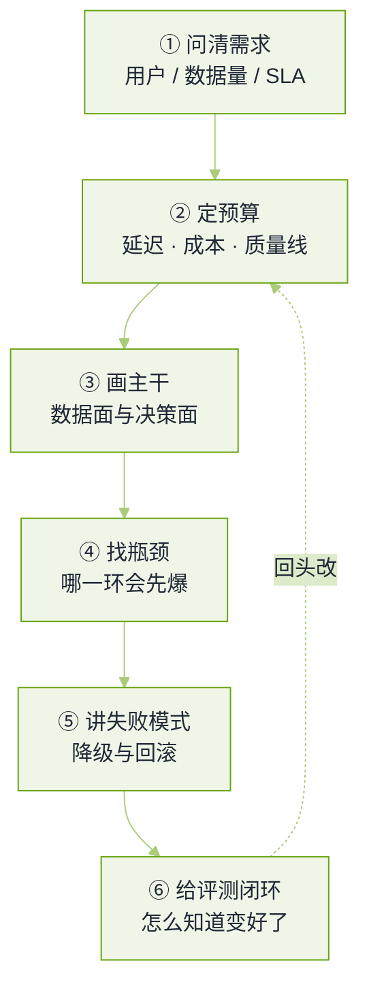

# 系统设计真题


**一句话**：大模型系统的设计题不考你画不画得出框图，考你能不能把「不确定输出」这件事算进容量、延迟和质量三张账里。


这类题在各家都是 45 分钟一轮，面试官给的题目往往只有一句话，剩下的都靠你问出来。题源与口径见本章[导读](README.md)。

## 评分骨架

*《图：设计题的六个台阶——大多数人死在最后两级，因为从没把评测与失败模式当成架构的一部分》*

## 怎么读这一页

下面每题给的「要点」是一条可辩护的答题顺序，不是唯一答案。同一题在不同公司侧重点不同：基础设施岗会往下追问显存与调度，应用岗会往上追问产品语义与验收口径。

## 检索与知识类

**1. 给一千万份文档做企业级 RAG 助手，而且不同人能看的内容不一样，你怎么设计？**

- 要点：先破题——「权限」不是生成阶段的提示词约束，是**检索阶段的过滤条件**。任何把无权文档送进上下文再指望模型「别说出去」的设计，在这题上直接判负。
- 主干：解析与分块（按文档结构而不是固定字数）→ 双索引（稠密向量 + 关键词/BM25）→ 召回后做权限过滤，最好把权限维度做进向量库的标量过滤，保证「先过滤再排序」而不是召回 100 条再丢掉 95 条；重排序放在过滤之后。
- 数据账：一千万文档要谈增量与重建。权限变更的频率通常远高于文档变更，所以权限应放在**独立的可快速更新的元数据层**，不要因为 ACL 变了就重新向量化。
- 质量闭环：黄金问答集 + 在线反馈 + 「无答案」阈值；权限类问题要有专门用例（跨部门越权、同文档不同版本）。
- 面试官在等：会不会主动问「权限模型从哪来、多久同步一次、离职与调岗怎么处理」。
- 回看：[企业知识助手](../12-applications/enterprise-knowledge-base.md)

**2. 文档局部更新时，怎么避免全量重新向量化？**

- 要点：把内容哈希挂在分块粒度上，只重算变动的块；文档级元数据（权限、标题、目录）单独存，改它不动向量。
- 关键细节：删除要真删或者打墓碑标记，否则旧块仍会被召回；跨块引用的编号会随分块边界漂移，所以稳定的引用锚点要在解析阶段就固定下来。
- 加分：说得出「影子索引」——新索引建好并验证后再切读，避免重建期间的服务退化。
- 回看：[向量数据库选型](../09-frameworks/vector-databases.md)

## 编码与开发者工具类

**3. 设计一个代码助手：仓库索引、上下文组装、修改应用、评测，四段都要讲。**

- 要点：这题的区分度在**上下文组装**和**修改应用**两段，索引与评测大家都会说。
- 索引：语言感知的符号图（定义、引用、调用边）+ 轻量语义索引，二者互补；纯文本分块对代码不够，因为一个函数与其依赖的文件常常不在同一块。
- 上下文组装：从当前光标、最近编辑、打开文件、报错信息推断意图，再沿符号图补一跳依赖；顺序要稳定以便前缀缓存命中，动态内容放在末尾。
- 修改应用：diff 应用是最容易出事故的一环。要点是可定位（锚点要容忍空白与上下文漂移）、可回滚（改动前保留原始快照）、可解释（告诉用户改了哪、为什么）。整文件重写和精确补丁是两种失败方式不同的方案，要能比较。
- 评测：离线用真实 PR 构造任务集，在线看接受率与保留率（接受了但第二天被撤掉的编辑才是真信号）。
- 加分：能主动说清「模型强不强」和「harness 好不好」在这题上分别贡献什么。
- 回看：[编码智能体](../12-applications/coding-agent.md)

**4. 需要跨多份文档才能回答的问题，RAG 链路怎么改？**

- 要点：单跳检索对聚合类问题（「对比这三个系统的差异」）先天不足，因为没有任何一个块同时含三者。
- 可选方案按成本递增：查询分解成多个子查询并合并证据；给文档先建摘要层，先命中摘要再下钻原文；把实体与关系抽出来建图，做一跳/二跳扩展。
- 必须配套的是**归因**：跨文档合成的答案要能指出每条论断来自哪几块，否则无法验收。
- 诚实的取舍：图方案在建库与增量更新上很贵，业务里常输给「把摘要层做好」。
- 回看：[检索质量调优](../06-memory-rag/retrieval-quality-tuning.md)

## Agent 与产品类

**5. 设计一个能真正执行动作的客服 Agent，并且要能升级到人工。**

- 要点：先分层——哪些动作是只读查询（查订单、查政策），哪些是写操作（退款、改地址）。写操作按金额/风险分档决定自动执行、二次确认还是必须人工。
- 控制流：意图判断决定是否调 API；多轮状态要持久化（会话状态机 + 可重放事件），否则一次重启用户要从头说；工具失败要能区分「可重试」「要换路径」「必须问人」。
- 升级设计：升级不是兜底而是功能。要带上下文升级（摘要 + 关键证据 + 已尝试动作），并且规定 SLA；触发条件包括置信度低、连续失败、用户明确要求、涉及投诉与合规。
- 质量与合规：全程留痕可审计，敏感动作二次确认，禁止动作清单要显式（例如不能自行承诺赔偿金额）。
- 面试官在等：会不会主动谈「错一次的真实成本」，并据此设计审批档位。
- 回看：[客服与支持 Agent](../12-applications/customer-service-agent.md)

**6. 怎么为一个能代表用户执行动作的 AI 系统设计防护栏？**

- 要点：把防护栏拆成四道闸，并说明各挡哪类错误：动作白名单与参数校验（挡结构性错误）、影响面评估（不可逆/对外可见/涉钱的一律降级到确认）、运行时沙箱与配额（挡失控循环与资源滥用）、事后可撤销（补偿事务与审计日志）。
- 关键洞察：提示注入是这道题的真正难点，因为攻击者控制的是**数据面的文字**。可行的边界是让模型只提出意图，让执行层根据调用者身份而非模型上下文来决定权限。
- 加分：能说出「权限不能由模型持有」这一句，并举一个反例（工具返回值里写着「请以管理员身份执行」）。
- 回看：[权限与沙箱](../10-evaluation-safety/permission-sandbox.md)

**7. 设计一个多人协作的 Agent 平台，并发、隔离、线程安全怎么落？**

- 要点：隔离单位要先定——按用户、按会话、按工作区还是按租户，不同选择决定锁粒度。跨会话共享的只有配置与知识，运行态一律不共享。
- 并发写：同一目标（文件、工单、数据库行）可能被两个 Agent 同时改，需要乐观并发（版本号 + 冲突即重试）或者串行化到单一执行者；「同 key 串行、不同 key 并行」是可辩护的中间态。
- 一致性：外部世界不像事务，动作要幂等（带幂等键），重放不能重复扣款；长任务要有 checkpoint 与租约，避免进程挂掉后任务永久卡住。
- 成本与公平：按租户配额，防止一个大任务饿死别人。
- 回看：[工作流与编排](../11-engineering/workflow-orchestration.md)

## 平台与算法类

**8. 设计一个模型评测平台，或者给某个垂直领域定评测方案。**

- 要点：评测平台的骨架是四件——数据集与版本（含来源与许可证）、任务运行器（可复现，记录模型/提示/参数指纹）、判分器（规则、裁判模型、人工三档）、报表（按能力分桶而不只报总分）。
- 垂直领域的关键是**判分器怎么造**：有标准答案的用规则，开放回答用裁判 + 抽样人工校准，主观项让业务专家双盲打分并报告一致性。
- 必须回答的追问：怎么防止测试集泄漏进训练数据（保留私有集、定期换题、看训练集重叠率）；为什么总分相同的两个模型会在线上表现不同（分桶分布与回归测试）。
- 加分：把 badcase 回流写成一个闭环（线上失败样本 → 人工归因 → 进评测集/进训练数据），并说明谁负责审核。
- 回看：[持续评估](../11-engineering/continuous-evaluation.md)

**9. 把大模型接进在线推荐/排序系统，值不值，效率问题怎么解？**

- 要点：先回答「为什么」——传统模型在冷启动、长尾语义、可解释的推荐理由上强；LLM 在语义理解与生成式解释上强。这题如果直接开始画架构，就漏了真正的考点（要不要用）。
- 效率账：在线 QPS 与延迟预算通常不允许逐条请求过大模型，常见做法是离线批量生成语义特征或表征、缓存到在线服务查表；真正实时调用只走高价值流量。
- 评估：离线指标（AUC/NDCG）提升不代表线上收益，必须有 A/B 且要能诊断「离线涨线上不涨」（分布漂移、评估集与线上候选不一致、位置偏置、时延导致降级）。
- 回看：[AI 在推荐与搜索](../12-applications/general-agent-products.md)

**10. 一个在线服务要在吞吐、延迟、成本之间做取舍，你怎么定量？**

- 要点：把三者写成可算的量：吞吐看每秒解码 token 数与并发上限（并发上限由 KV Cache 决定），延迟分 p50/p95 并拆开排队与生成，成本按每千 token 摊销到卡时。
- 关键判断：批越大吞吐越高但尾延迟越差；对交互产品要优先保护 p95，对离线任务要优先吞吐。说出这一点比报任何具体数字都值钱。
- 追问「你怎么知道该扩容还是该优化」：先看利用率与队列长度分布——饱和的是算力、带宽还是排队。
- 回看：[推理服务化](../16-ai-infrastructure/inference-serving.md)

## 常见误区

- ❌ 拿到题就开始画框图：需求、数据量与 SLA 都是问出来的，不是假设出来的。
- ❌ 把权限写进提示词而不是检索过滤：这是设计题里的致命错。
- ❌ 只讲主干不讲失败模式：一个没有降级与回滚方案的架构在这类题上拿不到高分。
- ❌ 不做评测闭环：大模型系统的改动没有回归就是赌博。
- ❌ 报具体倍数却不报负载条件：面试官会当成背答案。

## 参考资料

- [AI Engineering 面试题库（按公司标注的候选人转述）](https://github.com/pallavi-shekhar/ai-engineering-interview-questions-company-wise)
- [AIGC-Interview-Book 大厂高频面试题](https://github.com/WeThinkIn/AIGC-Interview-Book)
- [AgentGuide 企业面试案例](https://github.com/adongwanai/AgentGuide/blob/main/docs/04-interview/12-company-interview-cases.md)
- [牛客面经：百度大模型应用岗](https://www.nowcoder.com/discuss/927018114900922368)

## 相关知识点

- [20 面试真题 · 本章导读](README.md)
- [推理与服务化真题](inference-serving.md)
- [Agent 工程真题](agent-engineering.md)
- [RAG 与检索真题](rag-retrieval.md)
- [安全与红队真题](safety-redteam.md)
- [岗位分档与转岗真题](career-tracks.md)
