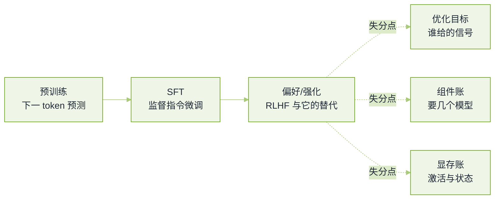

# 训练与对齐真题


**一句话**：这一轮的题只考一件事——你知不知道每一步在优化什么、省掉了哪个组件、代价落在显存的哪一行账上。


算法与后训练岗把这一轮拉得最满。题目来自公开题库与候选人面经（口径见本章[导读](README.md)），下面的排序按「在多少份独立面经里被复述过」从高到低。

## 一条训练流水线的三个失分点

*《图：训练流水线上被追问的三个层面——目标本身、为达成目标要挂载哪些模型、每一步在卡上占多少字节；第三层最区分人》*

## 流程与动机

**1. 预训练、SFT、RLHF 分别用在什么场景，各要注意什么？**

- 要点：预训练买能力（下一个 token 预测，数据规模决定世界知识）；SFT 买格式与可用性（少量高质量示范，教「按指令作答」这个分布）；对齐阶段买偏好（谁的回答更好，用成对信号）。
- 注意点按顺序是：预训练看数据去重与污染，SFT 看过拟合与风格塌缩，对齐阶段看奖励被钻空子。
- 面试官在等：能说出「SFT 数据翻倍不如把它做干净」这类经验，而不是三段定义复述。
- 回看：[预训练、微调与指令微调](../03-llm/pretraining-finetuning.md)

**2. 为什么 SFT 之后还要做偏好优化？已经造了推理数据，为什么还要上强化？**

- 要点：SFT 是行为克隆，只能学到「示范里出现过的分布」，没法告诉模型两个都对的答案哪个更好；偏好/强化给的是相对信号，能把分布往人类偏好或可验证奖励上推。
- 推理数据 + RL 的分工：数据决定模型会做这件事，RL 决定它在没有示范的题上也能做对（可验证奖励下探索出示范里没有的中间步骤）。
- 加分：给出切换信号——当 SFT 在保留集上的通过率已经不再随数据增长而涨，而失败案例是「同一步骤多种写法、结果好坏可判」时，才是强化该上场的地方。
- 回看：[用轨迹微调 Agent](../03-llm/agent-traj-finetuning.md)

**3. 讲一遍 RLHF 的完整流程，写出奖励模型和策略优化的目标。**

- 要点：三段。SFT 得到初始策略；用成对偏好数据训练奖励模型，损失形如 $$-\log\sigma\!\left(r(x,y_w)-r(x,y_l)\right)$$；用 PPO 优化策略，奖励是 $$r_\theta$$ 打分减去对参考模型的 KL 惩罚 $$-\beta\,\mathbb{D}_{\mathrm{KL}}\!\left(\pi_\theta\,\|\,\pi_{\mathrm{ref}}\right)$$。
- KL 惩罚的作用是防止策略把奖励模型推到它没见过的区域，也就是奖励钻空子。
- 代价要能说出来：这一步同时驻留策略、参考、奖励、价值四个模型，显存与调度是主要瓶颈，这也是后面各种简化版本的动机。
- 回看：[RLHF、DPO 与对齐](../03-llm/rlhf-dpo-alignment.md)

**4. PPO 的 clip 和对参考模型的 KL 约束是一回事吗？GAE 里的 $$\lambda$$ 怎么权衡？**

- 要点：不等价。clip 限制**单批更新内**新旧策略概率比偏离 1 的幅度，管的是这一步迈多大；KL 惩罚限制策略**整体**偏离参考模型多远，管的是越走越远之后的漂移。只做 clip 依然能在很多步之后累积出巨大偏移。
- GAE：$$\lambda$$ 接近 1 时接近蒙特卡洛回报，偏差小方差大；接近 0 时退化为一步 TD，方差小偏差大。语言模型里奖励往往只在序列末尾，所以更吃方差，需要较大的 $$\lambda$$ 与组内归一化配合。
- 追问常落在「为什么 PPO 要 minibatch + 多个 epoch 复用 rollout」——那正是让 off-policy 程度上升、clip 才存在的理由。

**5. DPO 相比 PPO 类方法改进了什么？什么时候在线强化仍然更好？**

- 要点：DPO 把奖励用策略自身的对数概率比重新参数化，代进 Bradley-Terry 偏好模型后奖励模型被消掉，得到一个直接作用在偏好数据上的分类式损失 $$-\log\sigma\!\left(\beta\log\frac{\pi_\theta(y_w|x)}{\pi_{\mathrm{ref}}(y_w|x)}-\beta\log\frac{\pi_\theta(y_l|x)}{\pi_{\mathrm{ref}}(y_l|x)}\right)$$。省掉采样、省掉奖励与价值模型，稳定性与成本都好得多。
- 代价：它是离线的，只能从给定的对比对里学，无法在示范之外的区域探索；分布漂移时（chosen 与 rejected 都不是当前策略会生成的）会退化，也容易学到长度、格式这类表面特征。
- 在线强化更好的场景：奖励可自动验证（数学、代码、工具执行成功），或者需要模型生成示范里没有的新链路。
- 面试官在等：能讲「省掉了什么组件」与「因此失去了什么能力」这一对。
- 回看：[RLHF、DPO 与对齐](../03-llm/rlhf-dpo-alignment.md)

**6. 讲 GRPO：去掉价值网络为什么在规模化上重要？序列级优势怎么落到 token 上？一个组全对或全错怎么办？**

- 要点：GRPO 对同一个提示采一组回答，用组内奖励的均值与标准差做归一化得到优势，因此不需要训练价值网络——省掉的是一个和策略同尺寸的模型和它的前向显存，这在长思维链上非常吃紧。
- 优势是序列级的，直接乘到该序列每个 token 的比上；常见改进是按长度归一化，避免长回答被同一条优势反复计入。
- 全组同分时归一化后优势为 0，这一步没有梯度信号。可落地的处理：动态采样把零方差组剔除并补采、提高采样温度或组大小、对全对组降权而不是全丢弃（保留它做正则）。
- 追问「GRPO 里 on-policy 还是 off-policy」：一个批次的 rollout 会被复用多次更新，随更新推进而变得 off-policy，大 batch 靠更准的优势估计与更小步长缓解，但需要比率裁剪兜住。

**7. 用 GRPO 训 MoE 为什么会不稳，怎么改？**

- 要点：路由是离散选择，rollout 时与更新时的专家分配容易漂移；再加上为均衡而设的辅助损失会和 RL 目标抢梯度，表现为策略损失看着正常但能力不涨。
- 实践修法：用不带辅助损失的均衡方式（可学习偏置只在训练侧调，不引入额外梯度冲突）、控制单次更新的策略漂移、必要时对 router 用更小学习率或短暂冻结。
- 加分：能说出「训练时路由与推理时路由不一致」是这类问题的通用根因，不只在 MoE。

**8. 为什么需要参考模型？**

- 要点：它是「别走太远」的锚。DPO 类方法里它让损失度量的是相对偏好而非绝对似然，没有它模型会靠拉长回答或复读来提高似然；PPO 类里它提供 KL 惩罚的基准。
- 追问：为什么参考模型可以离线算好并缓存对数概率——因为它是冻结的。

## 参数高效微调

**9. 讲 LoRA 的原理。秩怎么选，挂在哪些矩阵上，alpha 过大或过小分别看到什么？**

- 要点：把权重更新约束成低秩增量 $$\Delta W=BA$$（$$B\in\mathbb{R}^{d\times r}$$、$$A\in\mathbb{R}^{r\times k}$$、$$r\ll\min(d,k)$$），初始化时一侧随机一侧置零，保证起点等价于原模型；实际梯度尺度按 $$\alpha/r$$ 缩放。
- 秩的选法：先看任务要改动多少「行为」——格式与风格类任务很低就够，注入新知识或跨领域改写需要更大的秩，或者改挂到前馈层；再拿保留集看拐点，秩过了某个值之后指标不再涨就是够了。
- 挂载位置：只挂注意力（尤其查询与键）是省参数的经典选择；要搬动知识或改变长链路行为时，前馈层更管用，因为它承担检索与改写。
- 现象：$$\alpha$$ 太小相当于没学习率（不动、欠拟合）；太大表现为训练初期损失抖动、通用能力下滑、输出风格塌缩。
- 加分：能提合并（推理零开销但一个适配器一份权重）与多适配器热挂（省显存但要额外一次小算子）的取舍，以及量化基座 + LoRA 的组合。
- 回看：[Embedding 微调与领域适配](../06-memory-rag/embedding-finetuning.md)

**10. QLoRA 把成本降在哪？NF4 为什么合适？**

- 要点：基座冻结并压到 4 位，可训练部分（LoRA）保持高精度；归一化浮点 NF4 按权重近似正态的假设取分位级，等概率分箱，因此对真实权重分布的拟合比均匀格点更好；再对量化常数本身二次量化、把优化器状态分页，避免峰值显存爆。
- 代价要说得出：基座被量化意味着精度上限被压住，长程推理与多语言最先掉；QLoRA 学不动的知识需要更大秩或全参微调。
- 回看：[推理量化与部署](../03-llm/inference-quantization-deployment.md)

**11. SFT 的损失为什么只算回答部分？具体怎么实现，有什么坑？**

- 要点：提示是条件不是目标，对它算损失会挤占注意力预算，训练出「续写提示」的坏习惯。实现上是一张与标签同形的布尔掩码，把提示位与填充位都置为不参与。
- 三个坑：样本打包时掩码不能跨样本边界；归一化按有效 token 数而不是按条数，否则长回答主导；多轮对话要按轮次分段计算，别把上一轮 assistant 的输出当成下一轮的提示。
- 面试官在等：能主动说出「padding 也要掩掉，且掩码错位是静默 bug」。
- 回看：[预训练、微调与指令微调](../03-llm/pretraining-finetuning.md)

**12. 灾难性遗忘怎么治？SFT 之后通用能力下降怎么办？**

- 要点：原因是新任务的分布窄、更新步数多。可用的手段按性价比排：在 SFT 数据里混入原分布的样本（重放）、降学习率与更早停、用 LoRA 冻住基座、分阶段并保留上一阶段的评测集监控、必要时用蒸馏把旧模型当教师。
- 定位法：固定一组通用小集，每次保存点都跑，看是哪一类先掉——是知识型（问答）还是格式型（拒答变多），二者成因不同。
- 加分：能区分「遗忘」与「评测集被污染或格式不匹配造成的假跌」。

**13. 数据配比怎么设计？在线策略蒸馏和常规知识蒸馏的本质区别是什么？**

- 要点：配比要按「目标能力 × 约束能力」两张账设计，前者是你要提的，后者是不能掉的；每类给上下界并留验证集单独盯。
- 常规蒸馏在教师生成的固定语料上匹配软标签，学生只见过教师的轨迹；在线策略蒸馏在学生自己采出的回答上让教师打分，训练分布与推理分布一致，长链路任务上差距最明显。

## 基础设施与显存账

**14. 数据并行、张量并行、流水线并行各用在什么场景？DeepSpeed ZeRO 的 1/2/3 分别切了什么？**

- 要点：模型放得下单卡就用数据并行（最简单、通信是梯度同步）；单层权重放不下用张量并行（通信最重，必须落在卡间高带宽互联上）；层数很深用流水线并行（代价是气泡，靠 micro-batch 切细摊平）。
- ZeRO：1 切优化器状态，2 再切梯度，3 连参数也切（前向要临时聚合，通信换显存，且对批与序列长度更敏感）。
- 面试官在等：能把「省了多少显存」和「多花多少通信」同时说出口。
- 回看：[训练与微调基础设施](../16-ai-infrastructure/training-finetune-infra.md)

**15. 一个 7B 模型做训练，显存怎么估？**

- 要点：权重与梯度在混合精度下各约 2 字节一份，优化器状态（主权重 + 两个动量）通常 12 字节每参数，于是静态部分约 16 字节每参数——7B 就是 100 多 GB 量级，还没算激活。
- 激活随层数、批、序列长度、隐层维度增长，长上下文下会反超静态部分；省法按代价排序：梯度检查点（用重算换显存）、ZeRO 分片、只训适配器的 LoRA、缩短序列或用 FlashAttention 之类的分块实现。
- LoRA 的账不一样：基座冻结 ⇒ 没有它的梯度和优化器状态，只剩基座权重 + 适配器全套，所以单卡能跑。

**16. 混合精度里为什么还需要损失缩放？FP16 和 BF16 怎么选？**

- 要点：FP16 的尾数与指数都窄，小梯度会下溢成 0，因此把损失乘一个大系数把梯度抬回可表示区间，再在更新前除回去；BF16 保留了和 FP32 一样的指数范围，一般不需要缩放，代价是精度位少，累加要留在 FP32。
- 追问「什么时候 BF16 反而不稳」：极小梯度累积与某些算子的数值路径上，这时保留 FP32 主权重仍是标准做法。

**17. 手上只有 8 张卡，要做一个多模态模型的 GRPO 训练，怎么提速？**

- 要点：先看时间去哪儿——rollout 生成通常占大头，因为它自回归、解码受限；再看显存——策略、参考、奖励、视觉编码器四个都要驻留。
- 组合拳：vLLM 一类引擎做采样（连续批处理 + KV 分页）、权重批量同步而不是每步都传、参考模型与奖励模型量化到更低精度、组大小与生成长度按梯度方差调而不是拍脑袋、必要时把视觉编码器冻住只训语言侧。
- 面试官在等：能给出**测量顺序**（先测分布再优化），而不是一串名词。

## 怎么证明你训的东西变好了

**18. 微调后如何评估有没有提升？指标怎么定？**

- 要点：三层——固定基准（可复现但容易污染）、自建保留集（贴业务但要先冻结）、成对人工或模型评审（看主观质量）。任何一层都要有对照：同一批提示、同一解码设置、同一模板。
- 必须报置信度：小样本上几个点的差异常在噪声里，至少给重采样的波动范围。
- 陷阱：把训练用过的样本留在评测集（污染）、只测平均收益不看分桶、以及换了提示模板之后把增益算到模型头上。
- 回看：[评测指标](../10-evaluation-safety/evaluation-metrics.md)、[持续评测](../11-engineering/continuous-evaluation.md)

**19. 强化学习或 RLAIF 在企业场景可行吗？你会怎么落地？**

- 要点：可行的前提是**奖励可自动判定**（执行是否通过、单测、格式校验、检索命中）；判不了就退化成偏好标注，成本回到人工。
- 落地路径通常是：先把评测与日志做扎实（没有可验证信号就没有 RL），再上 DPO 这类离线偏好方法，最后才对少数可验证任务上强化。
- 加分：能说出 RLAIF 的失败模式——评审模型偏好长回答或偏好自己写得出的答案，于是要混入人类标注做锚。

## 常见误区

- ❌ 把 DPO 说成「更好的 PPO」：它换了范式（离线、无采样），不是同一目标函数的改良。
- ❌ 讲 GRPO 只说「省了评论家」，不说省的是同尺寸模型的显存与它的前向时间。
- ❌ LoRA 秩越大越好：过秩会过拟合，且推理侧成本随秩上升。
- ❌ 显存只算权重：混合精度下的优化器状态通常是最大一项，长上下文下激活会反超。
- ❌ 用单一基准分数论证提升：没有冻结的对照与置信区间，几个点什么都说明不了。

## 参考资料

- [AI Engineering 面试题库（按公司标注的候选人转述）](https://github.com/pallavi-shekhar/ai-engineering-interview-questions-company-wise)
- [AIGC-Interview-Book 大厂高频面试题](https://github.com/WeThinkIn/AIGC-Interview-Book)
- [AgentGuide 企业面试案例](https://github.com/adongwanai/AgentGuide/blob/main/docs/04-interview/12-company-interview-cases.md)
- [大模型训练岗面经（掘金）](https://juejin.cn/post/7648887289629179958)

## 相关知识点

- [20 面试真题 · 本章导读](README.md)
- [大模型基础真题](llm-foundations.md)
- [手撕代码与算法真题](live-coding.md)
- [RLHF、DPO 与对齐](../03-llm/rlhf-dpo-alignment.md)
