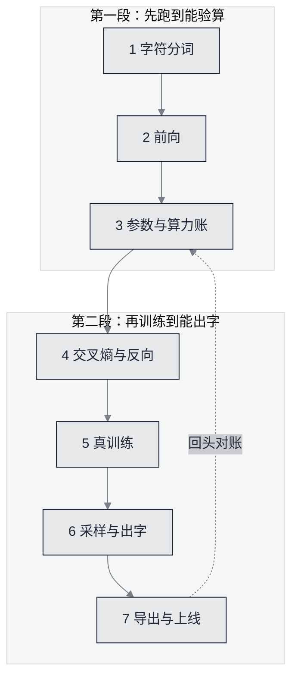

# 22 从零手写一个大模型 · 本章导读


**一句话**：七页走完 **分词 → 前向 → 预算 → 反向 → 训练 → 采样 → 导出**，落成一个 **3780** 个参数的字符级 GPT：1656 个字符的语料、36 个字符的词表、2 层 2 头、700 步真训练，全部只用 Python 标准库。**每一页贴出的每个数字，都有一条在跑之前就立好的达标线盯着。**


## 这一章为什么存在

讲「怎么造大模型」的资料，绝大多数只讲不造：形状画得漂亮，loss 曲线贴得平滑，读者照着跑不出任何东西。这一章把「造」缩到一台笔记本跑得完的规模，然后把整条链子**跑通并且逐字回核**：

- 模型真的训练了 700 步，末段 loss 从 3.590354 降到 1.672449（未训练与训练用的是同一批窗口）；
- 生成的文本真的被量化过（3-gram 命中率），不是作者挑一段好看的贴上来；
- 权重真的写盘再读回，`logits` 真的逐位比对；
- 每一页的读数都由 `nano/` 里的脚本打印，判据 `tools/checks/check_build_llm_from_scratch.py` 会**重新跑一遍**并逐字比对页面贴的记录。

规矩写在 [本章达标线](spec.md)：先立标准，后跑产物；**哪一条没达到就在页面上照实写没达到，不把标准改到结果能够得着的地方**。这一条不是修辞——第 5 页那张 11 行扫描表里有 10 行是 `MISS`，页面把它们全留着。

## 冻结配置（全章同一份）

```json
{
  "n_layer": 2,
  "n_head": 2,
  "d_model": 12,
  "d_ff": 24,
  "block_size": 24,
  "batch_size": 8,
  "train_steps": 700,
  "lr": 0.045,
  "warmup_steps": 30,
  "min_lr_frac": 0.1,
  "beta1": 0.9,
  "beta2": 0.999,
  "adam_eps": 1e-08,
  "init_std": 0.02,
  "seed": 20260927,
  "log_every": 10,
  "val_windows": 12,
  "ckpt_sig_digits": 9,
  "corpus_chars": 1656,
  "holdout_frac": 0.1
}
```

这份 JSON 不是装饰：判据拿它与 `nano/gptnano.py` 里的 `CONFIG` 逐键对平（键不存在、值不一样都会红）。也就是说**页面与代码不能各说一套**——改了代码忘了改页面，这里当场红。预算边界由脚本自己印出来：

```text
冻结配置（全章同一份）: L=2 H=2 d=12 d_ff=24 T=24 B=8 steps=700 V=36
边界: n_layer<=2 d_model<=40 block_size<=24 train_steps<=800，预算 120 秒
```

参数量 **3780** 个（`d_ff` 只有 `2d`，所以比 GPT 系列的 `4d` 小得多，这是预算换来的取舍，第 3 页有细账）。训练实跑 112.7 秒，预算 120 秒——这条线真正的难处不是余量，而是**它取决于读者电脑当时忙不忙**：同一份配置在本机空闲实跑过 83.3 到 117.6 秒（判据两趟各自的两个读数），旁边压四个满载进程就到 140.7 秒。判决口径（取两遍里快的那遍、线不动）与它的代价写在第 3 页与第 5 页。

## 七页地图



*《图：顺序不是教程的客气，是依赖关系——第 4 页的数值梯度要用第 2 页的前向，第 6 页的采样要读第 5 页写出的权重，第 7 页再回过头核对第 3 页那笔参数账》*

| 页 | 读者能独立验算的东西 | 本轮读数 |
|---|---|---|
| [1 字符分词](build-01-tokenizer.md) | `decode(encode(x)) == x` | 词表 36，序列长度 1656 |
| [2 前向](build-02-forward.md) | 每个中间张量的形状、掩码后的行和 | 未训练 loss 偏差 0.1907%，行和 1.000000 |
| [3 参数与算力账](build-03-budget.md) | 分模块求和 vs 实测 | 求和 3780，实测 3780，差 0 |
| [4 交叉熵与反向](build-04-backward.md) | 手写梯度 vs 中心差分数值梯度 | 抽样 30 个，最大相对误差 5.987e-06 |
| [5 真训练](build-05-train.md) | 真实 loss 序列、两次运行相同 | 71 行记录，末段均值 1.672449 |
| [6 采样与出字](build-06-sampling.md) | 生成文本与 3-gram 命中率 | 8 段各 220 字符，最差一段 61.0% |
| [7 导出与上线](build-07-export.md) | 权重 sha256、重载逐位一致 | 字节数 48488，最大绝对差 0.0e+00 |

## 三条硬规矩（从第 19 章带来）

本章的脚本与 [第 19 章动手实验](../19-labs/README.md) 的「三条硬规矩」同源：纯标准库、零依赖、不要 API key、本机直接跑、两次运行 stdout 逐字节相同。多出来的一条是**判据落库**：第 19 章的产物由 `tools/checks/check_lab_runnability.py` 真跑两遍对平，本章由 `check_build_llm_from_scratch.py` 把每一页的达标线逐条判决。

复跑顺序（每步都在 `nano/` 目录下执行，前一步的产物是后一步的输入）：

1. `python nano/nano_tokenizer.py` — 产出 `nano/out/corpus.txt` 与 `nano/out/vocab.json`
2. `python nano/nano_forward.py` — 走一遍前向，打印形状链与注意力权重
3. `python nano/nano_budget.py` — 分模块参数账、MACs、激活量与 KV Cache
4. `python nano/nano_backward.py` — 手写梯度与数值梯度对照，外加三种「故意少算一项」的变异
5. `python nano/nano_train.py` — 真训练，写出 `nano/weights_alice.json`
6. `python nano/nano_sample.py` — 贪心与温度 1.0 各四段续写
7. `python nano/nano_export.py` — 检查点的字节稳定性、截断代价、KV Cache 那笔账
8. `python tools/checks/check_build_llm_from_scratch.py` — 把上面七页的数字全部重新跑一遍并逐字回核

第 8 步会真跑第 5 步（而且跑两遍以核对 stdout 是否逐字节相同），所以完整验算一遍需要几分钟；只想看页面结构的读者可以先跑 `--pages-only`，但要注意：**那一趟不判决达标线**，它的绿不是「本章合格」的绿。

## 读完能做到

- 说清一个自回归大模型从文本到字节的**每一步**：字符表怎么建、位置怎么进模型、掩码为什么必要、下一字符分布怎么变成实际输出；
- 不查资料就算出一个 Transformer 的**参数量与每 token 的乘加数**，并指出「每层 12 d²」这个简写在什么条件下才成立；
- 用中心差分的办法**验证自己手写的反向**，并且知道哪一类梯度错误是数值检查也抓不出来的；
- 判断一个训练结果是否可信：末段均值而不是最低点、留出集而不是训练集、命中率而不是观感；
- 解释「为什么 3780 个参数的模型写成文本要 48488 字节」，以及换成 fp32、int8 各自省下什么、丢掉什么；
- 把这一整套判据搬到自己项目里：**先写下能被机器判决的达标线，再动手做**。

## 术语速查

| 英文 | 中文 | 白话 | 出处页 |
|---|---|---|---|
| tokenizer | 分词器 | 文本与整数之间的双向翻译 | 第 1 页 |
| vocabulary | 词表 | 模型只认识这些符号 | 第 1 页 |
| perplexity | 困惑度 | 平均在几个候选里犹豫 | 第 2 页 |
| causal mask | 因果掩码 | 不许偷看后面的字 | 第 2 页 |
| layer norm | 层归一化 | 把每个位置的数值重新拉平 | 第 2 页 |
| activation | 激活量 | 前向为反向留下来的中间结果 | 第 3 页 |
| KV cache | 键值缓存 | 用显存换掉重复计算 | 第 3 页 |
| gradient check | 梯度校验 | 拿差分当尺子量身写的梯度 | 第 4 页 |
| warmup schedule | 学习率预热 | 开头小步走，之后再加速 | 第 5 页 |
| holdout set | 留出集 | 训练时故意不看的那部分数据 | 第 5 页 |
| greedy decoding | 贪心解码 | 每步只挑最大那一项 | 第 6 页 |
| temperature | 温度 | 分布被压尖还是抹平 | 第 6 页 |
| checkpoint | 检查点 | 权重连同配置一起存下来的文件 | 第 7 页 |
| quantization | 量化 | 用更少的位数存同一个数 | 第 7 页 |

## 章末自测

1. 这一章敢用 1656 个字符当语料，凭什么不算玩具？训练见到的 token 数是语料长度的多少倍，页面用什么数字承认那是复述而不是理解？（提示：见 [参数与算力账](build-03-budget.md) 与 [真训练](build-05-train.md)）
2. 未训练模型的 loss 应该接近哪个量？偏差超过多少说明前向里有 bug，每行注意力权重又被判到什么精度？（提示：见 [前向与掩码](build-02-forward.md)）
3. 数值梯度检查全部通过，为什么仍可能藏着 bug？哪一类参数在数学上根本不可辨识？（提示：见 [手写反向](build-04-backward.md)）
4. 贪心四段 3-gram 命中率 100.0%，为什么这反而是本章最难看的结果？温度 1.0 那一边的读数是多少？（提示：见 [采样与解码](build-06-sampling.md)）
5. 「重载后 logits 逐位一致」为什么不能当成「序列化无损」？真正的截断代价是怎么量出来的、量到多少个数变了？（提示：见 [导出与上线](build-07-export.md)）
6. 「训练实跑 < 120 秒」这条线为什么会因为读者电脑上正开着别的程序而变红？判据为此把判决样本改成了什么，线又为什么不动？（提示：见 [真训练](build-05-train.md) 与 [本章达标线](spec.md)）

## 参考资料

- [本章达标线与判决口径](spec.md)
- [nanoGPT（同一规模思路的参照实现：先声明复现目标，再贴 val loss 表）](https://github.com/karpathy/nanoGPT)
- [Karpathy：Zero to Hero（字符级语言模型与温度采样的原始教学）](https://karpathy.github.io/2015/05/21/rnn-effectiveness/)
- [The Curious Case of Neural Text Degeneration（解码策略与退化，arXiv:1904.09751）](https://arxiv.org/abs/1904.09751)

## 相关知识点

- [Transformer 与 Attention（本章要实现的那个块）](../03-llm/transformer-attention.md)
- [第 19 章动手实验的三条硬规矩](../19-labs/README.md)
- [训练与微调基础设施（本章预算之外的做法）](../16-ai-infrastructure/training-finetune-infra.md)
- [推理服务与引擎（缓存、批量、连续批处理）](../16-ai-infrastructure/inference-serving.md)
- [大厂 LLM/AI 面试真题（被问「手写一个 mini GPT」时怎么答）](../20-interview/README.md)
