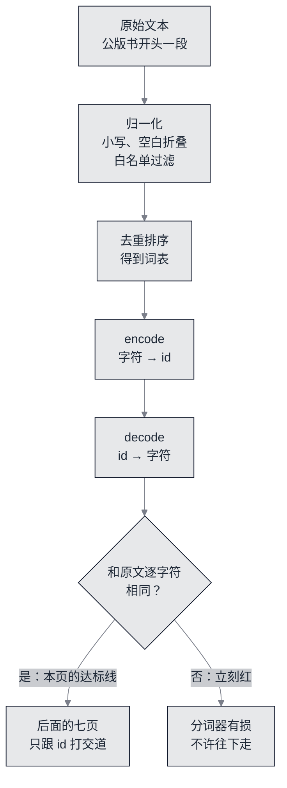

# 字符分词：文本变成整数，再原样变回来


**一句话**：这一站只做一件事——把一段文本映成整数序列，并且证明它能**原样**回来；顺手把后面七页要用的两个天花板（词表大小 $$V$$、序列长度）钉成可数出来的数。


造模型的第一步不是搭网络，是**决定模型能吐出哪些符号**。字符级分词把这件事简化到可以手算：词表就是语料里出现过的字符集合，一个字符一个 id。听起来简陋，但它换来了一条极硬的性质——**编解码恒等**，任何一段文本经过 `encode` 再 `decode` 必须逐字符相同。这条性质能当判据用，而「能不能当判据用」正是本章每页的达标线来源（见 [本章达标线](spec.md)）。

## 这一站要能验算的三件事



*《图：字符分词的闭环——归一化之后先去重排序建词表，再走一遍 encode→decode 的可逆性检查；不可逆就整章停下，因为后面七页贴的每一行数字都建立在「id 序列就是那段文本」之上》*

复跑物是 `nano/nano_tokenizer.py`，纯标准库，跑完把语料和词表落成两份产物。下面这段是它今天真实打印的：

```text
语料 CONFIG.corpus_chars = 1656  实际归一化后字符数 = 1656
词表大小 V = 36   (= 语料去重字符数 36)
词表(按码位排序): \n \s ! " ( ) , - . : ; ? a b c d e f g h i j k l m n o p r s t u v w x y
码位范围: 10 … 121
编码后 id 数 = 1656   前 40 个 id: [12, 23, 20, 14, 16, 1, 33, 12, 29, 1, 13, 16, 18, 20, 25, 25, 20, 25, 18, 1, 30, 26, 1, 18, 16, 30, 1, 32, 16, 28, 35, 1, 30, 20, 28, 16, 15, 1, 26, 17]
往返 decode(encode(x)) == x : True
id -> 字符 抽样: 0->\n  1->\s  5->)  11->?  20->i  35->y
最高频 5 字符: \s:302  e:153  t:136  o:110  a:103
只出现 1 次的字符数 = 7
一个长度为 24 的窗口 = 24 个输入 id + 24 个预测目标
每步喂给模型的预测数 = batch_size x block_size = 192
均匀猜测的 loss = ln V = 3.583519  (nats/token)
产物: nano/out/corpus.txt (1656 字符), nano/out/vocab.json (36 项)
```

三条达标线在这一页落地成三行读数：

| 达标线 | 读数出处 | 判决 |
|---|---|---|
| 解码恒等 | 往返那一行的 True | 相等才继续 |
| 词表大小 = 语料去重字符数 | 同一行里两个数都是 36 | 差 0 |
| 序列长度 = 字符数 | 归一化后 1656，编码后 id 数 1656 | 差 0 |

## 词表里没有的字母，模型永远打不出

上面那行词表里少两个字母：**q 和 z 根本不在语料里**。这不是缺陷描述，而是字符级词表的定义性后果——模型输出层的宽度就是 $$V$$，softmax 只在 $$V$$ 个格子里分配概率，所以「打出一个 q」在这套权重下不是低概率，是**概率恒等于零**。同理，`ALLOWED` 白名单里没有大写字母与数字，所以模型也没法输出它们。

把这条后果推到读者自己身上：换语料＝换词表＝换输出层形状＝换整份权重。第 7 页导出那站会再遇到这件事（`nano/nano_export.py` 里写得很直白：词表与预处理要一起打包）。这也是真实项目宁可买一个大词表 BPE 的原因——不是为了省算力，是为了**换文本不用换模型**。

## 为什么本章不用 BPE

BPE（Byte Pair Encoding，字节对编码）把高频字符对合成新符号，用几千条合并规则把有效词表压到 5 万上下；`nano_tokenizer.py` 走的是另一条路：把「合并规则」这一整层先拿掉，代价是模型必须自己从字符学拼词，好处是**词表构造这一步本身可以被手算验证**。

两条路的差别在数据上最清楚。BPE 训练完，读者无法回答「这个 id 对应什么」以外的任何问题，因为词表是学出来的规则集；字符级则能当场核对：去重字符数 36，词表 36，序列长度等于字符数。这条恒等一旦成立，后面所有 loss、困惑度、token 数就都有了不含糊的分母。

顺带交代一个容易读错的量：这里的「token」就是字符，所以 `每步喂给模型的预测数 = batch_size x block_size = 192` 里的 192 既是 token 数也是字符数，第 3 页的算力账和第 5 页的 token 吞吐都跟这个口径一致。

## 窗口、目标与那个「均匀猜测」的下界

分词器交出来的最后一样东西是**loss 的起点**。模型如果什么也没学到、对每个位置都给均匀分布，交叉熵恰好是 $$\ln V$$（推导在第 4 页）：

```text
均匀猜测的 loss = ln V = 3.583519  (nats/token)
```

这个数字后面出现三次，每次都换了身份：在第 2 页它是**未训练模型该贴住的靶心**（偏离太多说明前向写错了）；在第 5 页它是**训练进步的尺**（达标线写成末段 loss ≤ 0.70·$$\ln V$$）；在第 6 页它是困惑度的参照（$$e^{\ln V}=V$$，36 个字符里瞎猜一个）。三处都用同一个读数，是为了让读者能拿计算器对：$$\ln 36 = 3.5835189\ldots$$

窗口那一行也值得停一下。「24 个输入 id + 24 个预测目标」不是 24+24=48 个字符，而是同一段字符错开一格读两遍：目标是「下一个字符」，所以每行只有 24 个监督信号，而不是 25 个。第 2 页会把这条右移关系逐元素核对一遍。

## 读者可以现在就改的一处

把 `nano/gptnano.py` 里的 `RAW_TEXT` 换成任意一段中文，再跑 `python nano/nano_tokenizer.py`，会立刻看到白名单把不属于 `ALLOWED` 的字符全丢掉、归一化后字符数与 `CONFIG.corpus_chars` 对不平——这是设计好的失败：`nano_tokenizer.py` 会把两个数都打印出来，让读者自己看见不匹配，而不是抛个「形状错误」了事。想跑中文语料，要动的是 `ALLOWED` 与 `corpus_chars` 两处，而词表 $$V$$ 一变，全章后面七页的所有数字都要重算——这正是本章把「冻结配置」写进 [达标线表](spec.md) 的原因。

## 自测

**1. 为什么「解码恒等」比「词表大小」更适合作为分词器的第一条判据？**
词表大小只是一个数，写错成 35 或 37 都可能碰巧被别的 bug 抵消；而 `decode(encode(x)) == x` 是对全部 1656 个位置同时成立的性质，任何映射错位都会当场破坏它。恒等式是判据，单点是读数。

**2. 未训练模型的 loss 为什么应该接近 $$\ln V$$ 而不是 0？**
因为第 2 页的前向用的是标准差 0.02 的小随机初始化，logits 彼此差距极小，softmax 输出接近均匀分布；交叉熵在均匀预测时取 $$\ln V$$。一上来就远低于 $$\ln V$$ 反而是泄漏信号——多半是标签右移写错，模型看见了答案。

**3. 换成 BPE 词表后，「序列长度 = 字符数」这条恒等还成立吗？**
不成立，它变成「id 数 ≤ 字符数」，并且合并规则决定切法。这就是本章选字符级的取舍：少一层学习型规则，多一条能被手算验证的恒等。

## 参考资料

- [neural-machine-translation-of-rare-words-with-subword-units（BPE 原论文）](https://arxiv.org/abs/1508.07909)
- [minbpe（Karpathy 的最小 BPE 实现，GPT-4 分词口径）](https://github.com/karpathy/minbpe)
- [Alice's Adventures in Wonderland 公版全文（本章语料出处）](https://www.gutenberg.org/files/11/11-0.txt)
- [nanoGPT（对照：它的分词是 tiktoken，不是字符级）](https://github.com/karpathy/nanoGPT)

## 相关知识点

- [本章达标线：一页一页能验算的验收表](spec.md)
- [前向：形状链走到 logits](build-02-forward.md)
- [交叉熵与反向：`ln V` 的来历](build-04-backward.md)
- [导出与上线：词表与权重一起打包](build-07-export.md)
- [Transformer 与 Attention（本章要实现的那个块）](../03-llm/transformer-attention.md)
