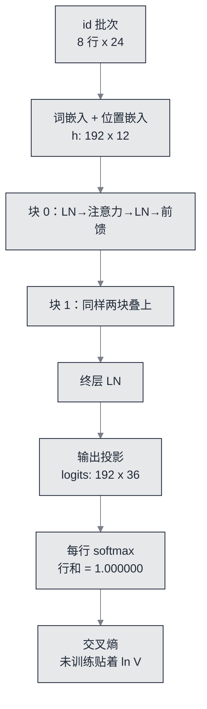

# 前向：把形状链一路走到 logits


**一句话**：这一站不训练，只做一次前向，然后把三件事摆到读者眼前——每个中间张量的**形状**、掩码后每行注意力的**概率和**、以及未训练模型的 **loss 该落在哪儿**。三件事都能被机器判决，写错一个下标就会红。


- 可运行脚本：[`nano/nano_forward.py`](https://github.com/funny8kids/ai-agent-handbook/blob/main/nano/nano_forward.py)（库在 [`nano/gptnano.py`](https://github.com/funny8kids/ai-agent-handbook/blob/main/nano/gptnano.py)，纯标准库）

一个没训练过的模型应该是什么样？答案很反直觉：**它的 loss 必须几乎等于 $\ln V$**。小随机初始化下 logits 之间差距极小，softmax 接近均匀分布，交叉熵就贴着 $\ln V = 3.583519$。所以「未训练 loss 与 $\ln V$ 差 ≤ 2%」不是走过场，而是一条能抓住标签错位、掩码反向、缩放漏掉这三类经典错误的判据（见 [本章达标线](spec.md)）。

## 计算图与三个可判决的位置



*《图：前向的形状链——从 8×24 的 id 批次到 192×36 的 logits；判据盯的三个位置都在这条链上：右移关系（进门前）、每行概率和（出门前）、loss 与 ln V 的距离（最后一步）》*

## 记录一：形状链，每一行都可以数

`nano/nano_forward.py` 今天打印的中间张量清单（原样贴出，读者对着代码数）：

```text
配置: n_layer=2 n_head=2 d_model=12 d_ff=24 block_size=24 batch_size=8 vocab=36
d_head = d_model / n_head = 12 / 2 = 6
xb: 8 行 x 24 个输入 id
yb: 8 行 x 24 个目标 id
第 0 行输入 -> 'down went alice after it'
第 0 行目标 -> 'own went alice after it,'
行内右移核对 yb[r][t] == xb[r][t+1]: 命中 184 / 184
嵌入相加后 h:       192 x 12   (B*T 个位置向量)
块 0  LN1 输出 a:   192 x 12
块 0  qkv 线性输出: 192 x 36   (q/k/v 各 12 列并排)
块 0  注意力后 ao:  192 x 12
块 0  LN2 输出 b:   192 x 12
块 0  fc1 输出 f1:  192 x 24   -> gelu 后 g: 192 x 24
logits:             192 x 36   (每个位置一个词表分布)
```

三处值得停下来核对：

- **192 = 8 × 24**：所有中间张量的「行数」都是展平后的位置总数，没有哪个算子偷偷改变它。改 batch 或窗口只改这一维，后面的形状全部跟着平移——这就是本章敢把形状表贴出来的原因。
- **qkv 是 36 而不是 12**：一块里 q、k、v 三个投影并成一次乘加，$3d = 36$ 列并排存；注意力之后 proj 把 12 映回 12。第 3 页的算力账就是靠这个「一次算三个」的形状算的。
- **右移 184 / 184**：$8\times24=192$ 个位置里只有 184 个能被行内核对——每行最后一个位置的目标在窗口外（脚本自己解释了这件事），所以这是「全部可核对的位置都核对上」，不是「漏了 8 个」。

## 记录二：注意力每行的和必须是 1

因果掩码保证查询位置 $t$ 只能看 $0..t$。脚本把掩码后的权重直接印出来：

```text
因果掩码后的注意力权重（块 0 头 0；查询 t 只能看 0..t，所以行长 = t+1）
  查询 t=0: 1.0000 | 行和 1.000000
  查询 t=1: 0.5001 0.4999 | 行和 1.000000
  查询 t=2: 0.3332 0.3341 0.3327 | 行和 1.000000
  查询 t=3: 0.2509 0.2487 0.2501 0.2503 | 行和 1.000000
  查询 t=4: 0.1997 0.2002 0.2005 0.2003 0.1993 | 行和 1.000000
缩放 1/sqrt(d_head) = 1/sqrt(6) = 0.408248290
```

行长 $=t+1$ 是「未来没进 softmax」的直接证据：如果掩码写反了，$t=0$ 那行会摊到整个窗口而不是 1 个位置。达标线要求每行和等于 1.000000，192 行全查：`192 行的概率和: 最小 1.000000 最大 1.000000`。

**为什么未训练时每行几乎均匀**：$q,k$ 由标准差 0.02 的随机权重投影而来，点积量级在 $10^{-2}$，再乘缩放 $1/\sqrt{6}=0.408248290$ 之后 logits 差值远小于 1，softmax 就退化成近似均匀——所以第 0 行是 1.0000，第 3 行四个数都在 0.25 附近。这不是「注意力没起作用」，而是**随机初始化的注意力本来就该长这样**；一旦训练起来，同一位置的值会拉开（第 5 页之后可以重跑这一页对比）。

脚本还留了一笔能手算的账：

```text
可手算核对的一笔：位置 3 的 q(头 0) 与位置 0 的 k(头 0) 点积 = 0.012031
  乘缩放 0.408248290 -> 0.004912；该查询位置 softmax 后对位置 0 的权重 = 0.250895
  位置 3 的行长 = 4（只覆盖 0..3），未来位置没有进入 softmax
```

三个数连起来读：$0.012031\times0.408248290=0.004912$，而四个未归一化的分数彼此差在 $10^{-3}$ 量级，softmax 之后 $\approx 1/4=0.25$。读者用计算器能把这一格从头算到尾——这正是本章把「可手算」当作达标线的意思。

## 记录三：LayerNorm 在这里打了个折扣（照实写）

```text
LayerNorm 之后每行应满足 mean=0, var=1（乘 gamma 加 beta 之前）：抽样 3 行
  行  0: mean(hat)=-0.000000000  mean(hat^2)=0.982472  std=0.023886
  行 191: mean(hat)=+0.000000000  mean(hat^2)=0.983735  std=0.024796
  行 0 的真实方差 5.605e-04，而 eps=1e-5 与它同量级 -> mean(hat^2)=0.982472 而不是 1
```

均值精确为 0（这条实现没问题），但平方均值是 0.982472 而不是 1。原因在分母：LayerNorm 除以 $\sqrt{\sigma^2+\epsilon}$，$\epsilon=10^{-5}$，而这一行的真实方差只有 $5.605\times10^{-4}$——**epsilon 与信号同量级**，归一化就必然偏小约 1.8%。

这是迷你模型的诚实后果：激活本来就小（$d=12$、嵌入标准差 0.02），固定 $\epsilon$ 的相对影响就大。真实大模型激活方差大得多，$\epsilon$ 可以忽略；反过来，任何把 LayerNorm 的 $\epsilon$ 设为 0 或 $10^{-12}$ 的实现，在本章这个规模上会给出更贴近 1 的读数。**同一段代码在两种规模上的误差量级不同**，这类差别只有把数字印出来才看得见。

## 未训练 loss：靶心打中了

```text
未训练 loss = 3.590354 nats/token
均匀猜测   = ln V = 3.583519
相对偏差   = 0.1907%  (达标线 2%)
困惑度 exp(loss) = 36.2469   词表大小 = 36
```

偏差 0.1907% 远低于 2% 的线，困惑度 36.2469 略大于词表大小 36——这两句其实是同一件事的两种说法：$\exp(3.590354)=36.2469$，而均匀分布的困惑度恰好是 $V=36$。模型此刻最看好的字符（`m(0.1263) s(0.0892) d(0.0809)`）来自随机权重的偏好，没有任何语言知识；第 5 页训练完再跑一次这一页，这五个字符会换成语料里真正高频的。

## 自测

**1. 标签右移写成 `yb[r][t] == xb[r][t]` 时，未训练 loss 会怎么变？**
会**掉得很低**而不是贴近 $\ln V$：每个位置的输入就是它自己的答案，模型只要学会复制。这正是这条判据的反向用途——「一上来 loss 就远低于 $\ln V$」是泄漏，不是好兆头。

**2. 为什么行和判据要写成「等于 1.000000」而不是「约等于 1」？**
softmax 的实现误差在 float64 下是 $10^{-16}$ 量级，任何能观察到的偏离都来自逻辑错误（掩码方向、归一化轴、忘记除 $\sqrt{d}$ 之后的溢出截断）。判据留 0 余量才能区分「实现有噪声」和「写错了」。

**3. 把 `n_head` 从 2 改成 3，形状链里哪些数会变？**
$d_{\text{head}}=12/3=4$，qkv 拼接仍是 $3d=36$ 列、proj 仍 12→12，注意力打分与 softmax 的形状不变。也就是说：**换头数不改任何一层权重的形状，只改打分的粒度**——这解释了很多框架允许原地换 `n_head` 而不动参数文件。

## 参考资料

- [Attention Is All You Need（缩放因子 $1/\sqrt{d_k}$ 与因果自注意力的原始定义）](https://arxiv.org/abs/1706.03762)
- [Layer Normalization（按单样本全部求和输入归一化，并给出逐元素 gain/bias）](https://arxiv.org/abs/1607.06450)
- [Gaussian Error Linear Units（本章 gelu 用的 $x\cdot\Phi(x)$ 形式）](https://arxiv.org/abs/1606.08415)
- [The Illustrated Transformer（多头注意力分块的图示口径）](https://jalammar.github.io/illustrated-transformer/)

## 相关知识点

- [字符分词：窗口、右移与 ln V 的来历](build-01-tokenizer.md)
- [参数与算力账：这些形状值多少钱](build-03-budget.md)
- [交叉熵与反向：把这份前向的梯度逐参数对上](build-04-backward.md)
- [Transformer 与 Attention](../03-llm/transformer-attention.md)
