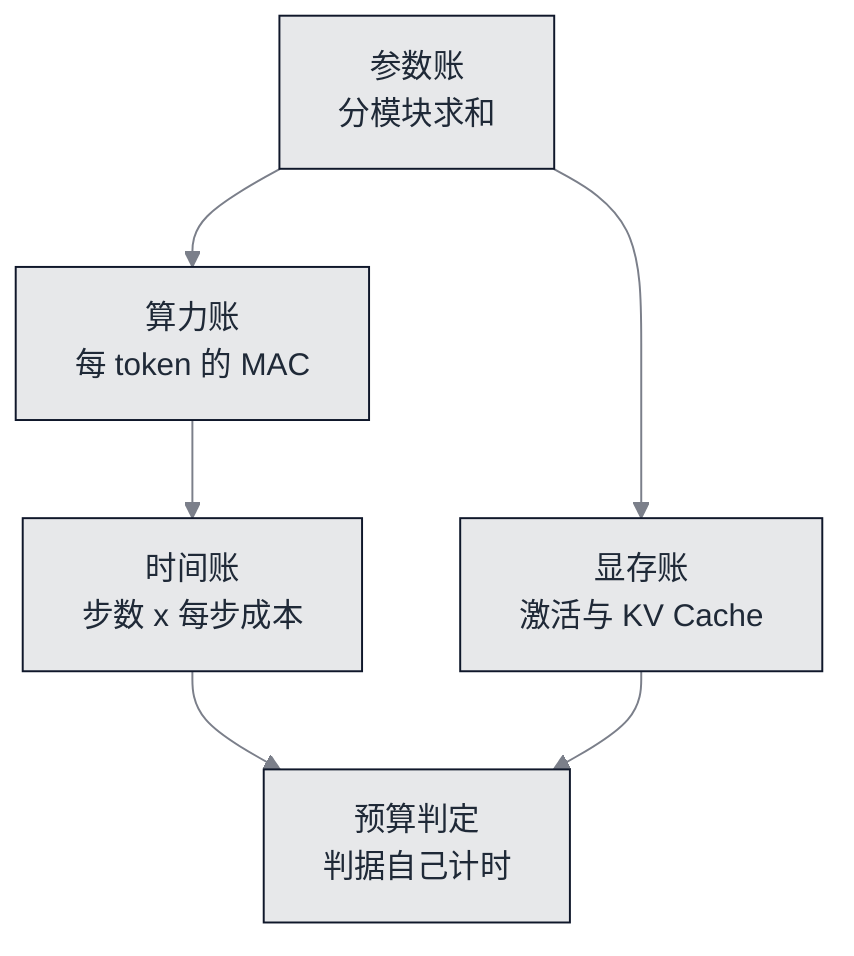

# 参数与算力账：这个模型值多少钱


**一句话**：这一站把「多大、多贵」变成两道能在纸上算完的题——**参数量分模块求和必须等于实测计数（差 0）**，**每个 token 的乘加数必须由维度名算出来**。算不清这两笔账，后面的训练时间与显存读数就都只是形容词。


- 可运行脚本：[`nano/nano_budget.py`](https://github.com/funny8kids/ai-agent-handbook/blob/main/nano/nano_budget.py)

冻结配置如下：

$$
L=2, H=2, d=12, d_{ff}=24, T=24, B=8, \text{steps}=700, V=36
$$

全章七个脚本共用这一份 `CONFIG`，[本章达标线](spec.md) 还把它的边界钉成硬线：`n_layer ≤ 2`、`d_model ≤ 40`、`block_size ≤ 24`、`train_steps ≤ 800`，超出去的写法属于基础设施话题，不在此章。

## 三笔账，各自能被谁验算



*《图：这一页的四笔账共享同一组维度名。参数账与算力账是精确对平（差 0），时间账只能带日期读数、由判据自己计时，显存账则随 batch 与上下文长度线性或二次增长——四者严格程度不同，页面写法也不同》*

## 参数账：八行表格求和等于实测

脚本按「维度名 → 个数」算一遍，再和 `count_params` 走一遍叶子张量得到的数对撞：

```text
分模块参数账（count 列只由维度名算出来，不是把张量再走一遍）
  token 嵌入 wte    V x d = 36 x 12               432
  位置嵌入 wpe      T x d = 24 x 12               288
  层归一化 x2 块    4 x d x 2 块                  96
  注意力 qkv+proj x2(3 d^2 + 3 d + d^2 + d) x 2   1248
  前馈 fc1+fc2 x2   (2 d x d_ff + d_ff + d) x 2   1224
  终层 layernorm    2 x d                         24
  输出投影 lm_head  d x V = 12 x 36               432
  输出偏置 lm_b     V = 36                        36
  求和 3780  vs  实测 count_params 3780  差 0（达标线要求 0）
```

| 模块 | 由维度名算出 | 个数 |
|---|---|---|
| token 嵌入 | V x d | 432 |
| 位置嵌入 | T x d | 288 |
| 两块层归一化 | 4 x d x 2 | 96 |
| 注意力 qkv+proj | 2 块 ×（下式） | 1248 |
| 前馈 fc1+fc2 | 2 块 ×（下式） | 1224 |
| 终层归一化 | 2 x d | 24 |
| 输出投影 | d x V | 432 |
| 输出偏置 | V | 36 |
| **求和 / 实测** | — | **3780 / 3780** |

三条最值得看的细节：

- **嵌入与输出投影都是 432，但角色不同**：`wte` 是查表（$$V$$ 行 $$d$$ 列），`lm_head` 是把 $$d$$ 映回 $$V$$。本章**没有做权重绑定（weight tying）**，所以两份都要钱；GPT-2 那份实现绑了，账上就会少一项 432。
- **层归一化看着便宜，其实是「每块 4 个 d」**：$$\gamma,\beta$$ 各 $$d$$ 个，一块两层就是 $$4d$$，两块 $$8d=96$$。$$d$$ 很小的模型里，归一化参数占比不算低。
- **`lm_b` 只有 V 个**：输出偏置的形状是词表大小而不是 $$d$$，这一项常常被忘记写，导致求和差 36 而查半天。

求和与实测的差必须是 0——这是本章最硬的一条线：两边由不同的代码路径算出（一边解析维度名，一边遍历叶子张量），任何一处漏项都会立刻暴露。**用两条独立算法对同一个量**，比任何单条算法的自洽都强。

## 算力账：每 token 每层到底多少乘加

```text
每 token 前向乘加数 MAC = (每层线性) x L + 2 T d x L + d V，每层线性 = 4 d^2 + 2 d d_ff
  每层线性 = 4*12^2 + 2*12*24 = 576 + 576 = 1152
  注意力侧 4 d^2 = qkv 3 d^2 + proj d^2 = 432 + 144
  前馈侧 2 d d_ff = fc1 d x d_ff + fc2 d_ff x d = 288 + 288
  = 1152*2 + 2*24*12*2 + 12*36 = 3888
```

`2 T d x L` 那一项是注意力打分的钱：每个查询位置要和 $$T$$ 个键做 $$d$$ 维点积（掩码前按满窗口上界算），再加权求和。$$dV$$ 是输出投影。

**这条式子最容易被记错的地方**，脚本自己也点出来了：

```text
常见简写「每层 12 d^2」只在 d_ff = 4d 时成立：GPT-2 124M（d=768, d_ff=3072）两者都是 7077888，本章 d_ff=24=2d，所以 12 d^2=1728 比真实每层 1152 多算 576（50%）
```

「每层 $$\approx 12d^2$$」是 $$d_{ff}=4d$$ 特例下的化简（$$4d^2 + 2d\cdot 4d = 12d^2$$）。本章为了跑进预算把 $$d_{ff}$$ 设成 $$2d$$，照抄化简就会把每层多算 50%。这类错误的代价不对称：读者拿 $$12d^2$$ 去估真机时间，误差会一路传到预算。

再往下是整次训练的总量：

```text
每步（B*T 个 token，反向按 2 倍前向）约 2239488 MAC
整次训练 700 步约 1.568e+09 MAC，喂进去的 token 总数 = 134400
训练见到的 token 数是语料长度 1656 的 81.2 倍（所以这是过拟合式的复述，不是预训练）
```

最后一句是全章最该被记住的限制：**同一个 1656 字符的语料被反复看了 81.2 倍**。scaling laws 那条「性能随参数、数据、算力呈幂律」的规律前提是三者同步放大（见 Kaplan 等人的原文），这里数据是固定的，所以第 5 页 loss 降得动、第 6 页生成的文本也只是**贴住语料的 n-gram**——这不是失败，而是这一预算下唯一诚实的期望值。

## 显存账：激活留在内存里，KV 留在解码期

```text
激活量（前向要为反向留住的中间量，单位 float）
  每块: B*T*(a+qkv+ao+b+f1+g) = 8*24*(12+36+12+12+24+24) = 23040
  2 块合计 46080，加 logits 192*36 = 6912，总计 5.299e+04 float ≈ 0.4 MB（float64）
解码期 KV Cache：每层每 token 存 k 与 v，各 H*d_head = d 个数
  每 token = 2*2*12 = 48 float = 0.2 KB（float32）
  上下文 1024，单条序列 = 0.19 MB
  上下文 4096，单条序列 = 0.75 MB
  上下文 32768，单条序列 = 6.00 MB
  同一公式换成 GPT-2 124M 的形状（L=12, d=768）：每 token 18432 float = 72.0 KB（float32）
```

训练期的量是 $$B\times T$$ 乘以每层中间宽度之和（反向要拿它们算梯度）；解码期的量只跟**层数 × 隐藏维度 × 序列长度**有关，跟参数量无关。这就是为什么一个很小的模型在长上下文、多并发下也会被 KV Cache 压垮——服务侧的分页与连续批处理解决的就是这一项（第 16 章 [推理服务那页](../16-ai-infrastructure/inference-serving.md) 讲机制，本页只给算术）。

顺带把二次项的位置也算了：

```text
注意力 O(T^2) 与逐位置 FF/O 的两笔账
  T=24    注意力打分 1152 : 线性层 2304  ->  比值 0.500
  T=512   注意力打分 24576 : 线性层 2304  ->  比值 10.667
  T=4096  注意力打分 196608 : 线性层 2304  ->  比值 85.333
  两条相等的上下文长度 T* = 每层线性 / (2 d) = 48；本章窗口 T=24 在它左边，所以二次项还压不过线性项
```

$$T^*=48$$ 是本章形状的一个具体后果：窗口只有 24，注意力打分的花费是线性层的 0.500 倍，所以「上 FlashAttention 省注意力二次项」在这个规模上是省错了地方。同一句话在 $$T=4096$$ 时反过来——那时比值是 85.333。

## 时间账：为什么这一页不写死秒数

```text
同一形状三种点积写法实测吞吐：倍率与秒数都走 stderr，stdout 只留下选中的写法
整步耗时实测：跑 3 步取均值（stderr），并外推 700 步
  预算判定交给判据自己计时，不信任这里贴出的数
```

`nano/nano_budget.py` 确实量了三种纯标准库点积写法，最快与最慢差 2.43 倍——**这类读数换台机器就变**，所以它只走 stderr，页面正文也不复述。墙钟唯一进入判决的方式是判据自己跑 `nano/nano_train.py` 计时，与达标线「训练实跑 < 120 秒」比。本轮脚本自报 `总耗时 112.7 秒`，判据同一趟的两次实跑是 83.3 与 98.0 秒（对 120 秒，余量 18%–31%），另一趟空闲时的两遍是 99.5 与 117.6 秒（余量只剩 2%）；同一份配置在四个 CPU 满载进程旁边跑到 140.7 秒。所以这一页要说的不是「余量多少」，而是**这条线的读数取决于机器当时忙不忙**：判据因此按 [达标线](spec.md) 的口径取两遍里快的那遍判决、把慢的那遍当负载读数印出来，线本身一个字没动。为什么这么改、以及它什么时候该红，写在 [训练页](build-05-train.md) 的余量一节。

## 自测

**1. 为什么「分模块求和 = 实测」这一条比「参数量 ≈ 3.8K」更有价值？**
前者是两条独立代码路径的交叉验证，能抓住漏项（例如忘了 `lm_b` 的 36 个）；后者是化简后的形容词，读者复算不了也判决不了。本章所有 CLAIM 桶的数字都要求精确对平，不留「约」。

**2. 本章 $$d_{ff}=2d$$ 而不是 $$4d$$，账面后果是什么？**
每层线性部分从 $$12d^2$$ 掉到 $$4d^2+2d\cdot 2d=8d^2$$，也就是每 token 每层少算 $$4d^2=576$$ 个 MAC。省下的是算力，代价是模型表达能力——第 6 页采样达标线只剩 1.0 个百分点的余量，跟这次削减同源。

**3. 把 `block_size` 从 24 提到 512（仍然 $$d=12$$），最先撑不住的是哪笔账？**
不是参数量（只多 $$T\cdot d=6144$$ 个位置嵌入），而是解码期的二次打分与 KV Cache：打分比值从 0.500 涨到 10.667，每 token 缓存仍只有 48 float 但长度涨了 21 倍。这个形状失衡正是「短窗口模型靠 FFN 活着」的含义。

## 参考资料

- [Scaling Laws for Neural Language Models（性能对参数、数据、算力呈幂律；结构形状影响很小）](https://arxiv.org/abs/2001.08361)
- [build-nanogpt（从零到 GPT-2 124M 的分步教程，含 token 量与成本口径）](https://github.com/karpathy/build-nanogpt)
- [Efficient Memory Management for LLM Serving with PagedAttention（KV Cache 为什么是服务侧的主要内存项）](https://arxiv.org/abs/2309.06180)
- [llm.c（纯 C/CUDA 实现，README 明说不需要 245MB 的 PyTorch）](https://github.com/karpathy/llm.c)

## 相关知识点

- [前向：形状链走到 logits](build-02-forward.md)
- [真训练：120 秒预算的实测与余量](build-05-train.md)
- [导出与上线：文本权重的真实字节代价](build-07-export.md)
- [训练与微调基础设施（本章预算之外的做法）](../16-ai-infrastructure/training-finetune-infra.md)
- [推理与服务化真题（KV Cache 与连续批处理的面经口径）](../20-interview/inference-serving.md)
