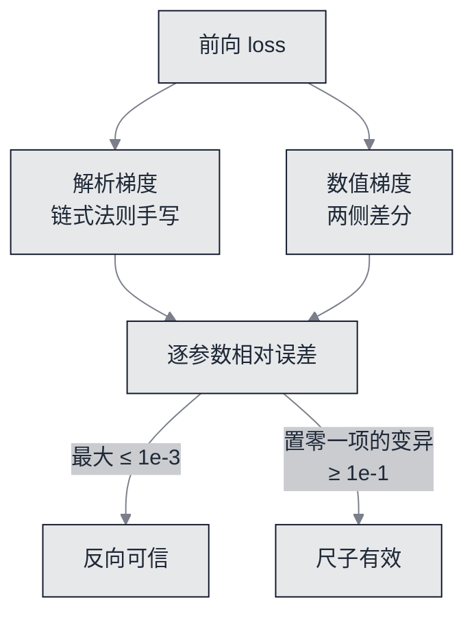

# 交叉熵与反向：手写梯度对撞数值梯度


**一句话**：反向是本章最容易「看起来对」的一步——代码跑通、loss 会降，梯度却可以是错的。所以这一站的判据不是「loss 下降」，而是**抽样 ≥12 个参数、手写梯度与差分梯度逐参数对照（最大相对误差 ≤ 1e-3）**，外加一条变异检验：**故意少算一项，误差必须 ≥ 1e-1**。


- 可运行脚本：[`nano/nano_backward.py`](https://github.com/funny8kids/ai-agent-handbook/blob/main/nano/nano_backward.py)

## 为什么必须有一条「反向也能红」的判据



*《图：两条独立路径算同一个梯度再对撞。左边那条（解析）是模型真正用的，右边那条（差分）慢但不容易写错；变异检验则回答「这把尺子能不能抓到错」——抓不到错的判据不算落地》*

## 交叉熵的起点就是 $\ln V$

单样本的交叉熵是 $-\log p_{y}$，实现里先算 log-softmax：

$$\log p_i = x_i - \operatorname{logsumexp}(x),\qquad \operatorname{logsumexp}(x)=m+\log\!\textstyle\sum_j e^{x_j-m},\quad m=\max_j x_j$$

减去最大值这一步不是优化而是**正确性**：`nano/gptnano.py` 里 `logsumexp` 用了这个恒等式，因为 $\exp$ 在 float 下会溢出，而移位后的最大项恰好是 $e^0=1$（原作者把它称作 exp-normalize trick，见参考链接）。有了它，第 1 页那句「均匀猜测的 loss 是 $\ln V$」才不是比喻：所有 logits 相等时，$p_i=1/V$，loss 精确等于 $\ln V=3.583519$。

## 记录一：30 个抽样的对撞结果

脚本给每个参数数组取一个叶子（30 个数组 → 30 个样本），数值侧用步长 $10^{-4}$ 的两侧差分：

```text
核对用的批: 8 行 x 24，loss = 3.590354
抽样策略: 每个参数数组取 1 个叶子（30 个数组 -> 30 个样本），嵌入行取批内出现过的 id
参数                       解析梯度        数值梯度        相对误差
wte[19][4]                  +1.170504e-03  +1.170501e-03   1.52e-06
lm_head[12][4]              -2.475561e-03  -2.475561e-03   4.31e-09
b0.qkv[12][4]               -4.440129e-06  -4.440128e-06   2.93e-08
b0.proj_b[4]                +3.999225e-03  +3.999177e-03   5.99e-06
b0.fc2_b[4]                 -2.333773e-02  -2.333776e-02   6.27e-07
样本数 = 30   最大相对误差 = 5.987e-06   达标线 1e-3 -> OK
数值梯度两侧都非零的样本 = 28 / 30
检查完 loss 复原 = 3.590354（与原值差 0.0e+00，证明扰动没有留在参数里）
```

（表里只摘了 5 行，完整 30 行在产物里。）最大相对误差 $5.987\times10^{-6}$，比 1e-3 的线低两个多数量级。这个数字该跟谁比？CS231n 的梯度检查经验口径是：相对误差 > 1e-2 基本说明梯度错了，1e-2 到 1e-4 之间会让人不安，小于 1e-4 通常可以接受。本章把它写成硬线 1e-3，同时要求**最坏样本**而不是平均样本——平均永远好看，最坏才会露馅。

两个容易被跳过的细节：

- **必须检查扰动是否留在参数里**。差分要临时改一个标量，改完要复原；脚本在全部抽样之后重新算一次 loss，读数 `3.590354` 与原值差 `0.0e+00`，这条自证才允许前面那 30 行当真。
- **「两侧都非零」的样本是 28 / 30**，不是 30。剩下两个是真正恒为 0 的梯度（下面解释），报告里写 28 而不是 30，是为了不让读者以为「所有样本都被非零值验过」。

## 记录二：故意少算一项，误差必须炸

一条永远能通过的判据等于没有判据。脚本内置三种变异——把某一项梯子在反向里置零：

```text
对照变异：故意把一整项梯度置零
  drop=attention  最大相对误差 1.000e+00  达标线 1e-1 -> OK  非零样本 28/30
  drop=fc2        最大相对误差 1.000e+00  达标线 1e-1 -> OK  非零样本 28/30
  drop=lm_head    最大相对误差 1.000e+00  达标线 1e-1 -> OK  非零样本 28/30
```

1.000 是相对误差的上界形式：解析侧被置成 0 而数值侧非零时，误差比就是 1。三条变异全部炸到上界，说明 1e-3 那条线**有区分力**：写漏任何一整块反向，判据都会红。这是 [达标线](spec.md) 里唯一一条「反着写」的线——它不检查模型对不对，检查检查者有没有用。

## 记录三：两个恒为 0 的梯度不是 bug

```text
两侧都恰好为 0 的样本（2 个）: b0.qkv_b[12], b1.qkv_b[12]
这不是漏检，而是模型的真实性质。把 qkv 偏置的三段各挪 0.5，看 loss 动多少:
  q 段: loss 3.590353841177 -> 3.590346030614（差 -7.811e-06）
  k 段: loss 3.590353841177 -> 3.590353841177（差 +0.000e+00）
  v 段: loss 3.590353841177 -> 3.592651167251（差 +2.297e-03）
  给每个位置的 k 加同一个向量，等于给每个查询位置的整行打分加同一个常数，
  而 softmax 对「整行加常数」不变 -> k 段偏置在数学上不可辨识，梯度恒为 0。
  q 段加的是 q+b 再点乘 k_j，随 j 变化所以有效；v 段直接加到输出上加权求和后仍在，也有效。
  反过来看这条检查为什么可信：数值侧是独立用差分算出来的，它一样看到了这个不变性。
```

这段是本章最值钱的一页纸。$qkv$ 的三个偏置里，**k 的偏置在数学上不可辨识**：它给每个键加同一个向量，于是每个查询位置的整行打分都加同一个常数，而 softmax 对整行平移不变。所以「解析梯度为 0」不是漏算，而是模型的性质；把它误判成 bug 而去「修」，就会引入真正的错误。

而这条判断的证据来自**两条独立实现的一致**：数值差分同样算出 $+0.000\times10^{0}$ 的 loss 变化。差分代码不看反向代码，两者却同意——这正是梯度检查的意义。

顺带一个可迁移的工程结论：真实框架的 GPT 块里，$k$ 偏置常常根本不存在（或被融掉）。看到「某个张量存在但永远不学习」时，先怀疑可辨识性，再怀疑 bug。

## 从第 19 章带来的那条硬规矩

本章的反向检查与 [第 19 章动手实验](../19-labs/README.md) 的「三条硬规矩」同源：纯标准库、零依赖、两次运行逐字节相同——所以这一页的 30 行读数在任何一台装有 Python 3 的机器上都一样，只有耗时例外（它走 stderr）。

## 自测

**1. 为什么用「最大相对误差」而不是「误差绝对值」？**
不同参数的梯度量级差几个数量级（本页 `wte` 是 $10^{-3}$，`qkv` 是 $10^{-6}$）。绝对阈值会让小量级参数的错误看起来无害；相对误差把所有参数放进同一把尺子里。

**2. 步长取 $10^{-4}$，太大或太小会怎样？**
太大则差分是**割线**不是切线，截断误差把两条曲线拉开；太小则 $f(x+h)$ 与 $f(x-h)$ 的差被浮点舍入吃掉，噪声主导。两侧差分把截断项压到 $O(h^2)$，但舍入风险始终在——这也是为什么判据是 1e-3 而不是 1e-12。

**3. 如果只跑 `drop=attention` 这一条变异，判据够不够？**
不够。前馈与输出层写错的形状和注意力不同（例如 fc2 的反向漏掉 gelu 导数）。三条变异各自命中一块，才让「整块反向漏算」这一类错误都被抓到；达标线只写了一句「故意少算一项」，脚本实现成三项。

## 参考资料

- [CS231n：Gradient Checking（中心差分、相对误差阈值 1e-2 / 1e-4 / 1e-7 的实操口径）](https://cs231n.github.io/neural-networks-3/)
- [The Exp-Normalize Trick（softmax 移位恒等式与溢出）](https://timvieira.github.io/blog/exp-normalize-trick/)
- [Adam: A Method for Stochastic Optimization（下一步优化器用的两阶矩与 1e-8 的 eps）](https://arxiv.org/abs/1412.6980)
- [Improving Reproducibility in ML Research（NeurIPS 可复现性清单：报告种子与容差）](https://arxiv.org/abs/2003.12206)

## 相关知识点

- [前向：被求导的那条计算图](build-02-forward.md)
- [真训练：Adam 与 warmup 把这份梯度变成权重](build-05-train.md)
- [参数与算力账：反向按 2 倍前向计入](build-03-budget.md)
- [本章达标线](spec.md)
