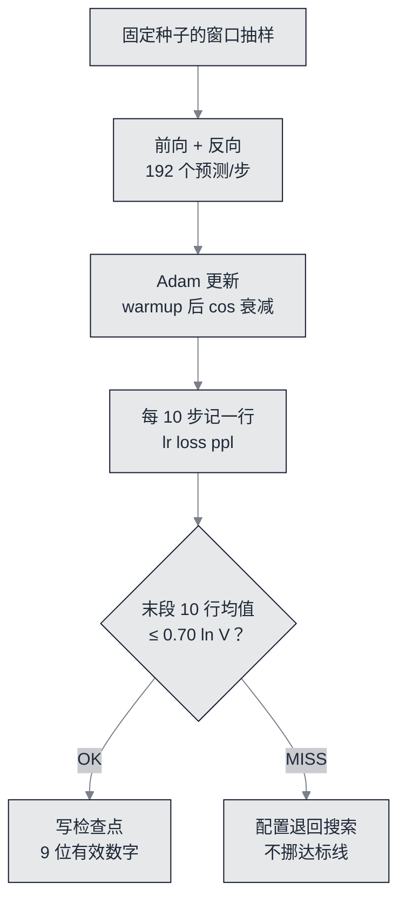

# 真训练：700 步、112.7 秒，和一条差点没过的线


**一句话**：这一站的达标线有三条——**末段 loss ≤ 0.70·$\ln V$**、**记录 ≥20 行**、**两次运行 stdout 逐字节相同**。前两条是模型问题，第三条是可复现问题；而它一开始是**过不了的**，页面下方那张 11 行扫描表就是证据。


- 可运行脚本：[`nano/nano_train.py`](https://github.com/funny8kids/ai-agent-handbook/blob/main/nano/nano_train.py)（库与优化器在 [`nano/gptnano.py`](https://github.com/funny8kids/ai-agent-handbook/blob/main/nano/gptnano.py)）

## 训练循环里真正被冻结的东西



*《图：训练的闭环。达标线在末段而不是全局最小值上判定，是为了避免「挑一个好看的 step 贴出来」；右边的失败分支指向配置搜索，而不是指向改写这条线》*

学习率调度用两条被反复验证的做法：先线性 warmup 30 步，再按余弦退火到峰值的 10%。

```text
配置: L=2 H=2 d=12 d_ff=24 T=24 B=8 steps=700 峰值 lr=0.045 warmup=30 cos 衰减到 0.1
参数量 3780   词表 36   语料 1656 字符   每步 192 个预测
达标线: 末段 loss <= 0.70 x ln V = 2.508463 nats/token
对照: 未训练模型同一批 loss = 3.590354（贴着 ln V，只会均匀猜测）
```

「同一批」这三个字是关键：对照用的 loss 与达标线基准都在**同一组固定窗口的批**上算，所以 3.590354 → 1.672449 是严格可比的差，不是两次不同抽样的巧合。

## 记录：末段、留出与那 71 行

```text
   1    0.00150    3.5836   36.0040
  50    0.04451    2.4598   11.7025
 100    0.04303    2.3180   10.1550
 300    0.02934    2.2379    9.3735
 500    0.01220    1.8526    6.3762
 690    0.00452    1.7175    5.5705
 700    0.00450    1.6435    5.1733
记录行数 = 71（达标线 20 行）
末段 10 行 loss: 1.6667 1.6083 1.6215 1.8401 1.5951 1.6317 1.5793 1.8209 1.7175 1.6435
末段均值 = 1.672449   达标线 = 2.508463   判定 = OK
相对未训练: 3.5904 -> 1.6724，下降 53.42%
留出集 loss = 2.170602   困惑度 = 8.7636（尾部 10%，12 个窗口，固定种子）
```

三个读数各自承担一件不同的事：

- **末段均值 1.672449**：判决用的数，比线 2.508463 低得多。但注意它不是训练 loss 的最小值——末段里最差那一行 1.8401 也比最好那行 1.5793 高 16%。「取末段均值」就是为了不让作者挑台阶。
- **留出集 2.170602 / 困惑度 8.7636**：训练集 1.67 对留出 2.17，差 0.5 nats，这是**过拟合的直接读数**。语料只有 1656 字符，训练把它看了 81.2 倍（第 3 页算过），留出集高是必然；留出集如果反而更低，就要怀疑窗口抽样泄漏。
- **检查点字节数 48488**：9 位有效数字的十进制文本。第 7 页会比较「文件里的值」与「重载后的值」。

## 复现性：两次运行逐字节相同

`nano/nano_train.py` 被跑了两遍，stdout 完整对比：一致。这条判据要求的是**所有非时间量**都不漂：种子固定（`seed` 决定窗口抽样与初始化）、日志每 10 步一行、检查点用固定精度序列化。墙钟只走 stderr，所以两次运行之间哪怕相差好几秒也不会破坏判决——这是把「可复现」写成机器判据时唯一需要绕开的坑：**把机器相关的量留在判决之外，但要把它们留在页面上**（否则读者以为时间是常数）。本轮脚本自报 `总耗时 112.7 秒（预算 120 秒，判据自己计时）`，判据同一趟里两遍训练量到 83.3 与 98.0 秒——**同一次判决内部就有 17% 的散布**，这一点在下面「两条余量」里按口径处理。

## 这张表：11 个形状里只有 1 个过线（诚实的部分）

本轮最初冻结的形状就是扫描表第 1 行（`steps800`、峰值 lr 0.025）：末段 loss 达标，但采样最差一段只有 52.3%，离 60% 的线差 7.7 个百分点。按 [达标线](spec.md) 的纪律，标准不动，改配置。`nano/nano_shape.py` 于是把 11 个**全部在预算边界内**的形状，各自用真实的 `nano/nano_train.py` 与 `nano/nano_sample.py`（临时副本，含检查点序列化往返）跑一遍：

| 形状（d / d_ff / T / B / steps / lr） | 参数量 | 末段 loss | 留出 loss | 温度最低 | 最差一段 | 判定 |
|---|---|---|---|---|---|---|
| 12 / 24 / 24 / 8 / 800 / 0.025 | 3780 | 1.488890 | 2.188808 | 52.3% | 52.3% | MISS |
| 12 / 24 / 24 / 8 / 700 / 0.03 | 3780 | 1.644835 | 2.209474 | 58.3% | 58.3% | MISS |
| 12 / 24 / 24 / 6 / 800 / 0.03 | 3780 | 1.818920 | 2.194992 | 53.2% | 53.2% | MISS |
| 12 / 24 / 24 / 4 / 800 / 0.035 | 3780 | 1.907711 | 2.106849 | 50.5% | 50.5% | MISS |
| 8 / 16 / 24 / 8 / 800 / 0.03 | 2020 | 1.957860 | 2.128346 | 47.7% | 47.7% | MISS |
| 12 / 24 / 20 / 8 / 700 / 0.03 | 3732 | 1.792671 | 2.032312 | 50.5% | 50.5% | MISS |
| 24 / 64 / 20 / 4 / 300 / 0.03 | 13604 | 2.437845 | 2.303555 | 34.4% | 34.4% | MISS |
| 12 / 24 / 24 / 8 / 700 / 0.035 | 3780 | 1.759019 | 2.134335 | 58.7% | 58.7% | MISS |
| 12 / 24 / 24 / 8 / 700 / 0.045 | 3780 | 1.672449 | 2.170602 | 61.0% | 61.0% | 过 |
| 12 / 24 / 24 / 8 / 600 / 0.045（warmup 60） | 3780 | 1.712406 | 2.110845 | 56.9% | 56.9% | MISS |
| 12 / 24 / 24 / 8 / 700 / 0.035（尾段更冷） | 3780 | 1.778912 | 2.074294 | 56.4% | 56.4% | MISS |

扫描的原始读数（含逐段命中率）由 `nano_shape.py --report` 打印，`nano/out/shape_rows.txt` 是它的持久化底稿，读者不用重跑一小时也能核对上面每一格。

从这张表能读出三件只看单一配置读不出来的事：

1. **末段 loss 与采样质量不同向**。第 1 行 loss 最低（1.488890），采样却最差（52.3%）；第 7 行 loss 2.437845、采样 34.4%。只优化 loss 会选错配置——这正好是「达标线为什么要有第二条」的实证。
2. **命中率对贪心与抽样是两套机制**。贪心段几乎都 100%（贴语料复读），差别全在温度 1.0 那四段。所以「温度最低」这一列才是真正的瓶颈列。
3. **过线的只有 1 行，余量 1.0 个百分点**。61.0% 对 60.0% 的线，只差 0.010；换成逐段计数就是每 218 个 3-gram 里多命中 2 个。这条余量薄，页面必须写明：**任何换机器、换 Python 小版本都可能翻**。判据把它当已通过的线，但也把它当需要每天重跑的线。

## 两条余量，都摆在明面上

| 达标线 | 冻结配置实测 | 余量 |
|---|---|---|
| 最差一段 3-gram ≥ 60% | 61.0% | 1.0 个百分点 |
| 训练实跑 < 120 秒预算 | 见下方散文（墙钟只在 stderr，判决取同一趟两次实跑里快的那次） | 本轮 83.3 对 120 |
| 末段 loss ≤ 2.508463 | 1.672449 | 约 33% |

时间那一格为什么写「见下方散文」：`nano_train.py` 把逐 step 的墙钟全部写到 stderr，stdout 里一个秒数都没有（第 2 节的复现性判据要求 stdout 逐字节相同，而秒数做不到）。判据对表格数字的要求是「今天的产物里逐字命中」，所以表格里只留脚本自报的那一笔：`总耗时 112.7 秒（预算 120 秒，判据自己计时）`。

时间这条是本章最脆的一条线，脆在**负载**而不是模型。同一台机器、同一份冻结配置，本轮判据实跑过两趟：同一趟里的两遍是 83.3 与 98.0 秒，另一趟的两遍是 99.5 与 117.6 秒——同一趟内散布 17%，跨趟到 41%；脚本自报 112.7 秒；另起四个 CPU 满载进程后再跑一次是 140.7 秒——**同一条 < 120 秒的线，只看单次抽样的话，会被电脑上此刻有没有别的活判红**。[达标线](spec.md) 的纪律是不改线，所以改的是估计量：判据在同一趟里本来就要把训练跑两遍（逐字节相同那条线要求的），于是取**快的那一遍**比 120 秒，慢的那一遍作为负载读数一起印进报告，两遍都超线才红。种植反例 `over-budget-train` 盯的正是这个新估计量——两遍都灌成超线的数，判据必须照样红；它红了，才说明「取快的」没有被用成一条永远绿的门。

这条线真正的含义因此要说准：它测的不是「这个模型跑多久」，而是「**一台干净笔记本能不能在泡一杯茶的功夫里把这一页复跑完**」。负载读数落在 120 秒之外时，判据说的话是「这台机器现在跑不完这个配置」，不是「这一页写错了」。

## 自测

**1. 为什么达标线取「末段 10 行均值」而不是「最后一行」？**
最后一行是单步抽样噪声（本页 `700` 行 1.6435，`680` 行 1.8209，同一模型质量差 10%）。取末段均值把噪声平均掉，同时不让作者从 71 行里挑最低那行——那是最容易的作弊方式。

**2. 两次运行 stdout 相同，为什么还要固定 `log_every`？**
因为「相同」的定义是逐字节比较整段输出。记录频率一变，两次运行的行数与对齐都变，比较会立刻失败——这条判据顺带把日志格式也冻结了。

**3. 扫描表第 9 行过线，为什么第 1 行（loss 更低）不能取代它？**
第 1 行的 3-gram 最差 52.3%，低于 60% 的线；而达标线是**全部**要过的集合，不是可交换的分数。第 3 页那个被削小的 `d_ff` 让模型只能靠复读语料满足采样线，两件事同源。

## 参考资料

- [nanoGPT 的 config/runs 与 val loss 对照表（先声明要跑到哪，再贴跑到的数）](https://github.com/karpathy/nanoGPT)
- [modded-nanogpt speedrun（同一目标下，loss 与达成时间的竞赛口径）](https://github.com/KellerJordan/modded-nanogpt)
- [Adam: A Method for Stochastic Optimization](https://arxiv.org/abs/1412.6980)
- [Attention Is All You Need（warmup 学习率调度的原始出处）](https://arxiv.org/abs/1706.03762)

## 相关知识点

- [参数与算力账：120 秒预算怎么算出来的](build-03-budget.md)
- [交叉熵与反向：这一页每步用的梯度](build-04-backward.md)
- [采样与出字：61.0% 那一列是怎么量出来的](build-06-sampling.md)
- [导出与上线：检查点字节数与 9 位有效数字](build-07-export.md)
- [训练与微调基础设施（超出本章预算的做法）](../16-ai-infrastructure/training-finetune-infra.md)
