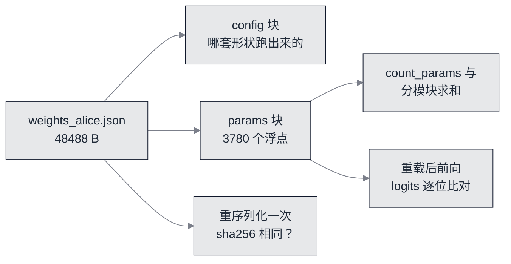

# 导出与上线：48488 字节的权重，和它离真部署还差的五件事


**一句话**：三条达标线全过——**sha256 稳定**、**重载后 logits 逐位一致**、**参数量与参数账页对平**。但这一页最要紧的一句是反面：「逐位一致」**没有**证明 9 位有效数字没丢东西，丢掉的那一笔在下面的实测里是 **3456 / 3780** 个值变了。


- 可运行脚本：[`nano/nano_export.py`](https://github.com/funny8kids/ai-agent-handbook/blob/main/nano/nano_export.py)（读 `nano/nano_train.py` 写出的 `nano/weights_alice.json`）

## 一个检查点要能自己回答三个问题



*《图：一个能自证的检查点要回答三件事——我是哪套配置跑出来的、我的参数个数对不对得上解析式的账、把我写出去再读回来还是不是我》*

## 检查点里存了什么

```text
检查点 nano/weights_alice.json
  字节数 = 48488   sha256 = fd7076c9431b682eb5f0c740c29335d0573afd2056d255ac17bd18b816c595a8
  顶层键 = config params（config 与 params 一起存，读者能核对跑的是哪套配置）
  文件内 config 的参数量口径: L=2 H=2 d=12 d_ff=24 T=24 V=36
```

`config` 与权重同行存放不是礼节，是这一章第 1 页那条结论的直接后果：**换语料就得换整份权重**（词表是语料的去重字符集，36 个字符之外一个都不认）。一个只存张量的文件，读者拿到手既不知道该按哪个形状解析，也不知道喂它的文本得用哪套字符表——这两件事在真实事故里都发生过。

## 参数个数三处对平

```text
参数个数对平
  从文件重载 count_params = 3780
  分模块求和            = 3780
  差 = 0（参数账页要求 0）
  顶层张量清单: lm_b lm_head lnf_b lnf_g wpe wte
  块内张量清单: fc1 fc1_b fc2 fc2_b ln1_b ln1_g ln2_b ln2_g proj proj_b qkv qkv_b
  每个数组的形状: wte 36 x 12, lm_head 36 x 12, qkv 36 x 12, fc1 24 x 12, fc2 12 x 24
```

三个数来自三条**互相独立**的路：第 3 页那张表用维度名写解析式求和；`count_params` 真的去数张量里的元素；这一页再从文件读回来数一遍。任何一处形状写错——比如 `lm_head` 存成 `12 x 36`——都会在这里断掉，而不是等到生成出乱码才发现。

顺带对平一件事：块内 12 个张量名（`qkv`、`qkv_b`、`proj`、`proj_b`、`fc1`、`fc1_b`、`fc2`、`fc2_b`、`ln1_g/b`、`ln2_g/b`）正是第 3 页那八行账里的第 3、4、5 行拆出来的名字。读者可以把那份表逐格对到这里的清单上。

## 「逐位一致」证明了什么，没证明什么

```text
重载后的 logits 逐位一致: True   最大绝对差 = 0.0e+00
  （这一条比的是同一份文件的两条读入路径：它证明解析没有非确定性，不证明截断没代价）
```

这一行是达标线，但它**只**值它说的那点东西：内存里的参数来自 `json` 解析出的字典，另一路从文件重新读一次再前向，两条路喂进同一个 `forward`。相同是必然的——它抓的是「加载代码写错了键名/丢了嵌套」这一类故障，抓不到精度。

所以这一页又把截断单独量了一遍。**拿一份全新、从未写过盘的参数**（`init_params`，固定种子）走完「写盘 → 读回 → 前向」：

```text
截断这一笔：9 位有效数字到底丢了什么（拿一份全新、从未写过盘的参数量）
  写盘再读回：3780 个浮点里 3456 个值变了，最大绝对差 4.998e-11  最大相对差 4.883e-09
  同一批 logits 过这道截断：最大绝对差 5.055e-10（未训练模型的 logits 本身就是 2.6e-01 量级）
  对照：把同样这份参数强转 fp32 再读回，最大相对差 5.781e-08
  所以 9 位十进制文本比 fp32 二进制更准 12 倍，而 float64 无损往返要 17 位
```

读这一段要注意三件事：

- **91% 的值都变了**（3456 / 3780）。任何说「文本格式只是换个写法、不丢信息」的话，在这台机器上都被这一行否掉了。丢的是最后一两位有效数字。
- 但**丢的量级**比推理引擎常用的 fp32 还小一个数量级：`4.883e-09` 对 `5.781e-08`。也就是说 9 位十进制这条取舍，比「干脆转 fp32」更准，代价只是字节数。
- 想对 float64 **逐位无损**得写 17 位有效数字。本章选 9 位是刻意的：多出的 8 位对模型输出没有可测影响，却要把文件撑大近一倍。这一页的脚本现在把两边的数都印出来，读者想改成 17 位自己权衡（`CONFIG["ckpt_sig_digits"]`）。

这就是「先写判据、再写正文」在本章的用法：达标线本身没写错（逐位一致确实成立、确实该判绿），**错的是脚本原来替它加的那句注解**——它把「解析没毛病」说成了「序列化没丢信息」。本轮把注解改成两句：一句说这条判据值什么，另一句把截断的代价单独量出来。

## 序列化稳定：sha256 两次相同

```text
重新序列化一次的稳定性
  第一次 sha256 = fd7076c9431b682eb5f0c740c29335d0573afd2056d255ac17bd18b816c595a8
  第二次 sha256 = fd7076c9431b682eb5f0c740c29335d0573afd2056d255ac17bd18b816c595a8
  相同: True   字节数 48488 vs 48488
```

做法是把文件读回来、再原样序列化一次写到临时文件，比两次摘要。这条判据抓的是**写盘的非确定性**：字典遍历顺序、浮点格式化位数、换行符（这里显式 `newline="\n"`，否则 Windows 会写成 `\r\n`，同一个模型在两种平台上产生两个 sha256）。抓不到的是训练本身的随机性——那是第 5 页「两次运行 stdout 逐字节相同」负责的。

## KV Cache：把第 6 页欠的那笔账跑成实数

```text
推理侧的一小步账：同一句话在有/无 KV Cache 下重算多少
  提示 'alice was beginning'（19 字符），再生成 8 个字符
  不用缓存：每个新字符把整个窗口重算一遍，位置前向次数合计 177
  用缓存：  只有最新位置需要新算，合计 27 次，省下 84.7%
  换来的代价：每层每位置存 k 与 v，27 个位置 x 2*2*12 float = 1296 个浮点数
  第 6 页的 generate 故意不用缓存：那样这笔账只能靠说，而不是靠跑
```

`177` 是 8 个新字符各自重算的窗口长度之和：提示 19 字符，每加一个字符就长一格，每一步算的是 `min(24, 当前长度)`，于是 `177 = 19+20+21+22+23+24+24+24`。`27` 则是 19 + 8——每个位置一辈子只算一次。**省下 84.7%**，代价是那 1296 个浮点数，正是第 3 页「每 token 48 个浮点」那一格在一条 27 位置序列上的展开（27 × 48 = 1296）。

为什么这里的省比大模型还小：窗口只有 24。第 3 页算过两笔账相等的那个上下文长度 `T* = 48`，本章整个跑在它左边，所以注意力那部分根本还没占大头。**缓存真正值钱的地方是长上下文与高并发**，那已经是第 16 章的主题。

## 离真部署还差五件事

```text
从这份检查点到真部署，还差的是机制而不是神秘感:
  1) 权重转置/命名对齐推理引擎（这里是按输出列存的 list，引擎侧要的是连续 buffer）
  2) 精度：3780 个参数，十进制文本 48488 B（47.4 KB）比 fp64 二进制 29.5 KB 大 1.60 倍，而 fp32 只需 14.8 KB、int8 只需 3.7 KB —— 从文本到 int8 是 13 倍
  3) safetensors / GGUF 这类容器格式：把张量元数据与 blob 分开放，加载可以 mmap 且防任意代码执行
  4) 词表与预处理一起打包（第 1 页的 36 个字符在这里变成真正的麻烦：读者换语料就得换整份权重）
  5) 生成侧补 KV Cache、批量与连续批处理（第 16 章的推理服务讲的就是这三件）
```

第 2 条是这一页唯一一个「读者会以为无关」的数字，所以单独摆出来（四格全是记录里的原读数，倍率不另算）：

| 表示 | 记录里的大小读数 |
|---|---|
| 9 位十进制文本（本章） | 48488 B，即 47.4 KB |
| fp64 二进制 | 29.5 KB，文本是它的 1.60 倍 |
| fp32 二进制 | 14.8 KB |
| int8 | 3.7 KB |

**从文本到 int8 是 13 倍**。这一格的意思是：本章选的格式确实是最贵的一种，它贵得有理——可读、可 diff、可手改、跨平台一字不差，而这些都是教学需要的性质；真要上线，第一件事就是换成二进制容器（第 3 条）。这两件事不矛盾，但页面必须说清自己站在哪一边：**这一页不是在推荐文本格式，是在推荐可核对**。

第 3 条值得展开一句：`pickle`（PyTorch 早期的默认权重格式）在加载时会执行任意代码，这是 safetensors 这类容器格式存在的直接理由之一——它把张量的元数据与字节块分开存，加载侧可以 `mmap` 且不需要反序列化任意对象。一个只有 3780 个参数的教学模型用不上 `mmap`，但**格式的理由和规模无关**。

## 自测

**1. 「重载后 logits 逐位一致」为什么不能当作「序列化无损」的证据？**
因为它比的是同一份文件的两条读入路径，两边都是从**已截断**的文本解析出来的。真正的无损测试必须拿一份还没写过盘的参数做往返（本页那一段就是这么做的），量出来的是 3456 个值变化、最大相对差 `4.883e-09`。

**2. 9 位十进制文本比 fp32 二进制更准，为什么还要留 fp32 这条路？**
因为两者优化的目标不同：9 位文本优化**可核对性**（人眼可读、跨平台字节稳定），fp32 优化**字节数**（14.8 KB 对 48488 B）。而 fp32 一旦落盘就没了可 diff 这个性质——同一个 float 用不同工具打印可能给出不同十进制串。

**3. 为什么这个检查点不能直接喂给推理引擎？**
差三层：命名与排布（这里权重按输出列存成 list，引擎要连续 buffer，`lm_head` 与 `wte` 的转置关系也得对齐）、格式与加载语义（容器元数据、`mmap`、禁止任意代码执行）、生成侧机制（缓存、批量、连续批处理）。这三层全是机制，没有一层是「模型聪不聪明」。

## 参考资料

- [safetensors：把张量元数据与 blob 分开存的容器格式（README 讲清它防的是什么）](https://github.com/safetensors/safetensors)
- [GPTQ: Accurate Post-Training Quantization for Generative Pre-trained Transformers（int8/int4 那一格的原始方法，arXiv:2210.17323）](https://arxiv.org/abs/2210.17323)
- [Efficient Streaming Language Models with Attention Sinks（KV Cache 在长序列上的真实代价与省法，arXiv:2309.17453）](https://arxiv.org/abs/2309.17453)

## 相关知识点

- [参数与算力账：每 token 48 个浮点的出处](build-03-budget.md)
- [采样与出字：故意不用缓存的那一段生成](build-06-sampling.md)
- [真训练：检查点是谁写出来的、stdout 逐字节相同判的是什么](build-05-train.md)
- [推理服务与引擎（缓存、批量、连续批处理的工业口径）](../16-ai-infrastructure/inference-serving.md)
- [训练与微调基础设施（本章预算之外的做法）](../16-ai-infrastructure/training-finetune-infra.md)
