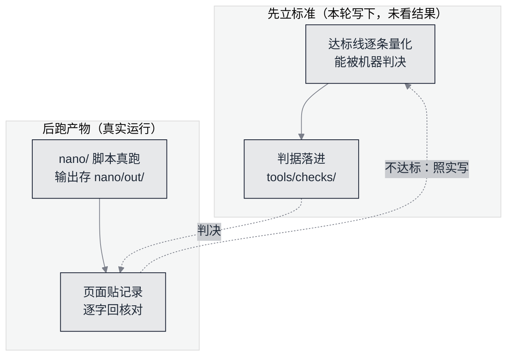

# 本章达标线：一页一页能验算的验收表


**一句话**：这一章教人「从零手写一个大模型」，所以它自己必须先能被从零验算——每个数字都有一个能复跑的出处，每条结论都有一条先立后跑的标准盯着。


一本讲「怎么造」的书，最容易犯的错是**只讲不造**：形状讲得漂亮、loss 曲线画得平滑，可读者照着跑不出任何东西。这一章反过来做——**先写这张表，再写正文**，表里每一条达标线都在真实运行发生之前立好；哪一条没达到，页面上就照实写没达到，不把标准改到结果能够得着的地方。

## 为什么「达标线」要写在正文前面

*《图：本章的信用来自一个闭环——标准在看到结果之前立好，结果由判据逐字回核，回不去的那条线不挪动、只在页面上留红》*


**这条纪律防的是自己**：一个会给自己打分的板块，一定会被分数牵着走。第 96 轮起这本书就把「首页每个数字都必须有判据能复跑」立成硬规矩，本章是第一次把同一条规矩用到**教学内容本身**上：达标表就是读者手里的评分表。


一个可借的样板：nanoGPT 的首屏先写死「`train.py` 复现 GPT-2（124M）」，再在 README 末尾给出 `gpt2 | 124M | 3.11 | 3.12` 这张 val loss 对照表——**先说清要跑到哪，再把跑到的数贴出来**。本章把同样的顺序缩小到一页能验算的规模。

## 全站房规（本章一条都不豁免）

| 房规 | 在本章怎么落 |
|---|---|
| 正文零可执行代码围栏 | 模型与训练循环住在 `nano/`，页面贴 `text` 记录与 `json` 契约 |
| 每页至少一张图 + 读者可见图注 | 每页一张本章色（`#0F172A`）Mermaid |
| 页级「参考资料」≥3 条 | 只放本轮真访过的地址 |
| 体裁字数地板 | 按 [编写规范](../14-templates/style-guide.md) 第八节的表判，不降级为 `draft` 绕过 |
| 纯标准库、零依赖 | 与第 19 章三条硬规矩同源：不 `pip install`、不要 API key、两次运行逐字节一致 |

## 逐页验收表

「复跑物」那一列写下每个页面对应的脚本，本轮写下时 `nano/` 还不存在。判据文件是
`tools/checks/check_build_llm_from_scratch.py`：它现读这两张表和下面那条预算硬线，不认手抄副本。

| 页 | 读者能独立验算的东西 | 复跑物 |
|---|---|---|
| [字符分词](build-01-tokenizer.md) | 文本→整数→文本恒等 | `nano/nano_tokenizer.py` |
| [前向](build-02-forward.md) | 每个中间张量的形状、掩码后的注意力权重 | `nano/nano_forward.py` |
| [参数与算力账](build-03-budget.md) | 分模块参数表求和、每 token 每层 MACs | `nano/nano_budget.py` |
| [交叉熵与反向](build-04-backward.md) | 手写梯度 vs 数值梯度逐参数对照 | `nano/nano_backward.py` |
| [真训练](build-05-train.md) | 真实 loss 序列、每秒 token 数 | `nano/nano_train.py` |
| [采样与出字](build-06-sampling.md) | 生成文本、3-gram 命中率 | `nano/nano_sample.py` |
| [导出与上线](build-07-export.md) | 权重 sha256、重载后 logits 逐位一致 | `nano/nano_export.py` |
| 本章导读 | 冻结配置、三件套 | `README.md` + 判据 |

### 达标线（先立后跑，不看结果）

下面这张表按**页面链接**与上一张表对平：判据顺着链接找到那一页、再顺着「复跑物」找到那个脚本，
所以行序换了不要紧，链接指错了页会当场红。

| 页 | 达标线 |
|---|---|
| [分词](build-01-tokenizer.md) | 解码恒等；词表大小 = 语料去重字符数；序列长度 = 字符数 |
| [前向](build-02-forward.md) | 未训练 loss 与 $\ln V$ 差 ≤ 2%；每行注意力权重和 = 1.000000 |
| [参数账](build-03-budget.md) | 分模块求和 = 模型实测参数量（差 0）；训练实跑 < 120 秒 |
| [反向](build-04-backward.md) | 抽样 ≥12 个参数，最大相对误差 ≤ 1e-3；且**故意少算一项**的变异必须 ≥ 1e-1 |
| [训练](build-05-train.md) | 末段 loss ≤ 0.70·$\ln V$；记录 ≥20 行；两次运行 stdout 逐字节相同 |
| [采样](build-06-sampling.md) | ≥4 段、每段 ≥200 字符、每段 3-gram 命中语料 ≥60%；贪心与温度 1.0 样本不同 |
| [导出](build-07-export.md) | 权重 sha256 稳定；重载后 logits 逐位一致；参数量与「参数账」页对平 |
| [导读](README.md) | 三件套齐；冻结配置 JSON 与脚本里的 `CONFIG` 对平 |

两条额外的硬线：**预算**——本章配置必须落在纯标准库跑得完的范围里（`n_layer ≤ 2`、`d_model ≤ 40`、
`block_size ≤ 24`、`train_steps ≤ 800`），超出去的写法属于第 16 章的基础设施话题，不在此章；
**跨章引用**——凡在本章写「与第 X 章一致」，必须带上指向那一章具体页的站内链接，并且句子里点名被引页
真实存在的那个节名；带 `#中文锚点` 的写法直接判红（GitBook 把中文标题转成拼音 slug，读者点不动，
全书站内 fragment 引用实测为 0），读不到节名就报 `XREF`。

## 判决口径

| 桶 | 含义 | 处置 |
|---|---|---|
| `SPEC` | 页面缺整节、缺图、缺三件套、复跑物路径不存在 | 红 |
| `ARTIFACT` | 页面贴的记录行在 `nano/out/` 里没有逐字命中；表格数字与产物对不上 | 红 |
| `CLAIM` | 定量声明与脚本账对不平（参数量、MACs、token 数、loss、ppl 精确对平；耗时 ±35%） | 红 |
| `XREF` | 跨章「一致」声明缺站内链接、链接带中文锚点、或句子里没点名被引页真有的节名 | 红 |
| `COVERAGE` | 表里某页不存在、产物目录为空、规范表读不出 | 退出码 2，**绝不读成通过** |

判据自带两类反例：每桶都在种植缺陷上真红过一次；并且拿 `git worktree add … --detach` 在**本章发布之前**的那棵树上复跑一遍——缺章的树不写死，由 git 现查本章规范页新增提交的父提交，因为本章上线之后 HEAD 自己就带着这些页了。那时本章一页未发布，判据必须整场红。一条永远绿的判据在本章不算落地。

「训练实跑 < 120 秒」这条线的**判决样本**是这么取的：判据在同一趟里把 `nano/nano_train.py` 跑两遍（「两次运行 stdout 逐字节相同」那条线本来就要两遍），
用**快的那一遍**去比 120 秒，慢的那一遍只作负载读数印进报告；两遍都超线才判 `ARTIFACT`，线的数值一个字没动。
理由是在这台机器上量出来的：同一形状空闲实测 83.3 与 98.0 秒（同一趟的两次），再起四个 CPU 满载进程后同一次跑到 140.7 秒。
拿单次抽样判决，等于让一条内容线取决于判据起跑那一刻机器上有没有别的活——那是尺子的毛病，不是模型的毛病，所以改估计量、不改线。
种植反例 `over-budget-train` 盯的就是这个新估计量：两遍都灌成超线的数，判据必须照样红。

## 自测

**1. 为什么达标线要写在正文之前，而不是写完再补？**
因为补出来的标准会不自觉地迁就已有结果（Goodhart）。线的出处是 `tools/checks/check_build_llm_from_scratch.py`，它只读这一页，改表等于改标准——但改动会同时改判据，藏不住。

**2. 「耗时 ±35%、loss 精确对平」为什么容差不一样？**
耗时是机器相关的量，写进页面时带日期；loss、参数量、token 数是代码与种子决定的量，读者复跑必须逐位一致，给容差就是放水。

## 参考资料

- [nanoGPT README（复现声明与 val loss 对照表）](https://github.com/karpathy/nanoGPT)
- [Improving Reproducibility in Machine Learning Research（MLR 可复现性清单）](https://arxiv.org/abs/2003.12206)
- [Scaling Laws for Neural Language Models（算力—参数—数据的权衡）](https://arxiv.org/abs/2001.08361)

## 相关知识点

- [编写规范（房规与字数地板）](../14-templates/style-guide.md)
- [第 19 章动手实验的三条硬规矩](../19-labs/README.md)
- [训练与微调基础设施（本章预算之外的做法）](../16-ai-infrastructure/training-finetune-infra.md)
- [Transformer 与 Attention（本章要实现的那个块）](../03-llm/transformer-attention.md)
